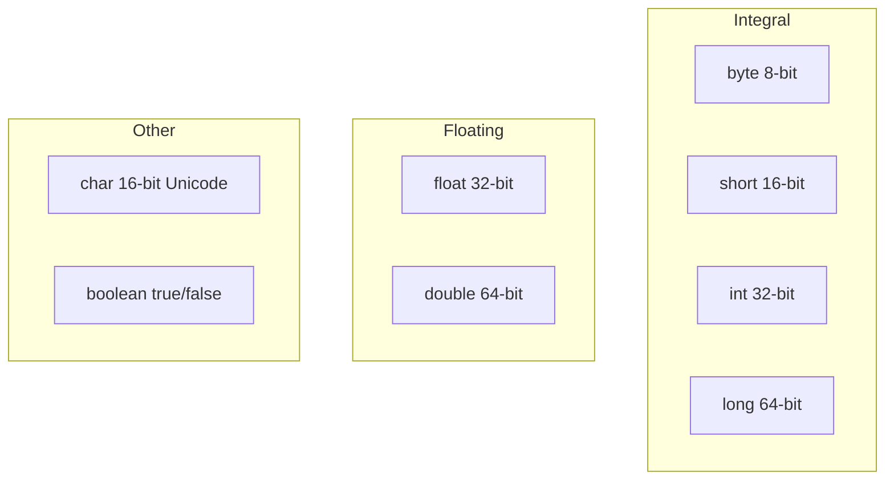
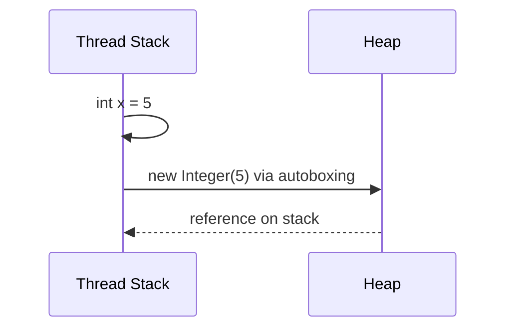

## Executive Summary

Java has **eight primitive types** that store values directly on the stack (or inside objects on the heap). They are **not objects** — no methods, no `null`, and predictable memory size. Primitives are the default choice for arithmetic, counters, and flags; use wrappers only when you need collections, generics, or nullable fields.

---

## Why It Exists

| Problem | How primitives help |
| :--- | :--- |
| Need fast numeric computation | No object header overhead; direct CPU operations |
| Need predictable memory | Fixed sizes (`int` = 4 bytes, `long` = 8 bytes) |
| Avoid null ambiguity | Primitives always have a default value |
| Interop with hardware / JNI | Maps cleanly to C types |

---

## Key Concepts



| Type | Size | Range / values | Default |
| :--- | :---: | :--- | :--- |
| `byte` | 8 bit | −128 … 127 | `0` |
| `short` | 16 bit | −32,768 … 32,767 | `0` |
| `int` | 32 bit | −2³¹ … 2³¹−1 | `0` |
| `long` | 64 bit | −2⁶³ … 2⁶³−1 | `0L` |
| `float` | 32 bit | IEEE 754 | `0.0f` |
| `double` | 64 bit | IEEE 754 | `0.0d` |
| `char` | 16 bit | `\u0000` … `\uffff` | `'\u0000'` |
| `boolean` | JVM-dependent | `true` / `false` | `false` |

{}
`char` is **unsigned** 16-bit UTF-16 code unit — not the same as a Unicode code point (use `int` code points for supplementary characters).
{}

---

## Syntax

```java
byte b = 127;
short s = 32_000;
int count = 1_000_000;
long timestamp = 1_700_000_000_000L;   // L suffix required

float ratio = 0.5f;                    // f suffix required
double precise = 3.141592653589793;

char letter = 'A';
char unicode = '\u0041';

boolean active = true;
```

| Literal | Rule |
| :--- | :--- |
| `long` | Suffix `L` or `l` (prefer `L`) |
| `float` | Suffix `F` or `f` |
| Underscores | Allowed in numeric literals: `1_000_000` |
| Octal / hex / binary | `0xFF`, `0b1010` (Java 7+) |

---

## Example

```java
public class PrimitiveDemo {
    public static void main(String[] args) {
        int a = 10;
        int b = 20;
        int sum = a + b;

        double avg = sum / 2.0;          // promote to double
        long bits = Double.doubleToLongBits(avg);

        System.out.println("sum=" + sum + ", avg=" + avg + ", bits=" + bits);
    }
}
```

{}
Integer division `sum / 2` truncates — use `2.0` or cast if you need fractional results.
{}

---

## Internal Working

- **Widening conversion** (byte → short → int → long → float → double) is implicit and lossless (except int → float may lose precision).
- **Narrowing conversion** requires explicit cast: `int i = (int) 3.9;` → `3`.
- Primitives inside objects live in the **object's field area on the heap**; local primitives live in the **thread stack frame**.
- Autoboxing (`Integer.valueOf(42)`) allocates on the heap — hot loops should stay primitive.



---

## Common Mistakes

{}
Comparing `float` / `double` with `==` for money or equality — use `BigDecimal` or epsilon comparison.
{}

- Using `int` where `long` is needed (timestamp overflow after year 2038 in 32-bit seconds).
- Forgetting `L` on large `long` literals (`10000000000` overflows `int` at compile time).
- Assuming `boolean` is 1 byte — JVM spec leaves size implementation-defined.

---

## Best Practices

- Default to **`int`** for integers, **`double`** for floating math unless you need `float` memory.
- Use **`long`** for IDs, timestamps, and counters that may exceed 2 billion.
- Prefer **`BigDecimal`** for currency — never `double` for money.
- Keep hot-path counters **primitive** to avoid allocation from autoboxing.

---

## Interview Questions


**Q:** How many primitive types does Java have? Can you name them?

**A:** Eight: `byte`, `short`, `int`, `long`, `float`, `double`, `char`, and `boolean`. They are not subclasses of `Object` and have default values when declared as fields.



**Q:** What is the difference between `char` and `String`?

**A:** `char` is a single 16-bit primitive; `String` is an immutable object referencing a `char[]` (or compact byte[] in modern JDKs). Only `String` can be `null`.


---

## Related Topics

- [Next: Wrapper Classes](/java-engineering/wrapper-classes/)
- [Java Engineering Handbook Index](/java-engineering/)
