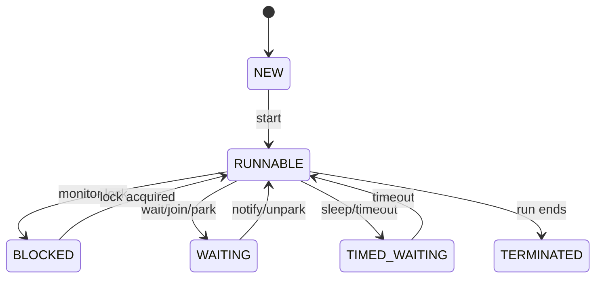

| State | Cause |
| :--- | :--- |
| BLOCKED | Waiting for synchronized monitor |
| WAITING | `wait`, `join`, `park` — no timeout |
| TIMED_WAITING | `sleep`, timed `wait`/`join` |

| Platform vs Virtual | |
| :--- | :--- |
| Cost | ~MB stack vs cheap VT |
| Blocking IO | VT unmounts carrier; pinning if synchronized/native |

**Deep dive:** [Java Threading Interview Guide](/java-engineering/java-threading-interview-guide/)
