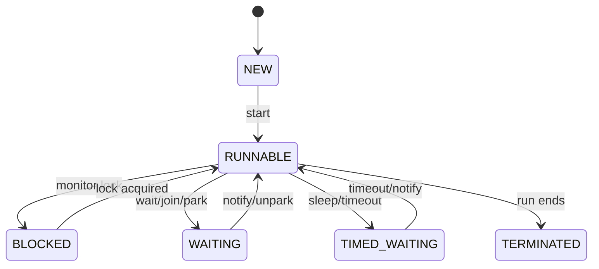

## At a Glance

- Platform thread states map to `Thread.State` enum.
- BLOCKED = monitor entry; WAITING/TIMED_WAITING = `wait`, `park`, `join`.
- Virtual threads: mount/unmount — not a 1:1 OS thread.
- Executors decouple task submission from thread lifecycle.

---

## Reference Tables



| State | Cause |
| :--- | :--- |
| RUNNABLE | Eligible — may be running or waiting for CPU |
| BLOCKED | Waiting for monitor |
| WAITING | `Object.wait`, `join`, `LockSupport.park` |
| TIMED_WAITING | `sleep`, timed `wait`, `join` with timeout |

| Platform vs virtual | |
| :--- | :--- |
| OS thread cost | ~MB stack vs cheap VT |
| Blocking IO | Blocks carrier if pinned |
| `Thread.State` | Still reported — interpret carefully |

---

## Snippets

```java
Thread t = Thread.startVirtualThread(() -> fetch(url));
t.join();
```

---

## Internals & Gotchas

- `RUNNABLE` includes running on CPU or ready on run queue.
- Interrupt sets flag — cooperative handling required.
- Virtual thread park releases carrier.

---

## Production Notes

- Thread dumps: distinguish deadlock vs pool exhaustion.
- Don't rely on thread count for VT workloads — use request metrics.

---

## Interview Probes


{< interview-answer >}
**Q:** BLOCKED vs WAITING?

**A:** BLOCKED waiting for synchronized monitor entry. WAITING voluntary no timeout — `wait`, `park`, `join` without timeout.
{< /interview-answer >}

{< interview-answer >}
**Q:** How virtual threads affect thread dumps?

**A:** Many virtual threads listed — look for carrier pool and pinned threads; interpret blocking on IO vs pinning.
{< /interview-answer >}

---

## See Also

- [Previous: Memory Diagram](/java-engineering/memory-diagram-interview/)
- [Java Engineering Handbook Index](/java-engineering/)
