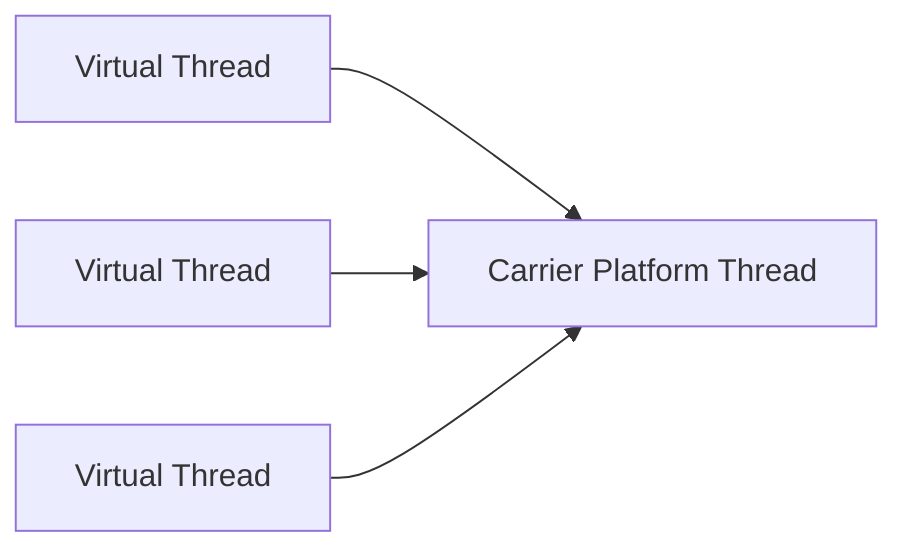

## At a Glance

- Virtual threads (21+): cheap — mount/unmount on carrier platform threads.
- Ideal for blocking IO — not CPU-bound parallel work.
- Pinning: synchronized/native/blocking on carrier — avoid synchronized in hot VT paths or use `ReentrantLock`.
- Structured concurrency (preview/incubator): parent scope owns child lifetimes.

---

## Reference Tables

| Workload | Platform threads | Virtual threads |
| :--- | :--- | :--- |
| Blocking HTTP/DB | Few thousand max | Millions feasible |
| CPU compute | Preferred | Wrong tool |
| Thread-local heavy | OK | Prefer `ScopedValue` |

| Pinning cause | Mitigation |
| :--- | :--- |
| `synchronized` in VT block | `ReentrantLock` |
| Native JNI blocking | Minimize |
| Carrier pool exhaustion | Monitor pinned count (JFR) |

| API (21+) | Purpose |
| :--- | :--- |
| `Thread.startVirtualThread` | Fire-and-forget |
| `Executors.newVirtualThreadPerTaskExecutor` | Per-task VT |
| `StructuredTaskScope` (preview) | Cancel siblings on failure |



---

## Snippets

```java
try (var executor = Executors.newVirtualThreadPerTaskExecutor()) {
    List<Future<String>> futures = urls.stream()
.map(url -> executor.submit(() -> fetch(url)))
.toList();
}
```

---

## Internals & Gotchas

- Continuation yield on blocking IO — carrier free for other VTs.
- `ThreadLocal` on millions of VTs — memory blowup; `ScopedValue` (preview) for implicit context.
- `ForkJoinPool` not used for VT scheduling — separate scheduler.

---

## Production Notes

- Enable JFR `jdk.VirtualThreadPinned` events in staging.
- Size connection pools for expected concurrent blocking calls, not thread count.
- Don't pool virtual threads — create per task.

---

## Interview Probes


{< interview-answer >}
**Q:** VT vs reactive (WebFlux)?

**A:** VT: blocking style code, simpler migration. Reactive: backpressure native, steeper model. VT needs pool sizing for downstream.
{< /interview-answer >}

{< interview-answer >}
**Q:** What is pinning?

**A:** VT stuck on carrier during native/sync block — reduces scalability; monitor and refactor locks.
{< /interview-answer >}

---

## See Also

- [Previous: Coordination](/java-engineering/concurrent-coordination/)
- [Next: Memory & GC](/java-engineering/jvm-memory-and-gc/)
- [Threads & Executors](/java-engineering/threads-and-executors/)
- [CompletableFuture](/java-engineering/async-completablefuture/)
- [Java Engineering Handbook Index](/java-engineering/)
