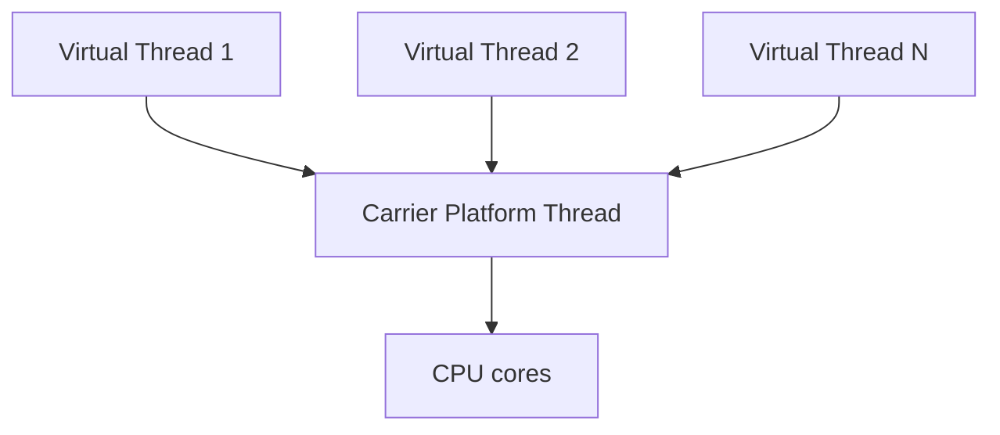
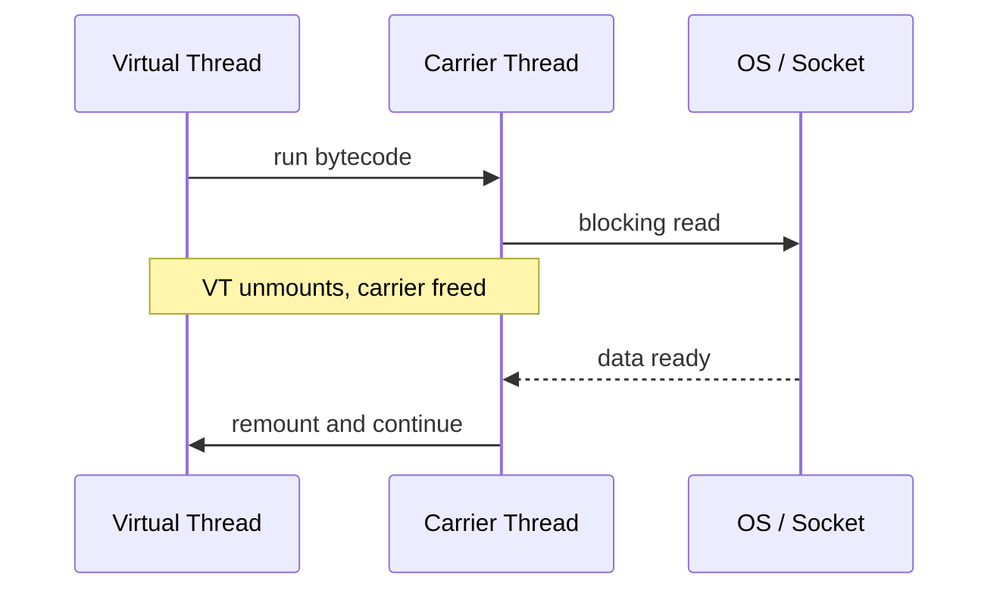

## Executive Summary

**Virtual threads** (Project Loom, finalized in **Java 21**) are JVM-managed lightweight threads. You can run **millions** of them on a small pool of **carrier platform threads**. They excel at **blocking I/O** (HTTP, JDBC) — write synchronous code, get async-scale concurrency without callback hell.

---

## Why It Exists

| Problem | How virtual threads help |
| :--- | :--- |
| Platform thread = ~1 MB stack | Virtual thread ≈ kilobytes — cheap to create |
| Thread pools cap concurrency | One virtual thread per request is viable |
| Reactive frameworks for scale | Blocking style with platform-thread scalability |

---

## Key Concepts



| Concept | Detail |
| :--- | :--- |
| **Carrier thread** | Platform thread that runs virtual thread bytecode |
| **Mount / unmount** | Blocked virtual thread unmounts; carrier runs another |
| **Not faster CPU** | Same throughput for CPU-bound work — use platform threads + pool sizing |
| **Pinning** | `synchronized` or native code on carrier can pin virtual thread — avoid in hot paths |

---

## Syntax

```java
// Java 21+
Thread.startVirtualThread(() -> System.out.println("hello"));

Thread vt = Thread.ofVirtual().name("worker-", 0).start(() -> task());

try (var executor = Executors.newVirtualThreadPerTaskExecutor()) {
    executor.submit(() -> fetchOrder(1));
    executor.submit(() -> fetchOrder(2));
}

// Factory
ThreadFactory factory = Thread.ofVirtual().factory();
```

| API | Purpose |
| :--- | :--- |
| `Thread.ofVirtual()` | Builder for virtual threads |
| `Executors.newVirtualThreadPerTaskExecutor()` | One virtual thread per task |
| `Thread.startVirtualThread(Runnable)` | Quick start helper |

---

## Example

```java
import java.net.URI;
import java.net.http.HttpClient;
import java.net.http.HttpRequest;
import java.net.http.HttpResponse;
import java.time.Duration;
import java.util.concurrent.Executors;

public class VirtualThreadDemo {
    private static final HttpClient CLIENT = HttpClient.newBuilder()
        .connectTimeout(Duration.ofSeconds(5))
        .build();

    public static void main(String[] args) throws Exception {
        try (var executor = Executors.newVirtualThreadPerTaskExecutor()) {
            var futures = java.util.stream.IntStream.range(0, 100)
                .mapToObj(i -> executor.submit(() -> fetch(i)))
                .toList();

            for (var f : futures) {
                System.out.println(f.get());
            }
        }
    }

    static String fetch(int id) throws Exception {
        var req = HttpRequest.newBuilder()
            .uri(URI.create("https://httpbin.org/get?id=" + id))
            .GET()
            .build();
        var res = CLIENT.send(req, HttpResponse.BodyHandlers.ofString());
        return "id=" + id + " status=" + res.statusCode();
    }
}
```

{}
Preview in Java 19–20 as `--enable-preview`. **Standard in Java 21+** without flags.
{}

---

## Internal Working

1. Virtual thread scheduled on a **ForkJoinPool** of carrier threads (default).
2. Blocking syscall (socket read) → JVM **parks** virtual thread, **unmounts** from carrier.
3. Carrier picks another runnable virtual thread.
4. When I/O completes, virtual thread **resumes** on an available carrier.



---

## Common Mistakes

{}
Do not replace a fixed platform pool for **CPU-bound** work with unlimited virtual threads — you gain nothing and add scheduling overhead.
{}

- **Pinning** via `synchronized` inside tight loops — prefer `ReentrantLock` or refactor.
- **ThreadLocal abuse** — millions of virtual threads × ThreadLocal = memory blow-up.
- Pooling virtual threads — unnecessary; create per task.
- Using platform-thread assumptions (`Thread.getAllStackTraces`) at massive scale.

---

## Best Practices

- **One virtual thread per request** in servlet-style servers (many frameworks default to this on Java 21+).
- Use **structured concurrency** ([Structured Concurrency](/java-engineering/structured-concurrency/)) for scoped task trees.
- Profile for **pinning** with JDK Flight Recorder events.
- Keep CPU work on **platform thread pools** sized to cores.

---

## Interview Questions


**Q:** Virtual thread vs platform thread — when would you still use platform threads?

**A:** CPU-intensive parallel work where you want a pool sized to core count. Virtual threads optimize **blocking I/O concurrency**, not raw compute throughput.



**Q:** What is pinning?

**A:** When a virtual thread cannot unmount from its carrier during a blocking operation — e.g. `synchronized` block or some native JNI. Pinning wastes carrier threads and reduces scalability.


---

## Related Topics

- [Previous: ThreadLocal](/java-engineering/threadlocal/)
- [Next: Structured Concurrency](/java-engineering/structured-concurrency/)
- [Java 21 Features](/java-engineering/java-21-features/)
- [Thread](/java-engineering/thread/)
- [Java Engineering Handbook Index](/java-engineering/)
