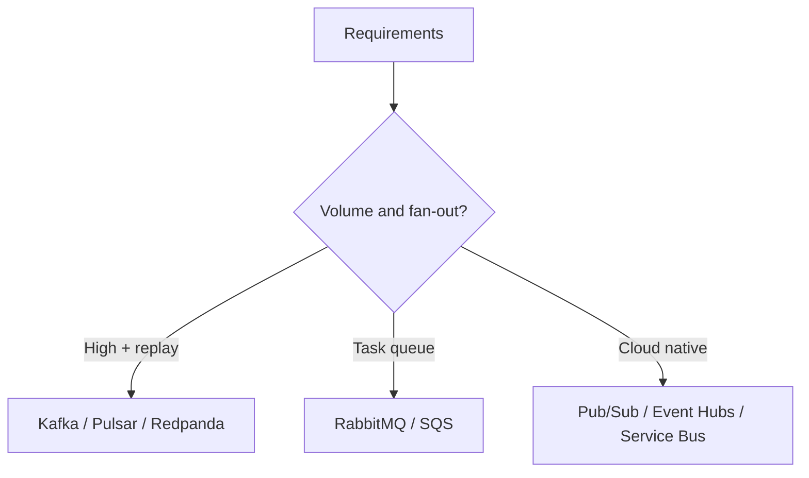

## Quick Revision

- Choose by **integration shape**, not logo preference.
- High-volume fan-out + replay → Kafka family.
- Task routing + priority → RabbitMQ / AMQP.
- No broker ops team → managed cloud messaging.
- Multi-tenant geo replication → evaluate Pulsar.

## Core Concepts

| Need | Primary candidates |
| :--- | :--- |
| Event backbone | Kafka, Redpanda, Pulsar |
| Task queue | RabbitMQ, SQS |
| GCP native | Pub/Sub |
| Azure integration | Event Hubs (Kafka API), Service Bus |
| Edge / low latency | NATS |
| Legacy JMS | ActiveMQ, IBM MQ |

## Internal Working

Selection ADR should capture: volume, ordering, replay, ops staffing, cloud strategy, cost model.

## Architecture

## Design Tradeoffs

| Factor | Self-hosted Kafka | Managed MSK/Event Hubs | SQS/Pub/Sub |
| :--- | :--- | :--- | :--- |
| Control | Full | Partial | Low |
| Ops load | High | Medium | Low |
| Replay | Full | Varies | Limited |
| Cost at scale | TCO staffing | Per-unit + ops | Per-request |

## Production Patterns

- Run **proof-of-load** before Black Friday — partition count is hard to reduce safely.
- Require **schema registry** or contract tests for shared topics.

## Scalability

Staff for **partition planning** and **consumer group operations** if you pick Kafka.

## Reliability

`min.insync.replicas` + `acks=all` for durability-critical topics.

## Security

Mutual TLS and ACLs for multi-team clusters.

## Observability

Define lag SLOs and ISR shrink alerts before go-live.

## Troubleshooting

Wrong broker choice shows up as fighting the platform (replay hacks on queues, routing hacks on Kafka).

## Common Mistakes

- Selecting Kafka without hiring/contracting for ops.
- Ignoring ordering requirements until production.

## Interview Questions

- What team capabilities must exist before self-hosted Kafka?
- When is managed cloud messaging preferable despite less control?
- How would you justify a hybrid Kafka + RabbitMQ platform?

## Architect Notes

See [Broker Comparisons](/kafka-handbook/03-broker-comparisons/) for per-technology matrices. Link ADRs from [Technology Playbook](/technology-playbook/how-to-choose-message-broker/).
