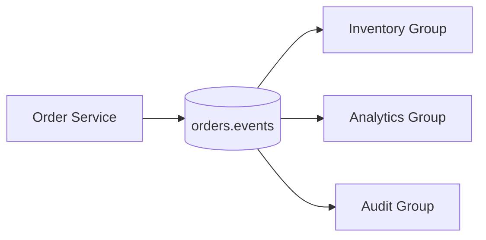

## Quick Revision

- **Point-to-point**: one consumer per message (queue semantics).
- **Pub/sub**: many subscribers; Kafka uses consumer groups for scale-out consumption.
- **Event-driven**: services react to facts; temporal decoupling is the default.
- **Request/reply**: possible over Kafka (reply topic + correlation ID) but not the sweet spot.

## Core Concepts

| Pattern | Mechanism | Kafka fit |
| :--- | :--- | :--- |
| Fire-and-forget notify | Topic publish | Strong |
| Work queue | Competing consumers in one group | Strong |
| Fan-out analytics | Multiple consumer groups | Strong |
| RPC / command | Request-reply, low latency | Weak unless isolated |
| Saga / choreography | Event chains + idempotency | Strong with design discipline |

## Internal Working

Patterns map to **topics + partitions + consumer groups**. A group is a scaled consumer pool; each partition is consumed by at most one member per group at a time.

## Architecture

## Design Tradeoffs

| Choice | Upside | Downside |
| :--- | :--- | :--- |
| Async events | Scale, resilience | Harder debugging |
| Sync REST | Simple traces | Tight coupling |
| Hybrid | Right tool per flow | More platforms to operate |

## Production Patterns

- Isolate **real-time** and **batch** paths with separate consumer groups on the same topic.
- Propagate **trace context** in headers on every publish.
- Design **idempotent** handlers with business keys (`orderId`, `paymentId`).

## Scalability

Fan-out scales by adding consumer group members up to partition count per group.

## Reliability

Assume **at-least-once** delivery; retries are normal. Compensate with idempotent consumers and DLQ topics.

## Security

Topic-level ACLs per consumer group in regulated domains.

## Observability

Lag per group, produce/fetch latency, error rate per handler.

## Troubleshooting

Poison messages block partition progress — route to DLT and skip or fix offset with a runbook.

## Common Mistakes

- One consumer group shared across unrelated microservices.
- Using messaging for synchronous consistency without sagas.

## Interview Questions

- Why does event-driven architecture complicate end-to-end debugging?
- When is point-to-point still the right pattern inside Kafka?
- How do multiple consumer groups differ from SNS fan-out?

## Architect Notes

Enterprises run **hybrid** platforms: Kafka for event backbone, queues for task routing. Document the boundary in your integration ADR.

## See Also

- [Queue vs Stream](/kafka-handbook/01-fundamentals/queue-vs-stream/)
- [Kafka Core](/kafka-handbook/02-kafka/kafka-core/)
