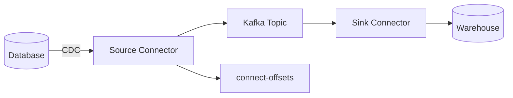

## Quick Revision

- **Kafka Connect** runs source/sink connectors with distributed workers.
- **CDC** (Debezium) captures DB changes into compacted topics.
- **Offset topics** (`connect-offsets`, `connect-configs`, `connect-status`) store connector state.
- Delivery is **at-least-once** unless you design idempotent sinks.

## Core Concepts

| Component | Role |
| :--- | :--- |
| Connector | Defines integration (JDBC source, S3 sink) |
| Task | Parallel unit of work |
| Worker | JVM running tasks |
| Converter | Serializes to Avro/JSON/Protobuf |

## Internal Working

Source connector reads external system → produces to Kafka; offsets committed to `connect-offsets` after successful produce. Sink connector consumes → writes external system → commits Kafka offsets. Failed tasks restart from last committed offset — may duplicate without idempotent sink.

## Architecture

Distributed mode: connectors spread tasks across workers; rebalance on worker join/leave (similar mental model to consumer groups).

## Design Tradeoffs

| Pattern | When |
| :--- | :--- |
| CDC | System of record is DB; need full history |
| App-published events | Rich domain semantics in code |
| Connect sink | Bulk load to warehouse/search |

## Production Patterns

- Monitor connector `FAILED` state and task restarts.
- Single message transforms for routing/enrichment.
- Dead letter queue for poison records in sink connectors.

## Scalability

Scale tasks up to source partitionability (DB binlog single thread per table often limits throughput).

## Reliability

Offset commit lag = replay window on failure. Exactly-once sink connectors exist for some targets with idempotent writes.

## Security

DB credentials in Connect secret store; ACL produce/consume topics per connector principal.

## Observability

Connect REST API status, task metrics, lag vs binlog position.

## Troubleshooting

Stuck connector: check offset topic, DB connectivity, schema errors.

## Common Mistakes

- Assuming CDC replaces domain modeling — events are row-level, not always business events.
- No monitoring on `connect-offsets` growth.

## Interview Questions

- What delivery guarantees for JDBC source connectors?
- How do offset topic failures affect CDC continuity?

## Architect Notes

CDC complements **outbox** — choose based on who owns event shape (DB vs application).

## See Also

- [Schema Registry](/kafka-handbook/02-kafka/kafka-schema-registry/)
- [Kafka Streams](/kafka-handbook/02-kafka/kafka-streams/)
- [Delivery Semantics](/kafka-handbook/02-kafka/kafka-delivery-semantics/)
