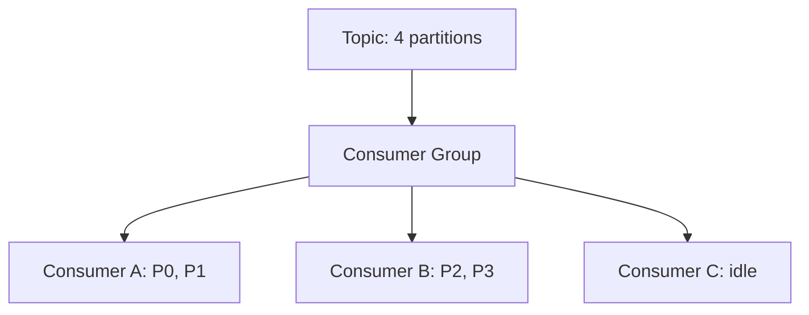
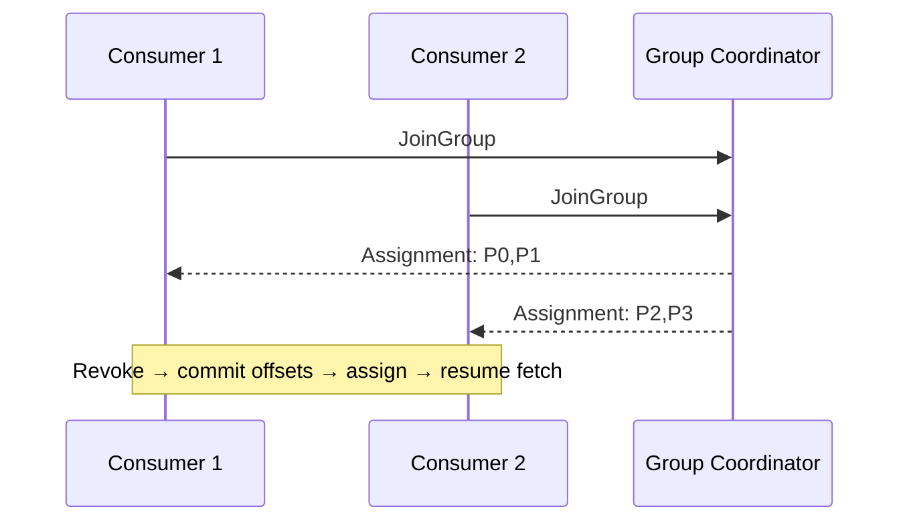

## Quick Revision

- A **consumer group** is a scaled pool sharing one logical subscription to a topic.
- Each partition is consumed by **at most one** consumer in the group at a time.
- **Rebalance** redistributes partitions when members join, leave, or miss heartbeats.
- Max parallelism per group = **partition count**.

## Core Concepts

| Term | Meaning |
| :--- | :--- |
| Group coordinator | Broker managing group membership |
| Group leader | Consumer driving partition assignment (not partition leader) |
| Assignment | Which consumer owns which partition |
| Rebalance | Stop-the-world or cooperative partition handoff |
| Static membership | `group.instance.id` reduces rebalance churn |

## Internal Working

On join, consumers send `JoinGroup`; the group leader receives partition metadata and runs an **assignor** (range, round-robin, sticky, cooperative sticky). Assignment is written to the coordinator; consumers receive new partitions and may need to **reset fetch positions** from committed offsets in `__consumer_offsets`.

**Rebalance triggers:** consumer join/leave, subscription change, `session.timeout.ms` expiry, `max.poll.interval.ms` exceeded (poll loop blocked).

## Architecture

Separate groups on the same topic enable **fan-out** (inventory vs analytics). Never share one group across unrelated microservices — coupling scaling and failure domains.

## Design Tradeoffs

| Strategy | Upside | Downside |
| :--- | :--- | :--- |
| More consumers | Higher throughput | Useless beyond partition count |
| Cooperative sticky | Less duplicate processing | Client/broker version requirements |
| Static membership | Fewer rebalances on restart | Ops discipline on instance IDs |
| Long `max.poll.interval` | Slow handlers tolerated | Slower failure detection |

## Production Patterns

- Size consumers ≤ partitions; scale partitions before consumers for campaigns.
- Use **cooperative-sticky** assignor for rolling deploys.
- Commit offsets **after** side effects succeed (at-least-once).

## Scalability

Adding a 5th consumer to a 4-partition topic leaves one consumer idle.

## Reliability

Rebalance causes **duplicate delivery** window — handlers must be idempotent. See [Delivery Semantics](/kafka-handbook/02-kafka/kafka-delivery-semantics/).

## Security

ACLs on `GROUP` resource per service principal.

## Observability

`records-lag-max`, rebalance rate metric, consumer group state (`Stable`, `PreparingRebalance`).

## Troubleshooting

Rebalance loops → `max.poll.interval.ms` too low for handler duration. See [Kafka Troubleshooting](/kafka-handbook/02-kafka/kafka-troubleshooting/).

## Common Mistakes

- Long synchronous DB calls inside poll loop without raising `max.poll.interval.ms`.
- Multiple services in one group name.

## Interview Questions

- How do consumer groups divide partition ownership?
- What triggers a rebalance storm?
- How does cooperative sticky rebalancing differ from eager?

## Architect Notes

Partition plan and consumer group boundaries are **architecture decisions**, not afterthoughts.

## Checklists

- [ ] Group name encodes service + environment
- [ ] `max.poll.interval.ms` validated under P99 handler time
- [ ] Idempotent handlers verified under forced rebalance test
