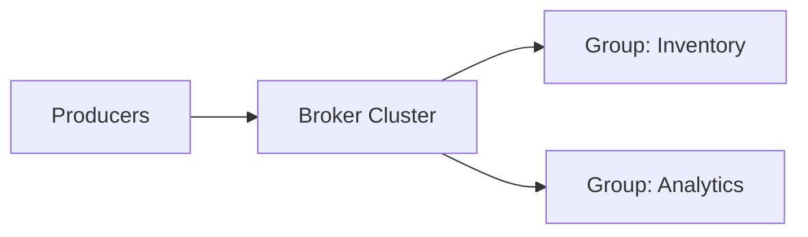

## Quick Revision

- Distributed **commit log**: producers append, consumers pull by offset.
- **Topics** split into **partitions** for parallelism and ordering scope.
- **Consumer groups**: scale-out consumption; one consumer per partition per group.
- **At-least-once** default; idempotent consumers required.

## Core Concepts

| Concept | Role |
| :--- | :--- |
| Topic | Named log category |
| Partition | Ordered, immutable sequence |
| Offset | Position in partition log |
| Producer | Appends with optional key |
| Consumer group | Cooperative partition assignees |

## Internal Working

Producers route records to partitions via key hash; consumers in a group each own a subset of partitions. For **leader election, ISR, and replication**, see [Kafka Internals](/kafka-handbook/02-kafka/kafka-internals/). For **groups and rebalance**, see [Consumer Groups](/kafka-handbook/02-kafka/kafka-consumer-groups/).

## Architecture

## Design Tradeoffs

| Setting | Effect |
| :--- | :--- |
| `acks=0` | Fastest; may lose data |
| `acks=1` | Leader ack; ISR lag risk |
| `acks=all` | Durable; higher latency |
| More partitions | Throughput ↑; ordering scope ↓ |

## Production Patterns

- **Order placed** event → inventory, payment, email, fraud in parallel via separate groups.
- **Batch reconciliation** reads same topic with isolated group and higher lag tolerance.
- Business-key idempotency: `orderId` dedupe store.

## Scalability

Max consumers per group ≤ partition count. Size partitions for **peak**, not average.

## Reliability

Poison messages → **dead-letter topic** + alerting. Schema drift → see [Kafka Internals](/kafka-handbook/02-kafka/kafka-internals/). Delivery semantics → [Delivery Semantics](/kafka-handbook/02-kafka/kafka-delivery-semantics/).

## Security

ACLs per topic and group; no PII in topic names.

## Observability

Consumer lag, produce/fetch p99, offline partitions.

## Troubleshooting

Single hot partition → bad partition key. See [Kafka Troubleshooting](/kafka-handbook/02-kafka/kafka-troubleshooting/).

## Common Mistakes

- Random UUID partition keys.
- Committing offset before side effects complete.

## Interview Questions

- Why partitions instead of a single queue?
- What does at-least-once imply for consumer design?
- How do separate consumer groups enable fan-out?

## Architect Notes

Kafka fits when events are a **first-class asset** — analytics, audit, replay, CDC. See [Queue vs Stream](/kafka-handbook/01-fundamentals/queue-vs-stream/).

## See Also

- [Kafka Internals](/kafka-handbook/02-kafka/kafka-internals/)
- [Delivery Semantics](/kafka-handbook/02-kafka/kafka-delivery-semantics/)
- [Broker Selection](/kafka-handbook/01-fundamentals/broker-selection-guide/)
