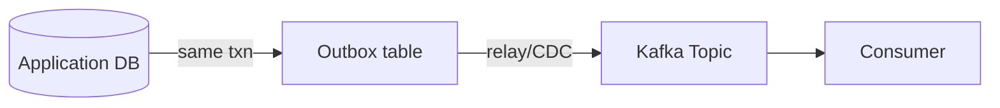
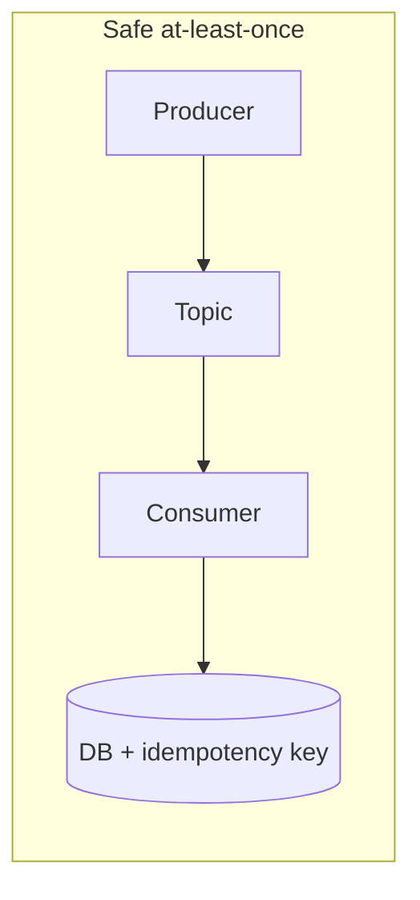

## Quick Revision

- **At-least-once** is the practical default: retries + idempotent consumers.
- **Idempotent producer** dedupes broker-side writes per producer ID + sequence.
- **Transactions** atomicize consume-transform-produce within Kafka.
- **End-to-end exactly-once** to a database requires outbox/CDC — not broker alone.

## Core Concepts

| Semantic | Guarantee | Typical mechanism |
| :--- | :--- | :--- |
| At-most-once | May lose messages | Commit offset before process |
| At-least-once | May duplicate | Commit after process + retries |
| Exactly-once (Kafka pipeline) | No duplicate in stream processing | Transactions + idempotent producer |
| End-to-end EOS | App + DB consistent | Transactional outbox / CDC |

## Internal Working

Idempotent producer assigns `ProducerId` + monotonic sequence per partition; broker dedupes within session. Transactions use a transaction coordinator and `__transaction_state` metadata; consumers read only committed transactional batches when `isolation.level=read_committed`.

## Architecture

## Design Tradeoffs

| Approach | When |
| :--- | :--- |
| At-least-once + idempotent consumer | Most microservices |
| Idempotent producer | Retry-heavy producers |
| Kafka transactions | Stream processors, read-process-write in Kafka |
| Outbox pattern | DB + Kafka dual write |

## Production Patterns

- Business-key dedupe store (`orderId`, `paymentId`).
- Transactional outbox table + Debezium/relay for domain events.

## Scalability

Transactions add coordinator overhead — avoid on ultra-high-throughput firehose without need.

## Reliability

`enable.idempotence=true` implies `acks=all` and safe retries for producers.

## Security

Transactional IDs and principal ACLs for exactly-once pipelines.

## Observability

Duplicate rate metric, transaction abort rate, consumer `read_committed` lag.

## Troubleshooting

Hung transactions block `read_committed` consumers — monitor open transactions.

## Common Mistakes

Claiming EOS across Kafka + PostgreSQL without outbox.
Committing offset before DB commit.

## Interview Questions

- What does at-least-once imply for consumer design?
- When are transactions required vs idempotent producer?

## Architect Notes

Clarify **semantic scope** in ADRs: broker vs application vs end-to-end.

## Checklists

- [ ] Idempotency key documented per event type
- [ ] Outbox or CDC for DB-originated events
- [ ] Producer idempotence enabled where retries exist
