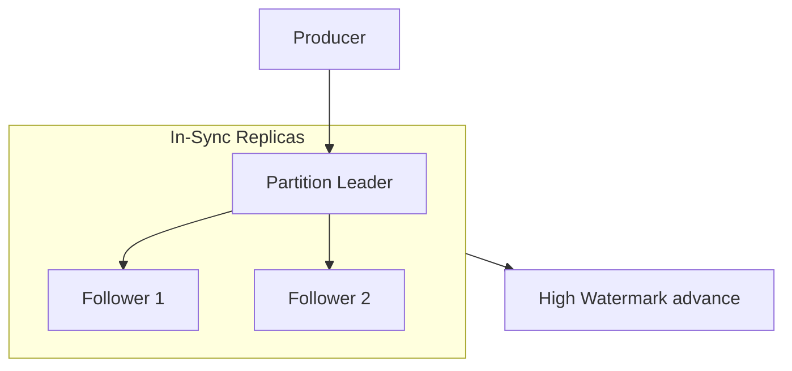
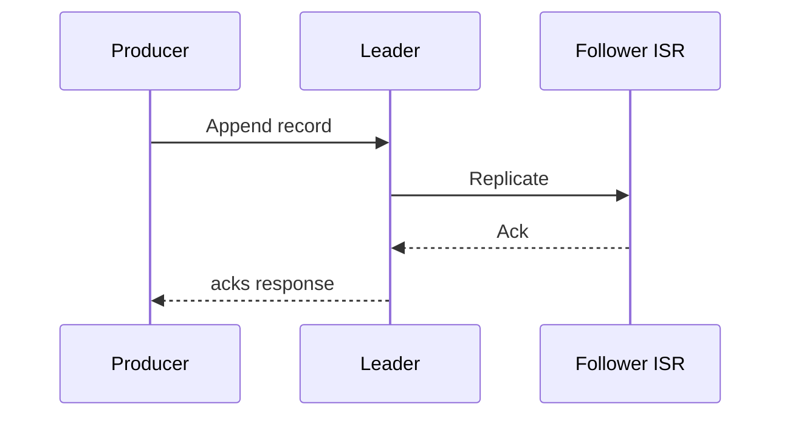

## Quick Revision

- Messages stored in **log segments** (`.log`, `.index`, `.timeindex`).
- **ISR** = replicas caught up to leader; shrink reduces durability window.
- Offsets committed to internal **`__consumer_offsets`** topic.
- **Rebalance** redistributes partitions — see [Consumer Groups](/kafka-handbook/02-kafka/kafka-consumer-groups/).

## Core Concepts

| Component | Function |
| :--- | :--- |
| Log segment | Rolling append file |
| Sparse index | Offset → byte position |
| Controller | Partition leadership |
| KRaft / ZK | Cluster metadata quorum |
| High watermark | Readable upper bound |

## Internal Working

**Write path**: hash(key) % partitions → leader append → replicate to ISR → respond per `acks`. **Read path**: long-poll fetch up to HW.

**Unclean leader election**: non-ISR broker becomes leader → **data loss** risk for un-replicated records.

## Architecture

Sequential disk writes + OS **page cache** = high throughput. Recent data often served from memory.

## Design Tradeoffs

| Choice | Trade-off |
| :--- | :--- |
| `unclean.leader.election.enable=false` | Safer; availability hit on ISR loss |
| Log compaction | Keyed changelog; tombstone lag |
| RF=3 + rack awareness | AZ fault tolerance vs cost |

## Production Patterns

- `min.insync.replicas=2` with `acks=all` for critical topics.
- Cooperative sticky rebalance for rolling consumer deploys — see [Consumer Groups](/kafka-handbook/02-kafka/kafka-consumer-groups/).

## Scalability

Metadata overhead grows with partition count — avoid partition explosion.

## Reliability

Monitor **under-replicated partitions** and ISR shrink events.

## Security

Inter-broker encryption on multi-tenant networks.

## Observability

Request handler idle ratio, log flush latency, ISR size per partition.

## Troubleshooting

| Symptom | Check |
| :--- | :--- |
| NOT_LEADER_FOR_PARTITION | Metadata stale; leader moved |
| URP | Broker disk / network — see table below |

## Common Mistakes

- RF=1 topics in production.
- Increasing partitions without re-key strategy.

## Interview Questions

- What happens during ISR shrink?
- When is unclean leader election acceptable?
- How does log segment rolling affect retention?

## Architect Notes

Internals explain **why** ops matters — partition and ISR discipline are not optional at scale.

## See Also

- [Consumer Groups](/kafka-handbook/02-kafka/kafka-consumer-groups/)
- [Delivery Semantics](/kafka-handbook/02-kafka/kafka-delivery-semantics/)
- [Kafka Troubleshooting](/kafka-handbook/02-kafka/kafka-troubleshooting/)
