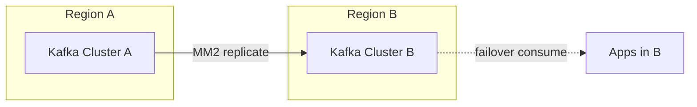

## Quick Revision

- **MirrorMaker 2** replicates topics cluster-to-cluster (active-passive DR or hub-spoke).
- **Active-active** requires conflict resolution — Kafka does not merge divergent writes automatically.
- **RPO/RTO** driven by replication lag and failover runbooks.
- **Pulsar geo-replication** is built-in; Kafka uses MM2 or managed multi-region offerings.

## Core Concepts

| Pattern | Use case |
| :--- | :--- |
| Active-passive | DR; secondary read-only until failover |
| Active-active | Low latency local produce; needs conflict rules |
| Hub-spoke | Central analytics aggregation |
| Stretch cluster | Same cluster across DCs — high latency risk |

## Internal Working

MM2 runs connector pairs: source consumer → remote producer. Offset mapping tracks replication progress. Heartbeats and checkpoint topics coordinate failover offset translation.

## Architecture

Prefer **cluster per region** over stretched brokers across WAN latency.

## Design Tradeoffs

| Approach | Trade-off |
| :--- | :--- |
| MM2 async | Lag = RPO window |
| Dual writes | Conflict risk without CRDT/versioning |
| Managed global (Confluent/MSK) | Cost vs DIY MM2 |

## Production Patterns

- Document failover: DNS, consumer group offset translation, topic prefix (`source.`) stripping.
- Test DR quarterly; measure replication lag under peak.

## Scalability

Cross-DC bandwidth limits replication throughput.

## Reliability

Monitor MM2 lag, connector health, and offset sync topics.

## Security

mTLS between clusters; ACLs on replication principals.

## Observability

Replication latency, bytes/sec per topic, failover drill results.

## Troubleshooting

Lag spike: WAN saturation or MM2 task failure.

## Common Mistakes

- Active-active without business-level conflict resolution.
- Assuming zero RPO with async replication.

## Interview Questions

- MirrorMaker 2 for DR vs dual writes?
- How to design active-active with conflict resolution?

## Architect Notes

Compare with [Kafka vs Pulsar](/kafka-handbook/03-broker-comparisons/kafka-vs-pulsar/) geo-replication when ADR includes multi-DC.

## See Also

- [Kafka Operations](/kafka-handbook/02-kafka/kafka-operations/)
- [Kafka Performance](/kafka-handbook/02-kafka/kafka-performance/)
- [Cloud Messaging Services](/kafka-handbook/03-broker-comparisons/cloud-messaging-services/)
