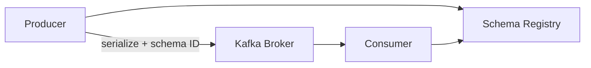

## Quick Revision

- **Schema Registry** stores versioned schemas; serializers embed schema ID in wire format.
- **Compatibility modes** (BACKWARD, FORWARD, FULL) gate breaking changes at registration.
- **Schema drift** breaks consumers when producers deploy ahead of contract tests.
- Prefer **Protobuf/Avro** for evolution; JSON Schema when human readability matters.

## Core Concepts

| Term | Meaning |
| :--- | :--- |
| Subject | Schema name (often `topic-value`) |
| Schema ID | Integer embedded in Confluent wire format |
| Compatibility | Rules for new schema versions |
| Schema drift | Producer/consumer contract mismatch |

## Internal Working

Producer registers or looks up schema → serializes with magic byte + schema ID + payload. Consumer fetches schema by ID from registry on deserialize. Registry validates new schema against compatibility policy before accept.

## Architecture

## Design Tradeoffs

| Format | Evolution | Ops |
| :--- | :--- | :--- |
| Avro | Mature with Registry | Compact binary |
| Protobuf | Strong typing | gRPC ecosystem |
| JSON Schema | Readable | Larger payloads |

## Production Patterns

- CI contract tests: consumer compatibility against proposed producer schema.
- BACKWARD default for consumers-first rollout; FORWARD when producers lead.
- Block `*` produce without registered schema in regulated domains.

## Scalability

Registry is metadata service — HA deployment required; cache schemas on clients.

## Reliability

Registry outage blocks new serializers — cache last-known schemas; plan HA.

## Security

ACL registry subjects; audit schema changes; PII fields in schema review.

## Observability

Schema registration rate, incompatible schema rejections, deserializer errors.

## Troubleshooting

`SerializationException` / `Unknown magic byte` → schema mismatch or wrong serializer.

## Common Mistakes

- Deploying producer schema change without consumer compatibility check.
- Using JSON without schema for high-evolution domains.

## Interview Questions

- How does Schema Registry enforce compatibility modes?
- When is Avro wrong for high-evolution contracts?

## Architect Notes

Treat schemas as **API contracts** — same review process as REST OpenAPI.

## See Also

- [Kafka Internals](/kafka-handbook/02-kafka/kafka-internals/)
- [Kafka Connect](/kafka-handbook/02-kafka/kafka-connect/)
- [Delivery Semantics](/kafka-handbook/02-kafka/kafka-delivery-semantics/)
