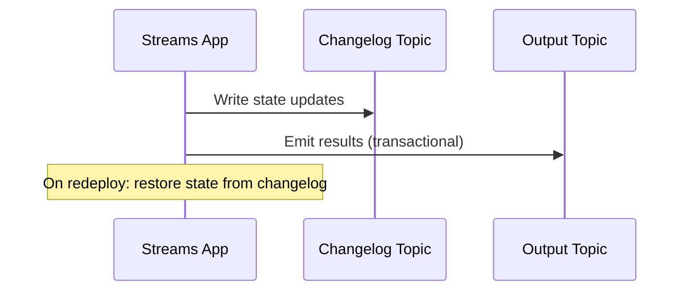

## Quick Revision

- **Kafka Streams** is a JVM library — no separate cluster; scales with application instances.
- **State stores** backed by **changelog topics** (compacted) for fault tolerance.
- **Rebalance** migrates state tasks — restore from changelog on new assignment.
- **Exactly-once** within Streams pipeline via idempotent producer + transactions.

## Core Concepts

| Term | Meaning |
| :--- | :--- |
| Topology | DAG of processors |
| KTable | Changelog stream (table) |
| KStream | Event stream |
| State store | RocksDB local + changelog topic |

## Internal Working

On rebalance, tasks revoke → flush state → new tasks restore from changelog offsets. `processing.guarantee=exactly_once_v2` uses transactional producer for read-process-write.

## Architecture

One stream thread per instance; partitions assigned like consumer group. Interactive queries read local state store.

## Design Tradeoffs

| Choice | When |
| :--- | :--- |
| Kafka Streams | Kafka-native aggregations, modest state |
| Flink/Spark | Large state, complex ops, multi-source |

## Production Patterns

- Size changelog topics with compaction and retention.
- Standby replicas (`num.standby.replicas`) for faster recovery.
- Monitor restoration lag after deploy.

## Scalability

State size bound by disk per instance; repartition topics add partition parallelism.

## Reliability

Changelog replay time = recovery RTO after crash.

## Security

ACLs on input, output, repartition, and changelog topics.

## Observability

`restore-consumer` lag, process latency, punctuate metrics.

## Troubleshooting

Long rebalance after deploy → state size; increase standby or rolling strategy.

## Common Mistakes

- Huge state in Streams without capacity planning.
- Mixing EOS Streams with non-transactional sink without idempotency.

## Interview Questions

- How do state stores recover after redeploy?
- When is Streams preferable to Flink?

## Architect Notes

Streams excels at **Kafka-in/Kafka-out** transforms; external IO breaks EOS boundaries.

## See Also

- [Delivery Semantics](/kafka-handbook/02-kafka/kafka-delivery-semantics/)
- [Kafka Internals](/kafka-handbook/02-kafka/kafka-internals/)
- [Consumer Groups](/kafka-handbook/02-kafka/kafka-consumer-groups/)
