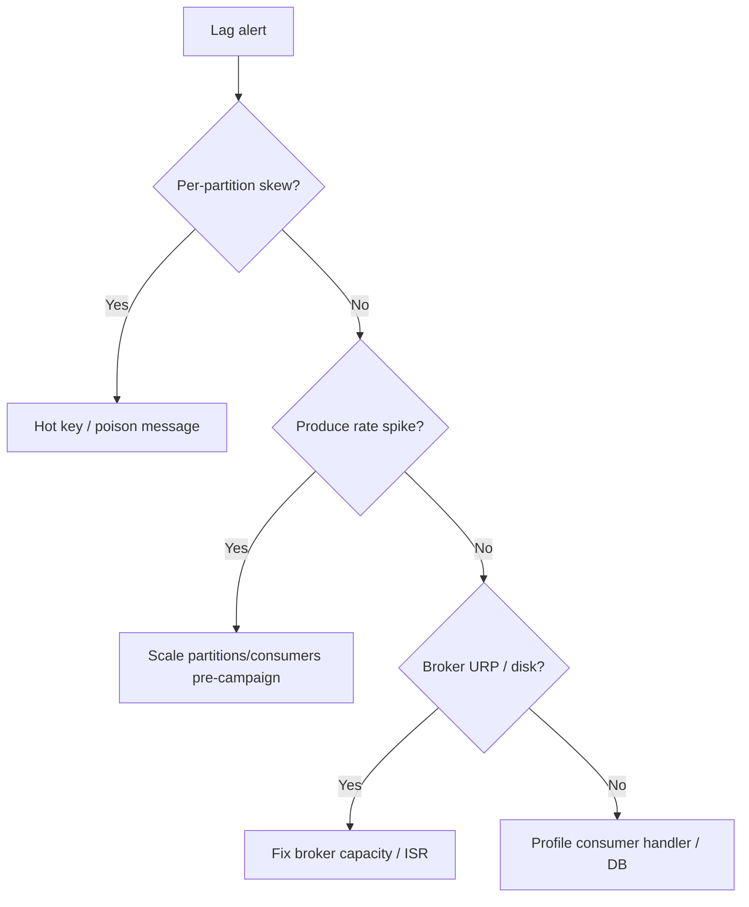

## Quick Revision

- **Lag** = end offset − committed offset per partition.
- **Poison message** blocks partition until skipped or DLT.
- **URP** after network partition — check ISR and disk.
- Isolate lag: producer vs broker vs consumer.

## Core Concepts

| Symptom | First checks |
| :--- | :--- |
| Lag spike | Consumer errors, deploy, traffic |
| Rebalance loop | `max.poll.interval.ms` |
| Produce timeouts | Broker GC, disk, ISR |
| Hot partition | Key distribution |

## Internal Working

Stuck consumer on one partition blocks progress for that partition only — others continue.

## Architecture

Incident flow: alert → dashboard → partition skew → consumer logs → broker metrics.

## Design Tradeoffs

| Fix | Risk |
| :--- | :--- |
| Skip bad offset | Data loss for that message |
| Scale consumers | No effect if partitions < consumers |
| Increase retention | Disk emergency |

## Production Patterns

- DLT + replay tooling from day one.
- Runbook: all consumers stopped committing offsets.

## Scalability

Campaign traffic — pre-scale consumers to partition count.

## Reliability

Test offset reset on staging with idempotency validation.

## Security

Authorization failures mimic "consumer stuck" — check ACL changes.

## Observability

Lag by group/topic/partition; consumer rebalance rate.

## Troubleshooting

### Consumer lag during campaigns
Auto-scale consumers to partition count; fix slow handlers; check downstream DB.

### Poison messages
Route to DLT; fix deserializer; replay after schema fix.

### Schema drift
Registry compatibility mode blocked deploy — coordinate producer/consumer rollout.

### Broker patching
Expect leader movement; watch under-replicated partitions.

## Common Mistakes

- Alerting only on total lag, not per-partition skew.
- No DLT before production.

## Interview Questions

- How do you troubleshoot one partition lagging behind?
- What causes rebalance loops?
- How would you replay after a downstream bug safely?

## Architect Notes

Temporal decoupling makes traces essential — propagate trace IDs in headers.

## See Also

- [Consumer Groups](/kafka-handbook/02-kafka/kafka-consumer-groups/)
- [Kafka Internals](/kafka-handbook/02-kafka/kafka-internals/)
- [Top 150 — Troubleshooting](/kafka-handbook/04-interview-guide/troubleshooting-questions/)
