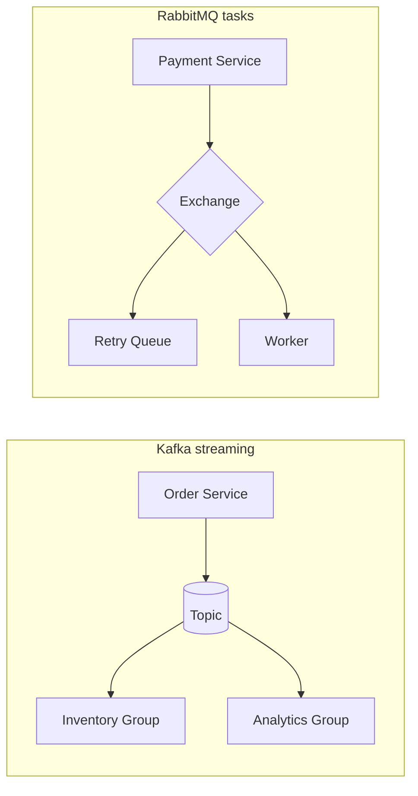


| Dimension | Kafka | RabbitMQ |
| :--- | :--- | :--- |
| **Throughput** | Very high (batching) | High |
| **Latency** | Tunable; batching adds tail | Lower per-message |
| **Ordering** | Per partition | Per queue (single consumer) |
| **Replay** | Native offset reset | DLQ / manual |
| **Multi-tenancy** | Cluster + ACLs | vhost isolation |
| **Scalability** | Partitions + brokers | Queues + consumers |
| **Operations** | Partitions, ISR, rebalance | Moderate broker HA |
| **Cost** | TCO staffing + infra | Lower at small scale |
| **Reliability** | RF + ISR + acks | Ack + mirrors |
| **Kubernetes** | Operators / Strimzi | Helm charts |
| **Best use cases** | Event streaming, CDC, analytics | Task queues, routing, RPC |


## Quick Revision

- Kafka = **log**; RabbitMQ = **broker routing to queues**.
- Kafka for fan-out + replay; RabbitMQ for task distribution + complex routing.
- Hybrid platforms are normal.

## Core Concepts

| Pain | Kafka | RabbitMQ |
| :--- | :--- | :--- |
| Massive fan-out | Consumer groups | Exchanges + bindings |
| Replay | Offset reset | DLQ patterns |
| Task routing | Awkward | Native |
| Per-entity order | Partition key | Single active consumer |

## Internal Working

RabbitMQ removes messages on ack. Kafka retains per policy.

## Architecture

## Design Tradeoffs

See matrix above. Anti-pattern: RabbitMQ as analytics source of truth without retention.

## Production Patterns

| Flow | Choice |
| :--- | :--- |
| Order events to warehouse + CRM + lake | Kafka |
| Payment retry TTL ladder | RabbitMQ |
| Fraud priority dispatch | RabbitMQ |

## Scalability

Kafka wins extreme throughput; RabbitMQ wins flexible routing at moderate scale.

## Reliability

Both: at-least-once + idempotent consumers + DLQ.

## Security

AMQP TLS + vhosts vs Kafka TLS + ACLs.

## Observability

Queue depth vs consumer lag.

## Troubleshooting

| Failure | Kafka | RabbitMQ |
| :--- | :--- | :--- |
| Poison message | Stuck offset / DLT | DLQ fills |
| Upgrade | Rebalance storm | Mirror queue migration |

## Common Mistakes

- Forcing one broker for everything.

## Interview Questions

- When pick Kafka over RabbitMQ?
- How does replay differ?
- Describe a hybrid architecture.

## Architect Notes

[Broker Selection Guide](/kafka-handbook/01-fundamentals/broker-selection-guide/)
