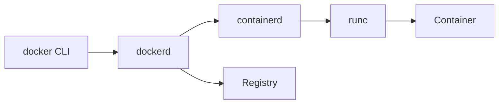

## Executive Summary

**Docker CLI** talks to **dockerd**, which uses **containerd** and **runc** to create OCI containers. Images live in registries; local storage uses layered graph drivers.

---

## Core Concepts



---

## Commands

### docker version

**Purpose:** Show client and server API versions.

**Syntax:**
```bash
docker version
```

**Example:**
```bash
docker version
```

**Output:**
```
Client: Docker Engine 26.1.0\nServer: Docker Engine 26.1.0
```

**Common mistakes:**
- Client/server version skew can cause API errors
- Server section missing means daemon not running

### docker info

**Purpose:** Display storage driver, cgroup, registry mirrors, and limits.

**Syntax:**
```bash
docker info
```

**Example:**
```bash
docker info
```

**Output:**
```
Storage Driver: overlay2\nCgroup Driver: systemd
```

**Common mistakes:**
- Root dir full causes cryptic pull/build failures
- Check `Insecure Registries` for on-prem registry config

### docker context ls

**Purpose:** List Docker contexts (local, remote, ECS).

**Syntax:**
```bash
docker context ls
```

**Example:**
```bash
docker context ls
```

**Output:**
```
NAME        DESCRIPTION\ndefault *   Current DOCKER_HOST
```

**Common mistakes:**
- Wrong context pushes images to unexpected host
- Remote context needs TLS certs configured

---

## Related Topics

- [Docker Commands](/kubernetes-handbook/docker-commands/) · [Container Lifecycle](/kubernetes-handbook/container-lifecycle/) · [Kubernetes Handbook — Docker](/kubernetes-handbook/docker/)
