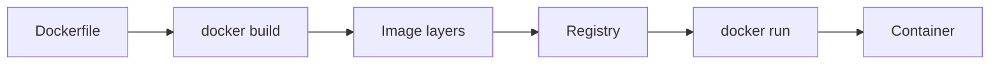

## Executive Summary

**Docker** packages an app and its dependencies into an **immutable image**, then runs it as an isolated **container** on a shared host kernel. This page is a quick CLI and Dockerfile recap — for isolation mechanics and production hardening, see [Application Containerization (Docker)](/microservices/application-containerization-docker/).

---

## Core Concepts



| Term | Recap |
| :--- | :--- |
| **Image** | Read-only layered filesystem + metadata (tag = `repo:tag`) |
| **Container** | Running instance of an image — writable top layer |
| **Dockerfile** | Build recipe — `FROM`, `COPY`, `RUN`, `CMD`/`ENTRYPOINT` |
| **Volume** | Persistent storage outside container lifecycle |
| **Network** | Bridge (default), host, or custom overlay |
| **Registry** | Docker Hub, ECR, ACR, GCR, Harbor |

---

## Quick Reference — CLI

### Images

```bash
docker pull nginx:1.27-alpine
docker images
docker rmi nginx:1.27-alpine
docker tag myapp:local registry.example.com/myapp:1.0.0
docker push registry.example.com/myapp:1.0.0
```

### Build & run

```bash
docker build -t myapp:dev .
docker build -f Dockerfile.prod -t myapp:prod --target runtime .

docker run -d --name api -p 8080:8080 myapp:dev
docker run --rm -it --entrypoint sh myapp:dev          # shell into image
docker exec -it api sh                                 # shell into running container
```

### Lifecycle & logs

```bash
docker ps                    # running
docker ps -a                 # all
docker stop api && docker rm api
docker logs -f --tail 100 api
docker inspect api --format '{{.State.Status}}'
```

### Cleanup

```bash
docker system df
docker container prune -f
docker image prune -a -f
docker volume prune -f
```

### Compose (v2)

```bash
docker compose up -d
docker compose ps
docker compose logs -f api
docker compose down -v
```

---

## Snippets

### Multi-stage Dockerfile (JVM service)

```dockerfile
FROM eclipse-temurin:21-jdk-alpine AS build
WORKDIR /app
COPY pom.xml .
COPY src ./src
RUN ./mvnw -q -DskipTests package

FROM eclipse-temurin:21-jre-alpine AS runtime
RUN addgroup -S app && adduser -S app -G app
WORKDIR /app
COPY --from=build /app/target/*.jar app.jar
USER app
EXPOSE 8080
ENTRYPOINT ["java", "-jar", "app.jar"]
```

### `.dockerignore`

```
target/
.git/
*.md
.env
```

### Run with env, volume, resource limits

```bash
docker run -d \
  --name api \
  -p 8080:8080 \
  -e SPRING_PROFILES_ACTIVE=prod \
  -v api-data:/data \
  --memory=512m --cpus=1 \
  myapp:prod
```

### Compose skeleton

```yaml
services:
  api:
    build: .
    ports:
      - "8080:8080"
    environment:
      SPRING_DATASOURCE_URL: jdbc:postgresql://db:5432/app
    depends_on:
      db:
        condition: service_healthy
  db:
    image: postgres:16-alpine
    healthcheck:
      test: ["CMD-SHELL", "pg_isready -U app"]
      interval: 5s
      retries: 5
```

---

## Common Gotchas

| Pitfall | Fix |
| :--- | :--- |
| PID 1 zombie processes | Use `ENTRYPOINT ["dumb-init", "--"]` or `tini` |
| Writing logs/state to container FS | Mount volumes or stdout-only logging |
| `latest` tag in prod | Pin digest or semver tag |
| Root in container | `USER nonroot` + read-only root FS where possible |
| Huge build context | `.dockerignore`; multi-stage to drop build tools |
| Wrong platform on Apple Silicon | `docker build --platform linux/amd64` for cloud deploy |

{}
`docker run -p 8080:8080` maps **host:container**. Inside the container the app still listens on its own port (often 8080).
{}

---

## Related Topics

- [Kubernetes](/kubernetes-handbook/kubernetes/) — orchestration cheat sheet
- [Podman](/kubernetes-handbook/podman/) — daemonless alternative
- [Application Containerization (Docker)](/microservices/application-containerization-docker/) — architecture deep dive
- [Kubernetes Handbook Index](/kubernetes-handbook/)
