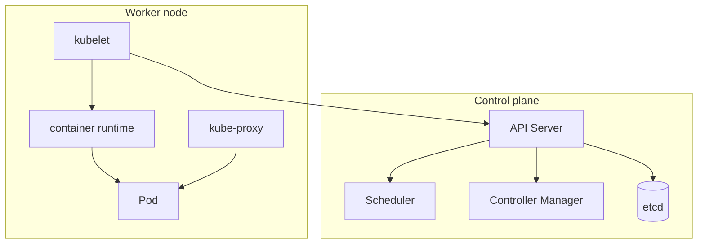

## Executive Summary

**Kubernetes** separates a **control plane** (API server, scheduler, controller manager, etcd) from **worker nodes** (kubelet, kube-proxy, container runtime). All cluster state flows through the API server.

---

## Core Concepts



| Component | Role |
| :--- | :--- |
| **API Server** | Front door — validates and persists all objects |
| **etcd** | Consistent key-value store for cluster state |
| **Scheduler** | Assigns unscheduled pods to nodes |
| **Controller Manager** | Reconciliation loops (Deployment, ReplicaSet, etc.) |
| **kubelet** | Registers node, runs pods, reports status |
| **kube-proxy** | Service load balancing via iptables/IPVS |

---

## Commands

### kubectl cluster-info

**Purpose:** Display control plane and CoreDNS endpoints.

**Syntax:**
```bash
kubectl cluster-info
```

**Example:**
```bash
kubectl cluster-info
```

**Output:**
```
Kubernetes control plane is running at https://10.0.0.1:6443\nCoreDNS is running at https://10.0.0.1:6443/api/v1/namespaces/kube-system/services/kube-dns:dns/proxy
```

**Common mistakes:**
- Assumes kubeconfig points to the right cluster — verify context first
- Fails if API server is unreachable or RBAC denies access

### kubectl get componentstatuses / get --raw

**Purpose:** Check health of control plane components (deprecated in newer clusters; use /readyz).

**Syntax:**
```bash
kubectl get --raw='/readyz?verbose'
```

**Example:**
```bash
kubectl get --raw='/readyz?verbose'
```

**Output:**
```
readyz check passed
```

**Common mistakes:**
- `componentstatuses` removed in Kubernetes 1.22+ — use `/livez` and `/readyz` instead
- Verbose output is long — pipe to grep for failing checks

### kubectl get nodes -o wide

**Purpose:** List worker nodes with roles, versions, and internal IPs.

**Syntax:**
```bash
kubectl get nodes [-o wide|yaml]
```

**Example:**
```bash
kubectl get nodes -o wide
```

**Output:**
```
NAME     STATUS   ROLES           AGE   VERSION   INTERNAL-IP\nnode-1   Ready    control-plane   30d   v1.29.0   10.0.0.2
```

**Common mistakes:**
- `NotReady` often means kubelet or CNI issue — check `kubectl describe node`
- Control-plane nodes may be tainted — workloads won't schedule there by default

### kubectl api-resources

**Purpose:** Discover available API groups, resources, and short names.

**Syntax:**
```bash
kubectl api-resources [--namespaced=true|false]
```

**Example:**
```bash
kubectl api-resources | grep deploy
```

**Output:**
```
deployments    apps/v1    true    Deployment
```

**Common mistakes:**
- Output is huge — filter with grep
- CRDs appear after operator install — resource may be missing on fresh clusters

---

## Related Topics

- [Pods](/kubernetes-handbook/pods/) — smallest deployable unit
- [Namespaces](/kubernetes-handbook/namespaces/) — logical isolation
- [RBAC](/kubernetes-handbook/rbac/) — API access control
- [Kubernetes Cheatsheet Index](/kubernetes-handbook/)
