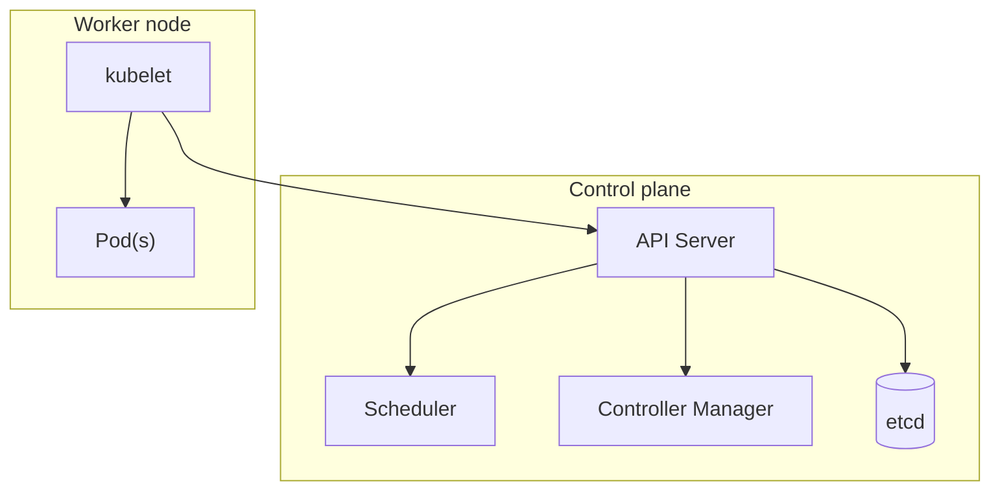

## Executive Summary

**Kubernetes** schedules container **Pods** on nodes, keeps desired state via controllers, and exposes workloads through **Services** and **Ingress**. This page is a kubectl and YAML quick reference — for orchestration architecture and deployment topologies, see [Declarative Container Orchestration (Kubernetes)](/microservices/declarative-container-orchestration-kubernetes/).

---

## Core Concepts



| Object | Recap |
| :--- | :--- |
| **Pod** | Smallest deploy unit — one or more containers sharing network/volumes |
| **Deployment** | Declarative ReplicaSet — rolling updates, rollbacks |
| **Service** | Stable ClusterIP / NodePort / LoadBalancer endpoint for Pods |
| **Ingress** | HTTP routing to Services (needs ingress controller) |
| **ConfigMap / Secret** | Non-sensitive / sensitive config injected as env or files |
| **Namespace** | Logical isolation — `default`, `kube-system`, app namespaces |
| **HPA** | Horizontal Pod Autoscaler on CPU/memory/custom metrics |

---

## Quick Reference — kubectl

### Context & namespaces

```bash
kubectl config get-contexts
kubectl config use-context prod-cluster
kubectl get ns
kubectl -n myapp get all
```

### Deploy & inspect

```bash
kubectl apply -f deployment.yaml
kubectl get pods -n myapp -o wide
kubectl describe pod myapp-7f8b9c-xyz -n myapp
kubectl logs -f deploy/myapp -n myapp --tail=100
kubectl logs myapp-7f8b9c-xyz -c sidecar -n myapp    # multi-container pod
```

### Exec, port-forward, copy

```bash
kubectl exec -it myapp-7f8b9c-xyz -n myapp -- sh
kubectl port-forward svc/myapp 8080:80 -n myapp
kubectl cp myapp-7f8b9c-xyz:/var/log/app.log ./app.log -n myapp
```

### Rollout & scale

```bash
kubectl rollout status deploy/myapp -n myapp
kubectl rollout history deploy/myapp -n myapp
kubectl rollout undo deploy/myapp -n myapp
kubectl scale deploy/myapp --replicas=5 -n myapp
```

### Debug & events

```bash
kubectl get events -n myapp --sort-by='.lastTimestamp'
kubectl top pods -n myapp                          # metrics-server required
kubectl run curl --rm -it --image=curlimages/curl -- sh
```

### Imperative shortcuts (dev only)

```bash
kubectl create deployment myapp --image=myapp:1.0.0 -n myapp
kubectl expose deployment myapp --port=80 --target-port=8080 -n myapp
```

---

## Snippets

### Deployment + Service

```yaml
apiVersion: apps/v1
kind: Deployment
metadata:
  name: myapp
  namespace: myapp
spec:
  replicas: 3
  selector:
    matchLabels:
      app: myapp
  template:
    metadata:
      labels:
        app: myapp
    spec:
      containers:
        - name: api
          image: registry.example.com/myapp:1.0.0
          ports:
            - containerPort: 8080
          envFrom:
            - configMapRef:
                name: myapp-config
            - secretRef:
                name: myapp-secrets
          resources:
            requests:
              cpu: 100m
              memory: 256Mi
            limits:
              cpu: 500m
              memory: 512Mi
          readinessProbe:
            httpGet:
              path: /actuator/health/readiness
              port: 8080
            initialDelaySeconds: 10
            periodSeconds: 5
          livenessProbe:
            httpGet:
              path: /actuator/health/liveness
              port: 8080
            initialDelaySeconds: 30
            periodSeconds: 10
---
apiVersion: v1
kind: Service
metadata:
  name: myapp
  namespace: myapp
spec:
  selector:
    app: myapp
  ports:
    - port: 80
      targetPort: 8080
  type: ClusterIP
```

### ConfigMap & Secret

```yaml
apiVersion: v1
kind: ConfigMap
metadata:
  name: myapp-config
  namespace: myapp
data:
  SPRING_PROFILES_ACTIVE: "prod"
---
apiVersion: v1
kind: Secret
metadata:
  name: myapp-secrets
  namespace: myapp
type: Opaque
stringData:
  SPRING_DATASOURCE_PASSWORD: "change-me"
```

### Ingress (nginx)

```yaml
apiVersion: networking.k8s.io/v1
kind: Ingress
metadata:
  name: myapp
  namespace: myapp
  annotations:
    nginx.ingress.kubernetes.io/rewrite-target: /
spec:
  ingressClassName: nginx
  rules:
    - host: api.example.com
      http:
        paths:
          - path: /
            pathType: Prefix
            backend:
              service:
                name: myapp
                port:
                  number: 80
```

### HPA

```yaml
apiVersion: autoscaling/v2
kind: HorizontalPodAutoscaler
metadata:
  name: myapp
  namespace: myapp
spec:
  scaleTargetRef:
    apiVersion: apps/v1
    kind: Deployment
    name: myapp
  minReplicas: 2
  maxReplicas: 10
  metrics:
    - type: Resource
      resource:
        name: cpu
        target:
          type: Utilization
          averageUtilization: 70
```

---

## Common Gotchas

| Pitfall | Fix |
| :--- | :--- |
| Pod `CrashLoopBackOff` | `kubectl logs` + `describe` — check command, probes, OOM |
| Probe kills healthy pod | Readiness ≠ liveness; tune `initialDelaySeconds` |
| `ImagePullBackOff` | Check tag, registry auth (`imagePullSecrets`) |
| Config not updated | ConfigMap mounted as volume may need pod restart |
| Wrong Service selector | Labels on Pod template must match Service `selector` |
| Resource limits too tight | JVM needs headroom above heap — set requests/limits explicitly |

{}
Never commit real Secrets to git. Use sealed-secrets, external-secrets, or cloud secret managers in production.
{}

---

## Related Topics

- [Docker](/kubernetes-handbook/docker/) — image build cheat sheet
- [Kubernetes CronJobs](/kubernetes-handbook/kubernetes-cronjobs/) — scheduled workloads
- [Nginx Ingress](/kubernetes-handbook/nginx-ingress/) — ingress controller
- [Declarative Container Orchestration (Kubernetes)](/microservices/declarative-container-orchestration-kubernetes/) — architecture deep dive
- [Kubernetes Handbook Index](/kubernetes-handbook/)
