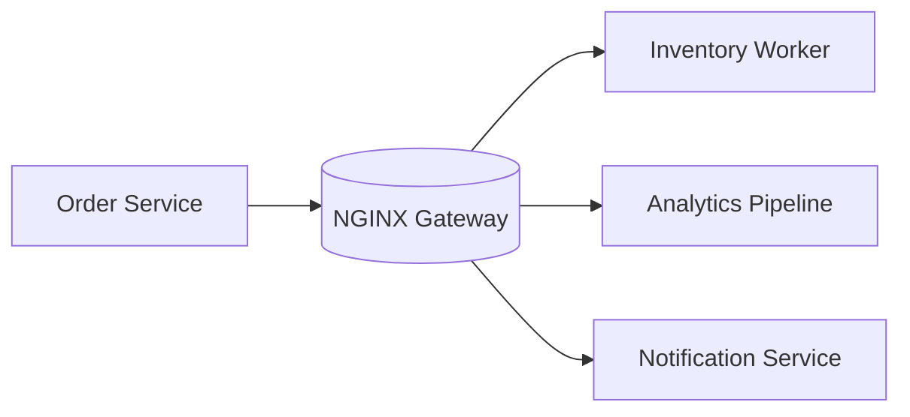

## 1. Executive Summary

**NGINX as API Gateway** — High-performance reverse proxy — routing, TLS termination, rate limits.

---

## 2. What Problem It Solves

| Need | How messaging helps |
| :--- | :--- |
| Decouple producers and consumers | Scale and deploy independently |
| Buffer traffic spikes | Queue absorbs burst without dropping users |
| Event notification | Many subscribers react to one business fact |
| Integration across legacy and cloud | Stable wire protocol between eras |

---

## 3. Where It Fits in Architecture

---

## 4. When to Choose

- You need **async** processing with clear back-pressure semantics
- Multiple consumers must react to the same event stream
- Peak traffic exceeds synchronous processing capacity
- Cloud-managed ops preferred (SQS, Pub/Sub, Service Bus) vs self-hosted (Kafka, RabbitMQ)

---

## 5. When Not to Choose

- Simple request/response suffices and latency budget is tight
- Strong synchronous consistency required across services without saga/compensation
- Team cannot operate broker HA, patching, and partition rebalancing
- Message ordering requirements exceed what the broker guarantees for your config

---

## 6. Popular Tools / Products

| Style | Examples |
| :--- | :--- |
| **Log / stream** | Kafka, Pulsar, Redpanda, Kinesis |
| **Queue / AMQP** | RabbitMQ, ActiveMQ, SQS, Service Bus |
| **Cloud pub/sub** | SNS, Google Pub/Sub, Event Grid |

---

## 7. Trade-offs


| Dimension | Upside | Downside |
| :--- | :--- | :--- |
| **Delivery** | At-least-once with retries | Idempotent consumers required |
| **Ordering** | Partition keys enable order | Global order is expensive |
| **Ops** | Managed services reduce toil | Self-hosted offers control at cost |
| **Debugging** | Temporal decoupling | Harder than tracing sync calls |


---

## 8. Real-World Example

**Order placed event** → inventory reservation, payment capture, email receipt, and fraud scoring run in parallel. **Payment reconciliation batch** reads from the same topic with a consumer group isolated from real-time paths.

---

## 9. Failure Scenarios

- **Poison messages** clog queues — use DLQ and alerting
- **Consumer lag** during campaigns — auto-scale consumers, partition count planning
- **Schema drift** breaks deserializers — schema registry or contract tests

---

## 10. Best Practices

1. Design **idempotent** consumers with business keys.
2. Use **dead-letter queues** and replay tooling from day one.
3. Propagate **trace context** in message headers.
4. Size **partitions/queues** for peak, not average traffic.

---

## 11. Interview Answer


"I'd pick **NGINX Gateway** when the domain needs high-performance reverse proxy. I clarify delivery guarantees, ordering needs, and ops model — managed cloud queue vs self-hosted Kafka. I always mention idempotent consumers and dead-letter handling."


---

## 12. Related Topics

- [How to Choose a Message Broker](/technology-playbook/how-to-choose-message-broker/)
- [Kafka vs RabbitMQ](/interview-prep/kafka-vs-rabbitmq/)
- [Event-Driven Architecture](/technology-playbook/event-driven-architecture/)
