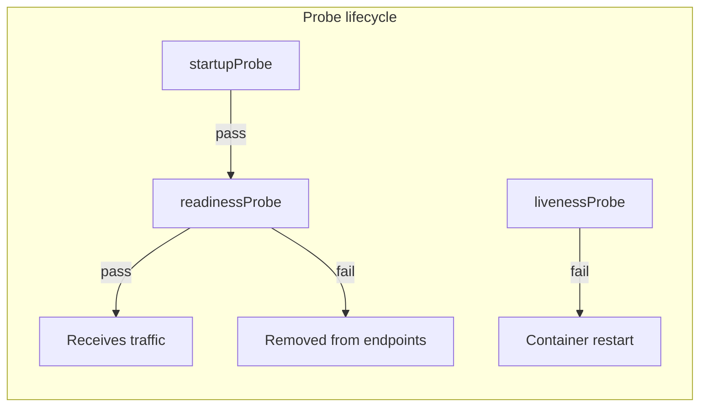

## Executive Summary

**livenessProbe** restarts unhealthy containers. **readinessProbe** removes pod from Service endpoints. **startupProbe** protects slow-starting apps from premature liveness kills.

| Probe | Kubelet action on failure | Use when |
| :--- | :--- | :--- |
| **Startup** | Blocks other probes until success | JVM/Spring slow boot (>30s) |
| **Liveness** | Restart container | Deadlock, unrecoverable hang |
| **Readiness** | Remove from Service endpoints | Temporarily cannot serve traffic |

**Rule:** Liveness = "should restart?" Readiness = "should receive traffic?" Never point both at the same shallow `/health` if it does not distinguish the two.

---

## Core Concepts



| Setting | Typical value | Notes |
| :--- | :--- | :--- |
| `periodSeconds` | 5–10 | How often to probe |
| `timeoutSeconds` | 1–3 | Must be < app SLA |
| `failureThreshold` | 3 | Failures before action |
| `startupProbe.failureThreshold` | 30+ | Allows 5 min boot at period=10 |

---

## Commands

### kubectl describe pod (probe failures)

**Purpose:** See probe failure messages and restart counts.

**Syntax:**
```bash
kubectl describe pod NAME -n NS
```

**Example:**
```bash
kubectl describe pod api-0 -n myapp
```

**Output:**
```
Warning  Unhealthy  Liveness probe failed: HTTP probe failed with statuscode: 503
```

**Common mistakes:**
- Liveness too aggressive kills app during GC spikes
- Readiness failure during rollout removes capacity — expected briefly

### kubectl logs (after restart)

**Purpose:** Correlate probe kills with application errors.

**Syntax:**
```bash
kubectl logs POD -n NS --previous
```

**Example:**
```bash
kubectl logs api-0 -n myapp --previous
```

**Output:**
```
OOMKilled or stack trace...
```

**Common mistakes:**
- `--previous` empty if pod never started successfully
- Exec probe shell must exist in image — alpine lacks bash

---

## YAML Snippet

### HTTP readiness + liveness

**Purpose:** Standard Spring Boot / HTTP service probes.

**Syntax:**
```yaml
readinessProbe:
  httpGet:
    path: /actuator/health/readiness
    port: 8080
  initialDelaySeconds: 10
  periodSeconds: 5
livenessProbe:
  httpGet:
    path: /actuator/health/liveness
    port: 8080
  initialDelaySeconds: 30
```

**Example:**
```yaml
startupProbe:
  httpGet:
    path: /actuator/health
    port: 8080
  failureThreshold: 30
  periodSeconds: 10
```

**Common mistakes:**
- Same path for liveness and readiness causes traffic to unhealthy instances
- initialDelaySeconds deprecated pattern — prefer startupProbe

---

## Related Topics

- [Deployments](/kubernetes-handbook/deployments/) · [Troubleshooting](/kubernetes-handbook/troubleshooting/)
