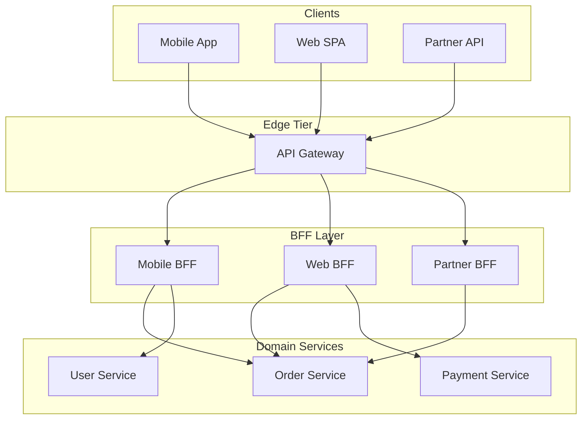
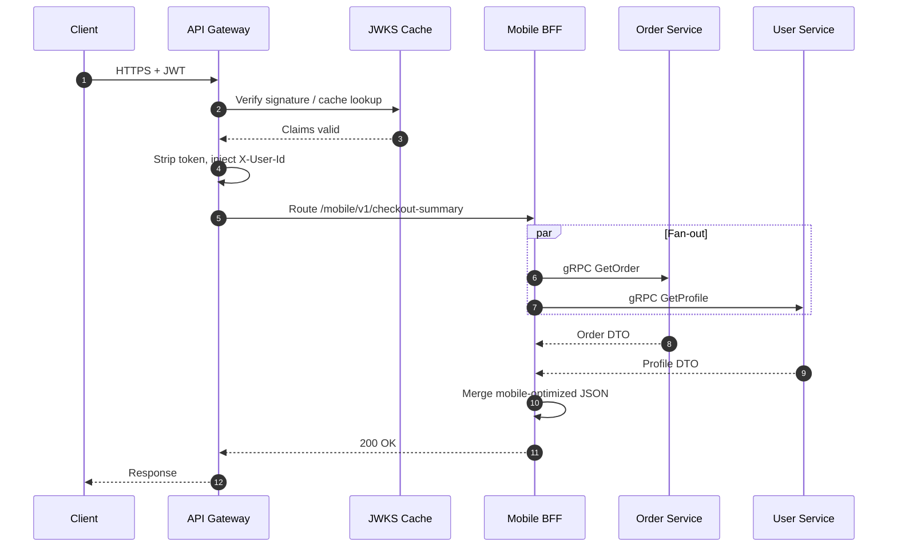

## Executive Summary

An **API Gateway** is the platform **ingress control plane**: TLS termination, authentication, authorization, routing, rate limiting, and protocol translation. A **Backend for Frontend (BFF)** sits behind (or beside) the gateway and **shapes responses per client** — mobile, web, partner API — by aggregating multiple downstream calls into one client-optimized payload. Keep the gateway **lean and stateless**; push business composition to BFFs or domain services so the edge does not become a distributed monolith.

- **Video reference:** [API Gateway & BFF Pattern Explained](https://www.youtube.com/watch?v=d2z78guUR4g)

---

## Problem It Solves

| Symptom without gateway | Root cause | Gateway/BFF fix |
| :--- | :--- | :--- |
| Every service exposes public TLS + JWT | Duplicated security bugs | Single verified edge |
| Mobile app makes 12 REST calls per screen | Chatty clients | BFF aggregation |
| Partner API needs different field shapes | One-size DTO leaks internals | Dedicated partner BFF |
| DDoS on checkout | No central throttle | Token bucket at ingress |

Clients should not know your internal service topology, port matrix, or gRPC vs REST mix.

---

## Where It Fits

- **API Gateway:** All **north-south** traffic from internet, mobile, B2B partners.
- **BFF:** Per **client experience** — `mobile-bff`, `web-bff`, `partner-bff` — behind the gateway.
- **Not here:** East-west service-to-service auth (mesh/mTLS), batch ETL, internal admin tools on private networks.

See also: [Layer 4 vs Layer 7 Ingress](/system-design/layer4-layer7-multi-tier-ingress-routing/) and [Service Discovery](/microservices/02-service-communication/service-discovery/).

---

## Architecture Diagram



### Request flow (aggregation)



---

## Internal Working

### API Gateway responsibilities

| Concern | Typical implementation | Notes |
| :--- | :--- | :--- |
| **TLS termination** | Envoy, Kong, AWS ALB + API GW | Cert rotation at edge only |
| **AuthN** | JWT validation vs JWKS | Cache keys; short TTL |
| **AuthZ** | Scope/role checks at route | Fine-grained authz often in BFF/service |
| **Routing** | Path/host → upstream cluster | Sync with service discovery |
| **Rate limiting** | Token bucket per IP/API key/user | See [Distributed Rate Limiter](/system-design/distributed-rate-limiter/) |
| **Protocol translation** | REST ↔ gRPC via transcoding | Keep schemas in protobuf |

**Runtime:** High-throughput gateways use **async I/O** (Netty, Envoy, Nginx) — thousands of idle connections without one thread per socket.

### BFF responsibilities

| Concern | Gateway | BFF |
| :--- | :--- | :--- |
| **Primary role** | Cross-cutting ingress | Client-specific composition |
| **Business logic** | None | Presentation + orchestration only |
| **State** | Stateless | Stateless; no domain DB |
| **Ownership** | Platform / SRE | Product / client squad |
| **Deploy cadence** | Infrequent | Per mobile/web release |

**Anti-pattern:** Gateway executes SQL, encodes promo rules, or owns checkout saga — that is a **distributed monolith at the edge**.

### Fan-out latency

Aggregated endpoints wait for **max(downstream latencies)**. Mitigations:

- Parallel calls with `CompletableFuture` / `asyncio.gather` / goroutines.
- Per-dependency timeouts **shorter** than client timeout.
- Partial responses with degraded sections (recommendations empty, cart still loads).
- Circuit breakers on BFF outbound clients — see [Resilience Patterns](/microservices/05-resilience-patterns/resilience-patterns/).

---

## Design Options

| Pattern | When | Risk |
| :--- | :--- | :--- |
| **Single gateway + multiple BFFs** | Default for product orgs | More deployables to operate |
| **Gateway-only (no BFF)** | Thin CRUD APIs, few clients | Fat clients; coupling to domain DTOs |
| **GraphQL at BFF** | Highly variable client fields | N+1 without DataLoader discipline |
| **Mesh ingress (Istio Gateway)** | K8s-native, mTLS east-west | Steeper ops learning curve |

---

## Tradeoffs

| Pros | Cons | When NOT to use |
| :--- | :--- | :--- |
| Hides internal topology | Extra network hop | Internal-only east-west |
| Central security enforcement | Gateway SPOF if mis-sized | Monolith with one client |
| Client-optimized payloads | Fan-out tail latency | Simple pass-through CRUD |

---

## Scalability

- Gateway scales **horizontally** — stateless replicas behind L4/L7 load balancer.
- BFF scales per client traffic; isolate noisy partner BFF from consumer mobile.
- JWKS cache and route config should be **local + watched** — avoid per-request identity provider calls.

---

## Reliability

| Failure | Symptom | Mitigation |
| :--- | :--- | :--- |
| Gateway thread exhaustion | Platform-wide 503 | Async I/O; short downstream timeouts |
| Stale service registry | Random 404/503 | Health-check-driven discovery |
| JWKS fetch failure | Total auth outage | Cached JWKS + break-glass policy |
| BFF fan-out storm | P99 spikes | Breakers; bulkhead per dependency |

---

## Security Considerations

- Validate JWT at gateway; forward **sanitized** identity headers (`X-User-Id`, `X-Tenant-Id`) — never forward raw bearer tokens to internal services if avoidable.
- mTLS or service mesh identity for gateway → BFF → service hops.
- WAF + bot protection at outer edge; OWASP rate limits on auth endpoints.

---

## Observability

- RED metrics per route: rate, errors, duration (`http_server_duration_seconds`).
- Trace gateway → BFF → service with propagated `traceparent`.
- Log `request_id`, `user_id` (hashed if PII), `route`, `upstream_status` — not full JWT.

---

## Production Lessons

- **Lean gateway rule:** If a change needs a product manager, it does not belong in the gateway.
- Version BFF APIs (`/mobile/v2/`) independently from domain services.
- Document **which team owns** gateway routes vs BFF aggregation to avoid deploy deadlock.

---

## Common Failures

| Failure | Cause |
| :--- | :--- |
| Gateway monolith | Years of business rules in Lua/Kotlin filters |
| Auth thundering herd | Cold JWKS cache on every pod restart |
| Wrong timeout chain | Client gives up while gateway still waiting |

---

## Common Mistakes

- Putting database queries in the gateway "just for one screen."
- One BFF for mobile + partner — partner SLAs pollute consumer deploys.
- Returning internal stack traces through the gateway on 500.

---

## Interview Questions

1. Gateway vs BFF — who owns checkout aggregation?
2. How do you avoid fan-out latency dominating P99?
3. Why strip the JWT at the edge?
4. What breaks if the gateway is the only rate limiter and it fails open?
5. When would you skip a BFF entirely?

> **60-second answer:** The API Gateway is the stateless security and routing edge — TLS, JWT, rate limits, protocol translation. BFFs are client-specific composition layers behind it that aggregate domain services into payloads tuned for mobile, web, or partners. Keep business logic out of the gateway to avoid a distributed monolith. Aggregated endpoints fan out in parallel with per-service timeouts and circuit breakers because total latency is bounded by the slowest dependency. Validate identity once at the edge and pass sanitized context headers internally.

---

## Implementation




```java
@RestController
@RequestMapping("/mobile/v1")
public class CheckoutBffController {

    private final OrderClient orders;
    private final UserClient users;

    @GetMapping("/checkout-summary")
    public CheckoutSummaryResponse summary(@RequestHeader("X-User-Id") String userId,
                                           @RequestParam String orderId) {
        CompletableFuture<OrderView> orderF = orders.getOrderAsync(orderId);
        CompletableFuture<UserView> userF = users.getProfileAsync(userId);
        return CompletableFuture.allOf(orderF, userF)
            .orTimeout(800, TimeUnit.MILLISECONDS)
            .thenApply(v -> CheckoutSummaryResponse.merge(orderF.join(), userF.join()))
            .join();
    }
}
```




```go
func (b *MobileBFF) CheckoutSummary(ctx context.Context, userID, orderID string) (Summary, error) {
    ctx, cancel := context.WithTimeout(ctx, 800*time.Millisecond)
    defer cancel()

    g, ctx := errgroup.WithContext(ctx)
    var order Order
    var profile Profile
    g.Go(func() error { return b.orders.Get(ctx, orderID, &order) })
    g.Go(func() error { return b.users.Profile(ctx, userID, &profile) })
    if err := g.Wait(); err != nil {
        return Summary{}, err
    }
    return MergeMobile(order, profile), nil
}
```




```python
async def checkout_summary(user_id: str, order_id: str) -> dict:
    async with asyncio.timeout(0.8):
        order, profile = await asyncio.gather(
            order_client.get_order(order_id),
            user_client.get_profile(user_id),
        )
    return mobile_checkout_dto(order, profile)
```




```text
ON request at gateway:
  VERIFY jwt via cached JWKS
  STRIP Authorization header
  SET X-User-Id, X-Tenant-Id from claims
  ROUTE to BFF or service by path prefix
  APPLY rate_limit(bucket_key = api_key OR user_id)

ON BFF aggregate endpoint:
  PARALLEL for each downstream in fan_out_list:
    CALL with deadline = min(client_deadline - gateway_slack, 300ms)
  MERGE results to client DTO
  RETURN partial success if optional deps fail
```




---

## Architect Notes

Canonical ingress page. Implementation stacks: Kong, Envoy Gateway, AWS API Gateway + Lambda BFF, Spring Cloud Gateway. East-west patterns: [Sidecar & Service Mesh](/microservices/07-platform-patterns/sidecar-and-service-mesh/).
