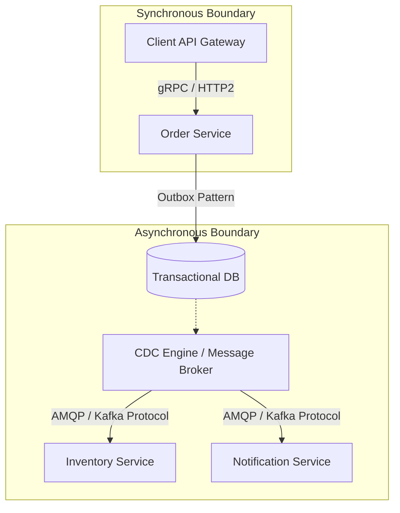

## Executive Summary

Hybrid Communication Topology (Synchronous Request-Response vs. Asynchronous Event-Driven) defines how distributed services exchange data over network boundaries, balancing immediate consistency needs against the decoupling and fault-isolation benefits of non-blocking message paths.

- **Video Reference:** [Microservices Communication Explained](https://www.youtube.com/watch?v=DKQLhy9bgdk)

---

## Architecture Diagram



## Internal Working

**Synchronous Hot-Path:** Critical, read-heavy, or immediate-validation workflows run over HTTP/2 (via gRPC with binary Protocol Buffers) or HTTP/1.1 (REST/JSON) to block client execution until a response is returned.

**Asynchronous Background-Path:** Post-validation mutations or side effects run over asynchronous binary protocols (Kafka wire protocol, AMQP, or MQTT) using non-blocking I/O event loops.

**Coordination & State Mechanics:**

* **Context Propagation:** Synchronous calls pass telemetry context via standard HTTP/gRPC metadata headers. Asynchronous boundaries preserve this context by embedding W3C trace contexts inside message envelopes, ensuring unbroken distributed tracing across thread hops.

See also: [Event-Driven Architecture & Log Streaming](/microservices/event-driven-architecture-log-streaming/), [API Gateway & BFF Pattern](/microservices/02-service-communication/api-gateway-and-bff/), and [Transactional Outbox Pattern](/database-handbook/transactional-outbox-pattern/).

---

### Sync vs. Async Topology Comparison

| Dimension | Synchronous (gRPC/REST) | Asynchronous (Kafka/AMQP) |
| :--- | :--- | :--- |
| **Coupling** | Tight temporal coupling | Loose; broker buffers spikes |
| **Latency model** | $\sum \text{hop latency} + \text{serialization}$ | Flat producer latency; consumer lag deferred |
| **Consistency** | Read-your-writes within sync chain | Eventual; race conditions on read replicas |
| **Failure propagation** | Cascades via blocked threads | Absorbed by broker queue depth |
| **Best fit** | Queries, validation, auth checks | Commands, side effects, notifications |

---

## Tradeoffs

### Network & Latency

Synchronous chains suffer from **latency amplification**: Total Latency = $\sum \text{Latency}_{\text{hop}} + \text{Serialization}$. Asynchronous boundaries trade immediate confirmation for flat, predictable producer latencies, though they introduce processing lag over the messaging bus.

### Data Consistency

Synchronous communication allows for immediate read-your-writes guarantees within transaction-adjacent services. Asynchronous messaging introduces eventual consistency, exposing the application to race conditions where read replicas or downstream stores temporarily disagree on the current state.

## Common Failures

Synchronous paths are highly vulnerable to **thread pool exhaustion**. If a downstream service slows down, upstream threads block waiting for timeouts, causing failures to cascade up the stack. Asynchronous architectures naturally absorb these traffic spikes by using the message broker as a buffer.

| Failure Mode | Symptom | Mitigation |
| :--- | :--- | :--- |
| **Sync chain cascade** | Gateway outage from one slow service | Circuit breakers; aggressive read timeouts |
| **Thread pool starvation** | Upstream 503s despite healthy CPU | Bulkhead isolation; async offload for side effects |
| **Broken trace context** | Orphan spans across async hop | W3C `traceparent` in message headers |
| **Sync-for-everything monolith** | Tight coupling; blast radius = full mesh | CQRS rule: sync queries, async commands |
| **Broker as silent buffer** | Hidden lag until retention breach | Consumer lag alerts; scale on lag not CPU |

---

### "Sync for Queries, Async for Commands" Decision Flow

```text
  Incoming request
        │
        ▼
  Is immediate response required? ──No──Γû║ Append to outbox / publish event
        │
       Yes
        ▼
  Is it a read (no mutation)? ──Yes──Γû║ Sync gRPC/REST with timeout + breaker
        │
       No (command)
        ▼
  Can user tolerate eventual confirmation? ──Yes──Γû║ Async command path
        │
       No
        ▼
  Sync command + saga/orchestrator for multi-step consistency
```

---

## Interview Questions

### The "Junior" Mistake

Defaulting to synchronous REST calls for every service-to-service interaction, creating a brittle, tightly-coupled distributed monolith that fails whenever any single downstream node drops offline.

### The "Senior" Counter-Measure

Design around a **"Synchronous for Queries, Asynchronous for Commands"** strategy. If a synchronous call is required across boundaries, enforce aggressive connection/read timeouts along with a circuit breaker (e.g., Resilience4j, Envoy) that fails fast with a fallback response rather than allowing threads to back up.

```text
  Order Service ──gRPC──Γû║ Inventory Service (sync query: "in stock?")
        │
        └──outbox──Γû║ Kafka ──Γû║ Inventory Service (async: "reserve stock")
                              Notification Service (async: "send email")
```

---


---

## Where It Fits

Apply at service boundaries within the microservices fleet. Cross-link to domain handbooks for broker, database, and cache engine internals.

---

## Security Considerations

Apply zero-trust between services, mTLS in mesh, and least-privilege credentials per service identity.

---

## Observability

Export RED metrics, structured logs with `trace_id`, and distributed traces on every cross-service hop. See [Observability](/microservices/08-observability/observability/).

---

## Architect Notes

Expanded from legacy playbook content. See related modules in the curriculum sidebar for adjacent patterns.
