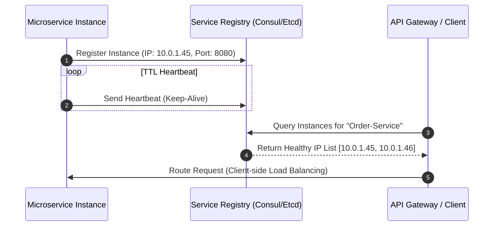

## Executive Summary

Dynamic Service Discovery and Service Registry (Client-Side vs. Server-Side Discovery) automates the tracking of dynamically changing network locations (IPs and ports) of auto-scaling microservice instances, eliminating hardcoded network configurations and preventing routing to unhealthy nodes.

- **Video Reference:** [Service Discovery Explained](https://www.youtube.com/watch?v=Pmzrogq4W4I)

---

## Architecture Diagram



## Internal Working

**Registration & Heartbeats:** Upon initialization, an instance registers its metadata (IP, port, service name) with the Service Registry (e.g., HashiCorp Consul, etcd) over gRPC or HTTP/1.1. It maintains this lease by sending periodic TTL heartbeats (e.g., every 5ΓÇô10 seconds).

**Discovery Mechanism:** In **Client-Side Discovery**, the caller queries the registry directly, caches the topology locally, and uses client-side load balancing (e.g., Ribbon, internal Envoy configuration) to route requests. In **Server-Side Discovery**, a load balancer acts as a proxy, querying the registry and forwarding the request.

**State Management:** Registry engines utilize consensus algorithms (Raft or Paxos) to guarantee data replication and strong consistency across registry nodes, ensuring a uniform view of the service cluster state.

See also: [API Gateway & BFF Pattern](/microservices/02-service-communication/api-gateway-and-bff/), [Load Balancers & Routing Algorithms](/system-design/load-balancers-and-routing-algorithms/), and [Service Mesh Architecture](/microservices/service-mesh-architecture/).

---

### Client-Side vs. Server-Side Discovery

| Dimension | Client-Side Discovery | Server-Side Discovery |
| :--- | :--- | :--- |
| **Who resolves endpoints** | Calling service or SDK | Load balancer / API gateway |
| **Hot-path hops** | One fewer proxy hop | Extra proxy hop per request |
| **Client complexity** | Registry polling, cache, LB logic | Minimal — caller uses single VIP |
| **Typical stacks** | Consul + Ribbon, Eureka + Feign | AWS ELB + ECS, Nginx + Consul template |
| **Failure isolation** | Per-client stale cache risk | Centralized routing; single LB SPOF |

---

## Tradeoffs

### Network & Latency

Client-side discovery keeps the network overhead low by eliminating an intermediate proxy hop on the request hot-path. However, it shifts the computing load to the client, which must manage background registry polling, connection pooling, and cache invalidation.

### Data Consistency

A common trade-off is **registry propagation delay**. When an instance crashes or is taken down, it takes time for the heartbeat to expire and for that update to propagate to all clients. This window can lead to intermittent HTTP 502/503 routing errors.

## Common Failures

If the service registry undergoes a network partition or a total outage, it can freeze the entire architecture. New instances won't be discoverable, and old instances won't be cleared. To prevent this, clients must fall back to their **last-known-good local cache** when the registry is unreachable.

| Failure Mode | Symptom | Mitigation |
| :--- | :--- | :--- |
| **Heartbeat expiry lag** | 502/503 to dead instances | Aggressive health checks; outlier detection in Envoy |
| **Registry partition** | Split-brain endpoint lists | Raft quorum sizing; multi-AZ registry cluster |
| **Registry total outage** | No new instances discoverable | Client-side last-known-good cache with TTL cap |
| **Static DNS in K8s** | Stale endpoints under rapid scale | CoreDNS + kube-proxy; avoid hardcoded IPs |
| **Cache stampede on refresh** | Registry overload after deploy | Jittered polling intervals; watch-based push (Consul) |

---

### Kubernetes Discovery Abstraction

```text
  Pod starts
      │
      ▼
  kubelet registers with API server
      │
      ▼
  Service object ──Γû║ CoreDNS (cluster.local DNS)
      │                    │
      ▼                    ▼
  kube-proxy (iptables/IPVS)   Client resolves order-service.default.svc
      │
      ▼
  Traffic routed to healthy pod endpoints (no app-level discovery code)
```

In Kubernetes, discovery is infrastructure-native — application code resolves a stable DNS name; endpoint updates are handled by the control plane.

---

## Interview Questions

### The "Junior" Mistake

Suggesting hardcoded static DNS names or standard cloud load balancers for highly dynamic, containerized environments without explaining how dead instances are pruned or how high-frequency scaling is managed.

### The "Senior" Counter-Measure

Advocate for modern **Service Mesh** abstractions (e.g., Envoy sidecars coordinated by an Istio control plane). Explain how **Kubernetes** abstracts discovery via CoreDNS and kube-proxy, removing discovery logic entirely from the application codebase and shifting it to the infrastructure layer.

```text
  Discovery responsibility stack (bottom = preferred in K8s):

    Application SDK (Eureka/Ribbon)     ← legacy microservices
    Service Mesh (Istio/Linkerd)        ← infra-layer, mTLS + LB
    Kubernetes (CoreDNS + kube-proxy)   ← platform default
```

---


---

## Where It Fits

Apply at service boundaries within the microservices fleet. Cross-link to domain handbooks for broker, database, and cache engine internals.

---

## Security Considerations

Apply zero-trust between services, mTLS in mesh, and least-privilege credentials per service identity.

---

## Observability

Export RED metrics, structured logs with `trace_id`, and distributed traces on every cross-service hop. See [Observability](/microservices/08-observability/observability/).

---

## Architect Notes

Expanded from legacy playbook content. See related modules in the curriculum sidebar for adjacent patterns.
