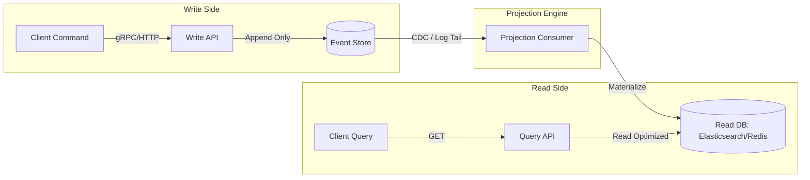

## Executive Summary

CQRS (Command Query Responsibility Segregation) paired with Event Sourcing separates the read data models from write data models to optimize performance and throughput, while storing state changes as a sequence of immutable events rather than overwriting single database rows.

- **Video Reference:** [CQRS & Event Sourcing Explained](https://www.youtube.com/watch?v=DpuQ3-7e-rY)

---

## Architecture Diagram



## Internal Working

**Write Pipeline:** A command arrives at the Write API → validates against business invariants → appends an immutable event into an Event Store (e.g., EventStoreDB, highly customized Postgres) → acknowledges write.

**Read Pipeline:** An asynchronous worker pools or consumes events from the Event Store's append-only log → projects/denormalizes payload data into a dedicated read database (e.g., Elasticsearch for text search, Redis for cache, PostgreSQL `jsonb` for view models) optimized for client presentation.

**State Management:** Core entities are reconstituted at runtime on the write side by fetching all historical events for a specific `aggregate_id` and replaying them sequentially.

See also: [Event-Driven Architecture & Log Streaming](/microservices/event-driven-architecture-log-streaming/) for broker-based projection and CDC relay patterns.

---

### Write Model vs. Read Model Responsibilities

| Dimension | Write Side (Command) | Read Side (Query) |
| :--- | :--- | :--- |
| **Data shape** | Normalized aggregates, event append log | Denormalized views tuned for UI queries |
| **Operations** | Validate invariants, append events | Index scans, filters, full-text search |
| **Consistency** | Strong within aggregate boundary | Eventually consistent with event log |
| **Storage** | EventStoreDB, Kafka log, custom Postgres WAL | Elasticsearch, Redis, read-replica Postgres |
| **Scaling axis** | Write throughput, audit durability | Query fan-out, search latency |

---

## Tradeoffs

### Network & Latency

Sub-millisecond execution on the write path since it only executes append operations. The trade-off is shifted to the read-side synchronization loop, where network latency during projection processing introduces **replication lag**.

### Data Consistency

The system is **eventually consistent**. If a user submits a command and instantly refreshes their page, the projection engine may still be processing the event log, presenting an apparent stale state.

## Common Failures

**Event Schema Evolution:** If an event structure changes over time, old historic events cannot be modified because the event log is immutable. System code must maintain backward-compatible **upcasters** to transform historical payloads on the fly during replay phases.

**Infinite Log Replay:** As event counts grow into the millions, replaying logs from genesis to rebuild an aggregate state becomes too slow. The architecture must introduce scheduled **Snapshots** (e.g., saving aggregate state every 1,000 events) to anchor reconstruction baselines.

| Failure Mode | Symptom | Mitigation |
| :--- | :--- | :--- |
| **Projection lag** | User sees stale UI after write | Read-side token tracking; optimistic client state |
| **Schema break on replay** | Aggregate reconstitution crashes | Versioned events + upcaster chain per schema revision |
| **Genesis replay timeout** | Slow cold-start; recovery SLA breach | Periodic snapshots + incremental replay from anchor |
| **Dual write to read DB** | Read model diverges from event log | Single writer per projection; idempotent consumers |
| **Over-applied CQRS** | CRUD services with 3x operational cost | Restrict to audit-heavy, high-collaboration domains |

---

### Snapshot & Replay Mechanics

```text
  Events:  [E1][E2]...[E999][E1000] ──Γû║ Snapshot S1000 saved
                                              │
  Reconstitute aggregate at E1500:           ▼
         Load S1000 + replay E1001..E1500   (not E1..E1500)
```

Snapshots trade storage overhead for bounded recovery time. Snapshot frequency is a tunable knob: more frequent snapshots reduce replay cost but increase write amplification on the snapshot store.

---

## Interview Questions

### The "Junior" Mistake

Treating CQRS/Event Sourcing as a default golden standard for every standard microservice CRUD module, adding unnecessary architectural complexity where simple relational databases would suffice.

### The "Senior" Counter-Measure

Advise restricting CQRS/Event Sourcing only to **high-value, highly collaborative domains** that inherently rely on historic audit trails and state transitions (e.g., financial ledgering, e-commerce shopping carts, airline booking, logistics tracking). Clearly explain how to address replication lag using **read-side token tracking** or **client-side optimistic UI state management**.

```text
  Client submits command
        │
        ▼
  Write API returns { commandId, expectedVersion }
        │
        ▼
  UI holds optimistic state until projection cursor >= commandId
        OR poll Query API with ?afterEventSeq=N
```

---


---

## Where It Fits

Apply at service boundaries within the microservices fleet. Cross-link to domain handbooks for broker, database, and cache engine internals.

---

## Security Considerations

Apply zero-trust between services, mTLS in mesh, and least-privilege credentials per service identity.

---

## Observability

Export RED metrics, structured logs with `trace_id`, and distributed traces on every cross-service hop. See [Observability](/microservices/08-observability/observability/).

---

## Architect Notes

Expanded from legacy playbook content. See related modules in the curriculum sidebar for adjacent patterns.
