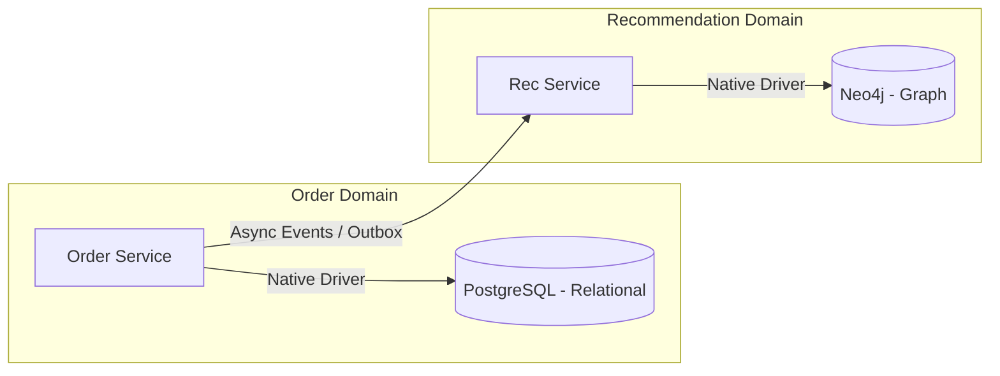

## Executive Summary

Database per Microservice enforces loose coupling and domain encapsulation by ensuring a microservice's persistence store is accessible only via its public API, preventing hidden data dependencies and allowing teams to select storage engines tailored to their specific access patterns.

- **Video Reference:** [Database Per Microservice Explained](https://www.youtube.com/watch?v=ecuEkmFs5Vk)

---

## Architecture Diagram



## Internal Working

Microservices connect to their assigned databases using **isolated connection pools**. No service may execute cross-database joins or directly query another domain's tables.

**Polyglot persistence** allows each service to use the optimal storage engine for its workload—such as PostgreSQL for relational order transactions, MongoDB for flexible product catalogs, or Neo4j for graph-based social networks.

### Coordination Mechanics

Shared master data (e.g., user profiles or product names) is replicated across service boundaries asynchronously using Change Data Capture (CDC) or event streaming. Services store lightweight, read-only copies of this external data locally to eliminate runtime dependencies on other services during transactions.

See also: [Saga Pattern](/microservices/03-data-management/saga/), [CQRS & Event Sourcing](/microservices/03-data-management/cqrs-and-event-sourcing/), and [Transactional Outbox Pattern](/database-handbook/transactional-outbox-pattern/).

---

### Polyglot Persistence Selection Matrix

| Domain workload | Typical engine | Access pattern |
| :--- | :--- | :--- |
| **Transactional orders** | PostgreSQL, MySQL | ACID writes, relational joins within boundary |
| **Product catalog** | MongoDB, DynamoDB | Flexible schema, document reads |
| **Social graph / recommendations** | Neo4j, Neptune | Traversal queries, relationship-heavy reads |
| **Session / cart cache** | Redis | Sub-millisecond key-value lookups |
| **Search & discovery** | Elasticsearch, OpenSearch | Full-text, faceted queries |

---

## Tradeoffs

### Network & Latency

Eliminating direct database joins forces applications to handle data aggregation at the code layer. Joining data across domains requires either making multiple network calls to separate service APIs or implementing a **CQRS read-side projection** database.

### Data Consistency

Distributed data splitting makes ACID transactions across boundaries impossible without running into distributed locking issues. The system must accept **eventual consistency**, using patterns like the [Saga pattern](/microservices/03-data-management/saga/) to handle failures and reconcile cross-domain state.

## Common Failures

Replicated lookup data can fall out of sync if the underlying event pipelines slow down or fail. If a service depends on an external API for reference validation during a write operation, an outage in that external service can bring down the entire write path.

| Failure Mode | Symptom | Mitigation |
| :--- | :--- | :--- |
| **Stale reference replica** | Writes rejected or based on outdated master data | CDC lag monitoring; local cache TTL + fallback policy |
| **Sync validation dependency** | Write path blocked by external service outage | Async validation; saga compensation; cached allow-lists |
| **Cross-DB join workaround** | N+1 API calls; P99 latency spikes | CQRS read model; BFF aggregation at query layer |
| **Shared schema for reporting** | Hidden coupling; deploy lock-in | ETL/CDC to warehouse; no cross-schema queries |
| **Connection pool bleed** | One service starves another's DB | Strict per-service credentials; network policy isolation |

---

### Reporting & Analytics Boundary

```text
  Operational DBs (per service)          Analytics Plane
  Γöî─────────┐  Γöî─────────┐              Γöî──────────────────┐
  │ Order   │  │ Product │  ──CDC/ETL──Γû║  │ Snowflake /      │
  │ Postgres│  │ MongoDB │              │ BigQuery / Lake   │
  └─────────┘  └─────────┘              └──────────────────┘
        Γû▓                                        │
        │                                        ▼
   NO cross-joins                          BI / dashboards /
   at runtime                               cross-domain SQL
```

Operational databases serve live traffic only. Cross-domain reporting runs exclusively against the warehouse or lakehouse fed by separate pipelines.

---

## Interview Questions

### The "Junior" Mistake

Claiming that every microservice has a completely separate database, but then proposing shared database links or direct cross-schema queries to handle reporting requirements.

### The "Senior" Counter-Measure

Acknowledge the operational complexity of managing isolated databases. Explain that analytics and cross-domain reporting should be shifted completely off operational databases and onto an **enterprise data warehouse or data lakehouse** (e.g., Snowflake, BigQuery) via separate ETL/CDC pipelines.

```text
  Rule of thumb:
    ΓÇó Writes  → own database only
    ΓÇó Reads   → own DB + local replicas of foreign reference data
    ΓÇó Reports → warehouse/lakehouse (never operational cross-joins)
```

---


---

## Where It Fits

Apply at service boundaries within the microservices fleet. Cross-link to domain handbooks for broker, database, and cache engine internals.

---

## Security Considerations

Apply zero-trust between services, mTLS in mesh, and least-privilege credentials per service identity.

---

## Observability

Export RED metrics, structured logs with `trace_id`, and distributed traces on every cross-service hop. See [Observability](/microservices/08-observability/observability/).

---

## Architect Notes

Expanded from legacy playbook content. See related modules in the curriculum sidebar for adjacent patterns.
