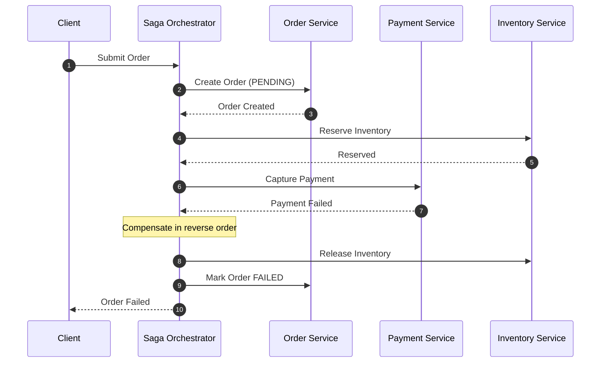
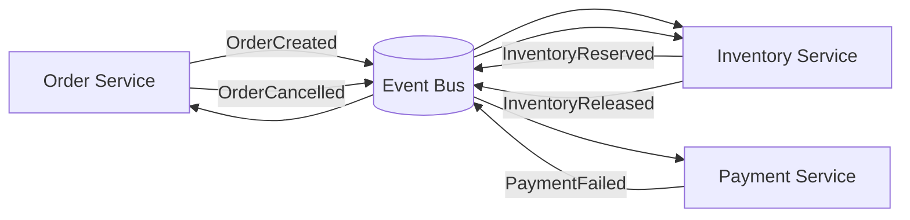

## Executive Summary

The **Saga pattern** coordinates multi-service business transactions without two-phase commit (2PC). Each service performs a **local ACID transaction** and publishes success or failure; on failure, the saga runs **compensating transactions** — forward counter-actions (credit memo, release hold, cancel order), not cross-database rollbacks. Choose **orchestration** when flows branch, need timeouts, or require a single timeline; choose **choreography** when the flow is linear, teams are mature on events, and you accept distributed trace complexity.

- **Video reference:** [Saga Pattern Explained](https://www.youtube.com/watch?v=dJI2saoM5_k)

---

## Problem It Solves

| Business pain | Technical symptom | Why 2PC fails |
| :--- | :--- | :--- |
| Checkout spans order, payment, inventory | One failure leaves partial state | 2PC locks rows across DBs — latency + deadlock risk |
| Refund after failed ship | Orphaned payment or double charge | XA coordinators are fragile at cloud scale |
| Long-running approval flows | Holding locks for minutes | 2PC does not tolerate human-in-the-loop |

Naive approach: call services sequentially and hope. Payment fails after inventory reserved → stock locked, no order, angry ops. Saga replaces hope with **explicit forward steps + compensations** and **idempotency** on every step.

---

## Where It Fits

- **Use sagas** when a business operation spans multiple **database-per-service** boundaries and you need **eventual consistency** with an audit trail.
- **Do not use** when a single monolith DB can enforce ACID, or when strong isolation on every read is mandatory without semantic locking.
- Pairs with [Outbox & CDC](/microservices/03-data-management/outbox-and-cdc/) for durable orchestrator state and [CQRS & Event Sourcing](/microservices/03-data-management/cqrs-and-event-sourcing/) in audit-heavy domains.

---

## Architecture Diagram

### Orchestration (central coordinator)



### Choreography (event-driven, no central brain)



---

## Internal Working

### Saga step types

| Step type | On success | On failure |
| :--- | :--- | :--- |
| **Forward action** | Commit local txn; emit event/command | Trigger compensation chain |
| **Compensating action** | Undo business effect (not DELETE) | Retry with backoff; escalate to ops |
| **Pivot / read-only** | Validate preconditions | Abort saga early |

### Orchestration vs choreography

| Dimension | Choreography | Orchestration |
| :--- | :--- | :--- |
| **Coordination** | Decentralized — services react to events | Centralized — orchestrator issues commands |
| **Visibility** | Hard end-to-end trace across event mesh | Single state machine with full timeline |
| **Coupling** | Loose — services know neighbor events only | Tighter — orchestrator knows all participants |
| **Failure handling** | Each service must publish compensating events | Orchestrator sequences compensations explicitly |
| **Timeouts / branching** | Awkward — scattered timers | Natural fit (Temporal, Step Functions) |
| **Best fit** | Simple linear flows, mature Kafka ops | Complex branching, SLAs, human approval |

**Choreography runtime:** Service A commits locally → publishes `OrderCreated` → Service B consumes → local txn → publishes `PaymentCaptured` or `PaymentFailed` → downstream compensates via subscribed events. No central coordinator; correlation via `saga_id` / `trace_id` headers.

**Orchestration runtime:** Orchestrator persists state (often **transactional outbox** in same DB as state machine) → sends gRPC/HTTP commands → waits for replies or async callbacks → transitions state → on failure, runs compensations **N-1 … 1** in reverse order.

### Semantic locking (missing ACID isolation)

Sagas sacrifice **Isolation**. Mid-saga rows are visible as `PENDING` — concurrent users may see inconsistent reads. Mitigation:

- Status columns: `PENDING_PAYMENT`, `PENDING_INVENTORY` — reject conflicting operations.
- Optimistic versioning on aggregate roots.
- UI copy: "Processing…" instead of showing partial totals as final.

### Compensation is not rollback

```text
  Step N fails
        │
        ▼
  Compensate N-1 ──► Compensate N-2 ──► … ──► Compensate 1
        │                  │                         │
        ▼                  ▼                         ▼
  Credit memo         Release inventory hold    Cancel order (FAILED)
  (audit retained)    (not ROLLBACK txn)        (status + event log)
```

Every compensating command carries an **idempotency key** (`saga_id + step_name`) so retries do not double-credit or double-release.

---

## Design Options

| Approach | Pros | Cons |
| :--- | :--- | :--- |
| **Choreography + Kafka** | No orchestrator SPOF; team autonomy | Hard to debug; implicit flow |
| **Orchestration + Temporal** | Durable timers, retries, UI for ops | Operational complexity; vendor/learn curve |
| **Orchestration + custom + outbox** | Full control | You own state machine bugs |
| **2PC / XA** | Strong isolation | Does not scale; blocking locks |

See also: [Transactional Outbox Pattern](/database-handbook/transactional-outbox-pattern/) for atomic orchestrator state + broker publish.

---

## Tradeoffs

| Pros | Cons | When NOT to use |
| :--- | :--- | :--- |
| No distributed locks | Eventual consistency; dirty reads without semantic lock | Single DB monolith checkout |
| Per-service autonomy | Compensation design is domain-hard | When business requires serializable cross-aggregate reads |
| Audit trail via compensations | Stuck saga if compensation fails | Teams without idempotency discipline |

---

## Scalability

- Orchestrator DB is a **hot write path** — partition sagas by `tenant_id` or `order_id`.
- Choreography scales with **consumer groups**; watch **hot partitions** if all events share one key.
- Keep saga steps **small and fast**; long steps belong in async workers with heartbeat, not blocking HTTP chains.

---

## Reliability

| Failure | Mitigation |
| :--- | :--- |
| **Compensation failure** | Persistent retry queue; DLQ + ops dashboard |
| **Orchestrator state loss** | Durable store + outbox; never in-memory only |
| **Duplicate forward step** | Idempotency store per `(saga_id, step)` |
| **Choreography blindness** | `saga_id` on every event; OpenTelemetry links |

---

## Security Considerations

- Orchestrator credentials need **least privilege** per downstream service — not one super-token.
- Compensating APIs (refund, release hold) are **high-value** — require mTLS + service identity, rate limits, and fraud checks on credit paths.

---

## Observability

- Metrics: `saga_started_total`, `saga_completed_total`, `saga_compensating_total`, `saga_stuck_age_seconds`.
- Logs: structured `saga_id`, `step`, `correlation_id` on every hop.
- Traces: one root span per saga; child spans per forward/compensate step.

---

## Production Lessons

- Design compensations **before** go-live — "we'll figure out rollback later" fails in payments.
- Run **game days** for stuck saga at step 3 of 5 with compensation service down.
- Prefer **orchestration** until choreography flow is documented and testable in staging.

---

## Common Failures

| Failure | Symptom | Fix |
| :--- | :--- | :--- |
| Non-idempotent compensate | Double refund | Idempotency keys + dedup store |
| Missing semantic lock | Double ship on pending order | Status guards on aggregate |
| Infinite compensate retry | DLQ flood | Max attempts + human escalation |
| Choreography cycle | Event loop | Explicit saga terminal events |

---

## Common Mistakes

- Treating compensation as `DELETE FROM orders` instead of status transition + audit event.
- Using saga for **read-only** fan-out (use API composition instead).
- Orchestrator without outbox — state committed but command never sent.

---

## Interview Questions

1. Why can't you `ROLLBACK` across microservice databases?
2. Compare choreography vs orchestration for a 6-step checkout with optional gift wrap.
3. What is semantic locking and why do sagas need it?
4. How do you handle a failed compensation after payment already refunded?
5. Where does the transactional outbox fit in the orchestrator?

> **60-second answer:** A saga breaks a distributed transaction into local ACID steps with compensating counter-actions on failure — not 2PC. Orchestration uses a central state machine that commands each service and runs compensations in reverse order; choreography uses events where each service knows only its neighbors. Compensations must be idempotent and leave an audit trail. You lose isolation, so use semantic locks on entity status. Production orchestrators persist state with an outbox so transitions and broker publishes are atomic.

---

## Implementation




```java
// Orchestration-style saga step with idempotent compensation hook
public final class OrderSagaOrchestrator {

    public SagaResult execute(CreateOrderCommand cmd) {
        String sagaId = cmd.sagaId();
        if (steps.alreadyCompleted(sagaId, "CREATE_ORDER")) {
            return SagaResult.resume(sagaId);
        }
        try {
            orderService.createPending(sagaId, cmd);
            steps.markDone(sagaId, "CREATE_ORDER");

            inventoryService.reserve(sagaId, cmd.sku(), cmd.qty());
            steps.markDone(sagaId, "RESERVE_INVENTORY");

            paymentService.capture(sagaId, cmd.paymentId(), cmd.amount());
            steps.markDone(sagaId, "CAPTURE_PAYMENT");

            orderService.confirm(sagaId);
            return SagaResult.success(sagaId);
        } catch (PaymentDeclinedException ex) {
            compensate(sagaId, ex);
            return SagaResult.failed(sagaId, ex.getReason());
        }
    }

    private void compensate(String sagaId, Exception cause) {
        // Reverse order: payment skip if never captured; always release + cancel
        if (steps.completed(sagaId, "RESERVE_INVENTORY")) {
            inventoryService.release(sagaId); // idempotent
        }
        if (steps.completed(sagaId, "CREATE_ORDER")) {
            orderService.markFailed(sagaId, cause.getMessage()); // not DELETE
        }
    }
}
```




```go
// Choreography: publish domain event after local commit
func (s *OrderService) CreateOrder(ctx context.Context, cmd CreateOrderCmd) error {
    if s.idempotency.Seen(cmd.SagaID, "create_order") {
        return nil
    }
    tx, err := s.db.BeginTx(ctx, nil)
    if err != nil {
        return err
    }
    defer tx.Rollback()

    if err := s.repo.InsertPending(ctx, tx, cmd); err != nil {
        return err
    }
    if err := s.outbox.Enqueue(ctx, tx, Event{
        Type:    "OrderCreated",
        SagaID:  cmd.SagaID,
        Payload: cmd,
    }); err != nil {
        return err
    }
    if err := tx.Commit(); err != nil {
        return err
    }
    s.idempotency.Mark(cmd.SagaID, "create_order")
    return nil
}
```




```python
# Compensation handler — idempotent by saga_id + step
def compensate_release_inventory(saga_id: str, sku: str, qty: int) -> None:
    key = f"{saga_id}:release_inventory"
    if idempotency_store.contains(key):
        return
    inventory.release_hold(sku=sku, qty=qty, reason="saga_compensation")
    audit.log(event="InventoryReleased", saga_id=saga_id, sku=sku, qty=qty)
    idempotency_store.put(key)
```




```text
ON saga_step_failed(step N):
  FOR i FROM N-1 DOWN TO 1:
    IF step[i] completed AND NOT compensated[i]:
      SEND compensate[i] WITH idempotency_key = saga_id + step[i]
      WAIT ack OR retry with backoff
  MARK saga FAILED
  ALERT if compensate stuck > SLA
```




---

## Architect Notes

Canonical saga page for the playbook. Engine options: Temporal, AWS Step Functions, Camunda, or custom orchestrator with outbox. For broker semantics see [Kafka Handbook](/kafka-handbook/) — this page owns **coordination pattern**, not broker tuning.
