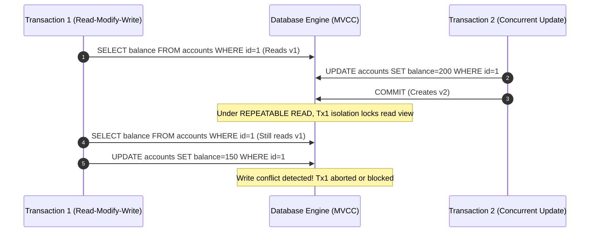

## Executive Summary

Database Isolation Levels and Concurrency Control (Pessimistic vs. Optimistic Locking) defines how a database engine manages simultaneous, competing transactions on the same rows, directly resolving anomalies like dirty reads, non-repeatable reads, and phantom reads within transaction-heavy microservices.

- **Video Reference:** [Database Isolation Levels Explained](https://www.youtube.com/watch?v=q7K20k6rV9E)

---

## Architecture Diagram



## Internal Working

**Read Committed:** The default engine configuration for many relational systems (e.g., PostgreSQL). It uses short-lived read locks to guarantee that data read has been committed before the query execution finishes. It prevents **Dirty Reads**.

**Repeatable Read:** Uses Multi-Version Concurrency Control (MVCC) to create a snapshot of the database at the start of the transaction. A transaction reading a row multiple times will always see the exact same data, preventing **Non-Repeatable Reads**.

**Serializable:** The most strict isolation level. It forces transactions to execute sequentially or applies strict predicate locking to eliminate **Phantom Reads** and write skew anomalies.

### Locking & Concurrency Mechanics

**Optimistic Locking:** Microservices append an abstract incremental field (e.g., `version_id` or a timestamp) to the row structure. Updates explicitly evaluate this predicate:

```sql
UPDATE table SET balance = 150, version = 2
WHERE id = 1 AND version = 1;
```

If another process mutated the row first, the affected row count returns 0, triggering an explicit application-layer rollback or retry loop.

**Pessimistic Locking:** The app issues an explicit blocking statement (e.g., `SELECT ... FOR UPDATE` in SQL) over an active connection pool, forcing concurrent callers to block until the holding transaction issues an explicit `COMMIT` or `ROLLBACK`.

See also: [MVCC Concurrency Anomalies & Locking Layers](/system-design/database-transactions-and-acid-isolation/), [Local Concurrency & MVCC](/database-handbook/local-concurrency-mvcc/), and [Saga Pattern](/microservices/03-data-management/saga/).

---

### Isolation Level vs. Anomaly Prevention

| Isolation level | Dirty read | Non-repeatable read | Phantom read | Typical engine default |
| :--- | :---: | :---: | :---: | :--- |
| **Read Uncommitted** | Possible | Possible | Possible | Rare in production |
| **Read Committed** | Prevented | Possible | Possible | PostgreSQL, Oracle |
| **Repeatable Read** | Prevented | Prevented | Varies by engine | MySQL InnoDB |
| **Serializable** | Prevented | Prevented | Prevented | Highest safety |

---

## Tradeoffs

### Network & Latency

Elevating isolation levels from Read Committed to Serializable increases lock acquisition wait times and conflict rollbacks. Pessimistic locking holds database worker threads open longer, decreasing available connection pool capacity and inflating upstream request latencies.

### Data Consistency

High data isolation inside a single database instance. However, these isolation levels **cannot cross microservice boundaries**. If a single user workflow requires mutating data across two separate microservice databases, local isolation levels provide no protection against global race conditions.

## Common Failures

**Distributed Deadlocks:** If Microservice A locks Row X and attempts to call Microservice B, which is currently blocked waiting for Microservice A to release a lock on Row Y, the system hits a deadlock state. This can quickly exhaust connection pools and freeze upstream operations.

| Failure Mode | Symptom | Mitigation |
| :--- | :--- | :--- |
| **SERIALIZABLE everywhere** | Lock contention; throughput collapse | Default RC/RR; Serializable only where required |
| **Long FOR UPDATE holds** | Connection pool exhaustion | Short transactions; lock only hot rows |
| **Optimistic conflict spike** | High retry rate under write load | Exponential backoff; merge conflict UX |
| **Cross-service workflow** | Local isolation useless | Saga + idempotency; semantic locking |
| **Distributed deadlock** | Both services frozen | Lock ordering; avoid cross-service calls inside TX |

---

### Optimistic vs Pessimistic Decision Guide

```text
  High read / moderate write (catalog, profiles):
    → Read Committed + optimistic version column

  Inventory hold during checkout (seconds-long window):
    → SELECT ... FOR UPDATE on seat row (pessimistic, SHORT tx)

  Financial ledger (strict invariants):
    → Serializable OR optimistic with strict version checks + retry

  Cross-microservice order + payment:
    → NO distributed 2PC — use Saga (isolation is per-service only)
```

---

## Interview Questions

### The "Junior" Mistake

Defaulting to Pessimistic Locking or setting all database schemas to full `SERIALIZABLE` isolation to handle multi-user concurrency, without realizing it can kill throughput and cause lock contention issues under real-world loads.

### The "Senior" Counter-Measure

Advocate for **Optimistic Locking via MVCC** for the majority of high-throughput distributed microservice domains, as read operations outnumber write operations in most web-scale systems. Reserve strict pessimistic locking (`SELECT FOR UPDATE`) only for low-volume, high-value, immediate-validation paths (e.g., matching a seat inventory hold during a checkout ticket window). Keep these transactions short to prevent connection pool exhaustion.

```text
  Concurrency control hierarchy:

    1. Default: Read Committed (PostgreSQL) + MVCC reads
    2. Most writes: Optimistic locking (version column)
    3. Rare hot paths: Pessimistic FOR UPDATE (sub-second tx)
    4. Cross-service: Saga pattern (not higher isolation level)
```

---


---

## Where It Fits

Apply at service boundaries within the microservices fleet. Cross-link to domain handbooks for broker, database, and cache engine internals.

---

## Security Considerations

Apply zero-trust between services, mTLS in mesh, and least-privilege credentials per service identity.

---

## Observability

Export RED metrics, structured logs with `trace_id`, and distributed traces on every cross-service hop. See [Observability](/microservices/08-observability/observability/).

---

## Architect Notes

Expanded from legacy playbook content. See related modules in the curriculum sidebar for adjacent patterns.
