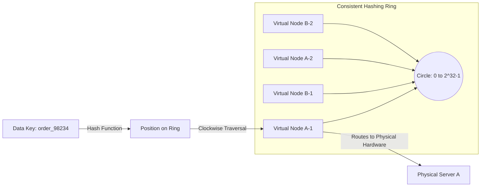

## Executive Summary

Consistent Hashing Rings with Virtual Nodes for Distributed Database Sharding solves the challenge of dynamic node membership in high-throughput partitioned databases, minimizing the volume of data that must be migrated when scaling the underlying database fleet up or down.

- **Video Reference:** [Consistent Hashing Explained](https://www.youtube.com/watch?v=AMNWLz_f6qM)

---

## Architecture Diagram



## Internal Working

**The Hash Ring:** Both physical database nodes and individual data lookup keys are mapped onto a continuous, logical cryptographic integer circle (typically spanning from 0 to $2^{32}-1$).

**Virtual Node Allocation:** To prevent uneven data distribution across hardware, each physical database machine is assigned multiple **Virtual Nodes (vnodes)** scattered randomly across the hash ring.

**Clockwise Traversal Path:** When a write command arrives, the routing system hashes the shard key to find its position on the ring. It then moves clockwise along the circle until it hits the first virtual node, which determines the physical database server that will store the record.

See also: [Database Sharding (Horizontal Partitioning)](/microservices/database-sharding-horizontal-partitioning/) and [Distributed Caching & Invalidation](/microservices/distributed-caching-invalidation/).

---

### Modulo vs. Consistent Hashing on Node Churn

| Operation | Modulo `hash % N` | Consistent hashing ring |
| :--- | :--- | :--- |
| **Add 1 node to N=4** | ~75% of keys remap | ~25% of keys remap ($1/N$) |
| **Remove 1 node** | ~75% of keys remap | ~25% of keys remap |
| **Load balance** | Uniform if hash is good | Needs virtual nodes for heterogeneity |
| **Lookup cost** | O(1) arithmetic | O(log N) with sorted ring / jump hash |

---

## Tradeoffs

### Network & Latency

The routing proxy performs client-side hashing calculations in sub-microsecond times. The true operational trade-off lies in the complexity of maintaining an accurate topology map across all application instances, which requires coordination through configuration meshes or distributed coordinators like ZooKeeper.

### Data Consistency

When adding a new physical node to a consistent hashing ring, the system only needs to move a fraction of the total dataset ($\frac{1}{N}$ of the data, where $N$ is the number of servers). However, during this data migration window, queries targeting the moving keys must handle **fallback lookups** to avoid serving stale data or causing temporary query failures.

## Common Failures

**Cascading Handoff Failures:** If a physical node drops offline, its keys automatically shift clockwise to the next available node on the ring. If that neighboring node is already running near capacity, the sudden influx of new traffic can overwhelm it, triggering a domino effect of sequential node failures across the ring.

| Failure Mode | Symptom | Mitigation |
| :--- | :--- | :--- |
| **Modulo resharding** | Full data migration on N change | Consistent hashing + virtual nodes |
| **Too few vnodes** | Hot physical nodes on ring | 100ΓÇô200 vnodes per physical server |
| **Migration window** | Stale reads during key handoff | Dual-read fallback; migration coordination |
| **Neighbor overload** | Domino node failures | Capacity headroom; gradual rebalancing |
| **Stale topology map** | Keys routed to dead nodes | ZooKeeper/etcd ring membership watch |

---

### Virtual Node Distribution

```text
  Physical Server A (large):  150 virtual nodes on ring
  Physical Server B (small):   75 virtual nodes on ring

  → Proportional load share without manual weight configuration
  → Keys hash to vnodes; vnodes map 1:1 to physical owner
```

---

### Sloppy Quorum & Hinted Handoff

```text
  Write for key K → primary vnode target Node A (DOWN)
        │
        ▼
  Sloppy quorum: write to next clockwise node Node B
        │
        ▼
  Attach hint metadata: "belongs to Node A, key K"
        │
        ▼
  Node A recovers → Node B streams hinted writes back to A
        │
        ▼
  Data integrity preserved without blocking write availability
```

Used in systems like Dynamo/Cassandra to survive transient node failures without sacrificing write availability.

---

## Interview Questions

### The "Junior" Mistake

Proposing simple modulo sharding ($\text{Hash}(\text{key}) \pmod N$) for dynamic enterprise applications, failing to realize that changing the node count $N$ completely alters the target locations for almost all existing keys, forcing an expensive and disruptive full-database migration during live operations.

### The "Senior" Counter-Measure

Detail how to implement **Sloppy Quorums and Hinted Handoffs** over a consistent hashing ring to ensure reliable writes during cluster disruptions. Explain that if the primary target node for a given key is temporarily unreachable, the routing layer can write the payload to a neighboring node on the ring tagged with a "hint" metadata flag. Once the primary node comes back online, the neighbor detects the recovery and streams the cached writes back home, preserving data integrity without sacrificing system availability.

```text
  Consistent hashing production checklist:

    ✓ Virtual nodes per physical server (proportional to capacity)
    ✓ Sorted ring or jump consistent hash for O(log N) lookup
    ✓ Topology coordination (ZooKeeper / gossip protocol)
    ✓ Migration tooling for incremental key handoff
    ✓ Sloppy quorum + hinted handoff for transient node loss
    Γ£ù Never use raw modulo for elastic shard fleets
```

---


---

## Where It Fits

Apply at service boundaries within the microservices fleet. Cross-link to domain handbooks for broker, database, and cache engine internals.

---

## Security Considerations

Apply zero-trust between services, mTLS in mesh, and least-privilege credentials per service identity.

---

## Observability

Export RED metrics, structured logs with `trace_id`, and distributed traces on every cross-service hop. See [Observability](/microservices/08-observability/observability/).

---

## Architect Notes

Expanded from legacy playbook content. See related modules in the curriculum sidebar for adjacent patterns.
