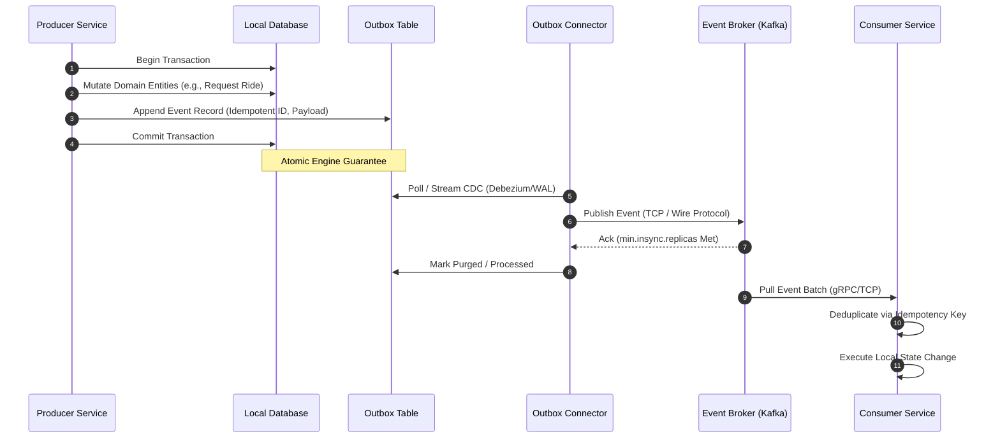

## Executive Summary

Event-Driven Architecture (EDA) via Pub/Sub and Log-Based Event Streaming, supplemented by Complex Event Processing (CEP). It decouples high-throughput distributed microservices asynchronously to solve temporal coupling, blocking I/O bottlenecks, and cascading failures inherent in massive synchronous request-response chains (e.g., Netflix user tracking, Uber ride matching).

- **Video Reference:** [Event-Driven Architecture Explained](https://www.youtube.com/watch?v=hrvx8Nv9eQA)

---

## Architecture Diagram



## Internal Working

**Ingress & Transport:** Edge microservices ingest high-frequency telemetry and requests over HTTP/2 or gRPC, validate inputs, and hand them off to a log-based message broker like Apache Kafka or RabbitMQ over persistent TCP connections using native binary protocols.

**Log-Based Partitioning:** Streamed events are assigned deterministic routing keys (e.g., `passenger_id` for Uber, `user_id` for Netflix) to route them to specific partitions within a topic. This guarantees strict in-order processing per entity at scale.

**Coordination & Atomic State Mechanics:**

* **Transactional Outbox Pattern:** To prevent dual-write anti-patterns, the producing service writes the domain state mutation and appends the event payload into an outbox table within the same ACID-compliant database transaction. See [Transactional Outbox Pattern](/database-handbook/transactional-outbox-pattern/) for schema design and relay engine trade-offs.
* **Change Data Capture (CDC):** A log miner (e.g., Debezium) parses the database transaction log (WAL) and streams events to the message broker, assuring at-least-once delivery without adding overhead to application threads.
* **Tracing Context Propagation:** Distributed trace headers (`traceparent`, `tracestate` via OpenTelemetry) are injected into the metadata/headers of the event record, allowing tracing tools to link asynchronous consumer execution spans across network boundaries.

---

## Tradeoffs

### Network & Latency

Swapping synchronous execution for an event broker introduces a structural network penalty of one extra hop (Producer → Broker → Consumer). High-throughput log-based brokers serialize data into binary payloads (e.g., Avro, Protobuf), shifting the bottleneck from network connection bloat to CPU compute overhead during high-frequency schema verification and serialization.

### Data Consistency

The system shifts from immediate consistency to eventual consistency. Read-side lag is an operational certainty. If a user mutates state and immediately polls an optimized read-database handled by an asynchronous consumer, they may encounter stale data. This requires backends to handle speculative local mutations or apply UI-level optimistic updates.

## Common Failures

**Poison Pill Events:** Malformed event payloads that crash consumer parsing logic will stall partition progression indefinitely. Mitigate this by wrapping consumers in strict try-catch handlers that route unparseable messages to a Dead Letter Queue (DLQ).

**Consumer Lag & Backpressure:** If a downstream consumer experiences degradation (e.g., database lockups), messages accumulate in the broker. If the broker's retention limits are breached, data loss occurs. System boundaries must feature auto-scaling consumers bound to consumer lag metrics rather than raw CPU usage.

| Failure Mode | Symptom | Mitigation |
| :--- | :--- | :--- |
| **Poison pill payload** | Partition offset frozen; no forward progress | DLQ routing + schema validation at ingress |
| **Consumer lag spike** | Stale read models; SLA breach | Scale on `consumer_lag`, not CPU alone |
| **Broker retention breach** | Irrecoverable event loss | Alert on lag + retention headroom; extend retention or shed load |
| **Dual-write without outbox** | Phantom or missing downstream events | Transactional outbox or CDC relay only |
| **At-least-once duplicates** | Double charges, duplicate side effects | Idempotent consumer with `event_id` unique constraint |

---

## Interview Questions

### The "Junior" Mistake

Assuming event-driven architectures automatically fix all scalability issues without mentioning ordering guarantees or thinking about data duplication. Juniors often say, *"Just publish an event to Kafka, and every consumer will update its database concurrently,"* ignoring split-brain risks, consumer race conditions, or the nightmare of implementing distributed two-phase commits over asynchronous brokers.

### The "Senior" Counter-Measure

Call out **Idempotent Consumer Design**. Specify that since network boundaries force an at-least-once delivery guarantee, consumers must execute an internal deduplication step. Detail how you would implement a distributed lock or an idempotent database unique constraint check (e.g., matching against an `event_id` in a `processed_events` tracking table) before applying any local mutations. Explicitly mention handling consumer rebalances during peak scale.

```sql
-- Idempotent consumer guard: reject duplicate event_id before side effects
INSERT INTO processed_events (event_id, processed_at)
VALUES ($1, NOW())
ON CONFLICT (event_id) DO NOTHING
RETURNING event_id;
-- If RETURNING is empty, skip mutation — already processed
```

---

### Pub/Sub vs. Log-Based Event Streaming

| Dimension | Classic Pub/Sub (RabbitMQ, SNS) | Log-Based Streaming (Kafka, Pulsar) |
| :--- | :--- | :--- |
| **Delivery model** | Push to subscribers; message deleted after ack | Append-only partition log; consumers track offset |
| **Replay** | Not native — dead-letter queues only | Full historical replay from any offset |
| **Ordering** | Per-queue FIFO (single consumer) | Strict per-partition ordering |
| **Fan-out** | Exchange/topic routing to N queues | Consumer groups share partition assignments |
| **Throughput ceiling** | Moderate; broker memory bound | Very high; disk-sequential writes |
| **Best fit** | Task queues, RPC-style async, low-latency commands | Event sourcing, CDC pipelines, analytics fan-out |

---


---

## Where It Fits

Apply at service boundaries within the microservices fleet. Cross-link to domain handbooks for broker, database, and cache engine internals.

---

## Security Considerations

Apply zero-trust between services, mTLS in mesh, and least-privilege credentials per service identity.

---

## Observability

Export RED metrics, structured logs with `trace_id`, and distributed traces on every cross-service hop. See [Observability](/microservices/08-observability/observability/).

---

## Architect Notes

Expanded from legacy playbook content. See related modules in the curriculum sidebar for adjacent patterns.
