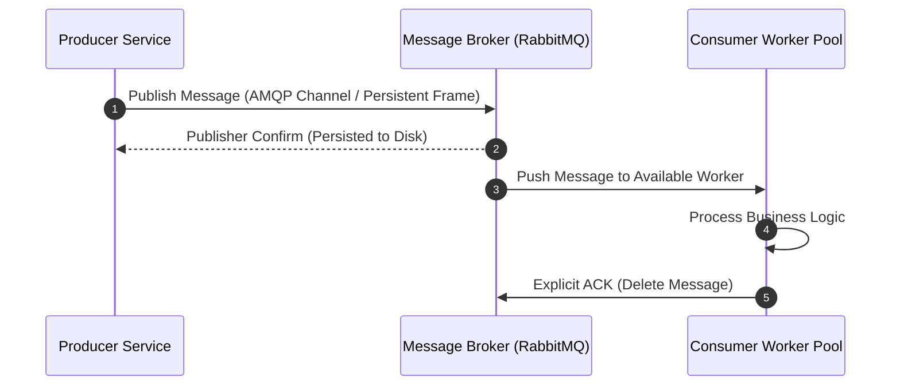

## Executive Summary

Asynchronous Message-Driven Communication using Point-to-Point Queues decouples sender and receiver execution lifecycles by placing an intermediate buffer (a message queue) between them, ensuring reliable delivery and protecting downstream services from traffic spikes.

- **Video Reference:** [Point-to-Point Message Queues Explained](https://www.youtube.com/watch?v=me_FwTx3ZEw)

---

## Architecture Diagram



## Internal Working

Microservices connect to a message broker (e.g., RabbitMQ, ActiveMQ) using long-lived TCP connections multiplexed into channels via protocols like **AMQP 0-9-1** or **AMQP 1.0**.

The producer publishes a message to an exchange; the broker evaluates routing keys and binds the payload into a persistent queue. The broker then pushes or allows workers to pull these messages asynchronously.

### State & Acknowledgment Mechanics

**Explicit Acknowledgments:** Consumers must use explicit ack modes (`no_ack = false`). The broker retains the message in-memory or on disk until the consumer sends a success ACK. If the consumer drops offline mid-process, the broker puts the message back into the queue for other workers.

See also: [Event-Driven Architecture & Log Streaming](/microservices/event-driven-architecture-log-streaming/) for Pub/Sub vs log-based streaming comparison.

---

### Point-to-Point Queue vs. Log-Based Event Stream

| Dimension | Point-to-Point Queue (RabbitMQ, SQS) | Log Stream (Kafka, Pulsar) |
| :--- | :--- | :--- |
| **Delivery model** | One consumer per message; deleted after ACK | Multiple consumer groups read same log |
| **Replay** | Not native — message is gone after ACK | Full offset replay from history |
| **Ordering** | FIFO per queue (single consumer) | Strict per-partition ordering |
| **Primary use** | Task/work queues, job dispatch | Event sourcing, analytics fan-out |
| **Backpressure** | Queue depth absorbs producer bursts | Retention-bound; lag monitoring critical |

---

## Tradeoffs

### Network & Latency

Introduces a decoupled queuing delay. While publishers benefit from fast, non-blocking fire-and-forget confirmations, total end-to-end processing time depends entirely on consumer availability and current queue depths.

### Data Consistency

Message queues prioritize reliable delivery over strict message ordering across different queues. If messages are re-queued due to consumer exceptions, they may arrive **out of order**, meaning downstream applications must be designed to tolerate non-sequential state updates.

## Common Failures

**Consumer Exception Loops:** If a malformed message causes a consumer to crash and re-queue the item indefinitely, it creates a processing loop that stalls the entire queue. To prevent this, configure maximum retry counters that automatically reroute failing messages to a **Dead Letter Exchange (DLX)**.

| Failure Mode | Symptom | Mitigation |
| :--- | :--- | :--- |
| **Poison message loop** | Queue frozen; no forward progress | Max retry count → DLX |
| **ACK-after-process crash** | Duplicate delivery to another worker | Idempotent consumer + dedup store |
| **No publisher confirm** | Message lost before disk persist | Enable publisher confirms / transactions |
| **Unbounded queue depth** | Broker memory/disk exhaustion | Queue TTL + consumer autoscaling |
| **Queue confused with Kafka** | Wrong tool for replay/fan-out | Use log stream for multi-consumer replay |

---

### Dead Letter Exchange Flow

```text
  Message arrives
        │
        ▼
  Consumer attempts processing
        │
        Γö£── Success ──Γû║ ACK ──Γû║ message deleted
        │
        └── Failure (retry count < max)
                │
                ▼
            Re-queue with delay
                │
        Failure (retry count >= max)
                │
                ▼
            Dead Letter Exchange ──Γû║ DLQ (manual inspection / alert)
```

---

### Idempotent Consumer Pattern

```sql
-- Deduplication before side effects
INSERT INTO processed_messages (message_id, processed_at)
VALUES ($1, NOW())
ON CONFLICT (message_id) DO NOTHING
RETURNING message_id;
-- Empty RETURNING → skip business logic (duplicate delivery)
```

Redis `SETNX message_id` with TTL achieves the same guard with lower latency for high-throughput workers.

---

## Interview Questions

### The "Junior" Mistake

Confusing point-to-point Message Queues (where each message is processed by exactly one worker and then deleted) with log-based Event Streams like Kafka (where multiple independent consumers can replay the same historic event stream from a persistent disk log).

### The "Senior" Counter-Measure

Design around **Idempotent Consumers**. Explicitly state that because network errors can cause duplicated messages (e.g., if a consumer crashes after processing business logic but before sending its ACK frame), every consumer must use an idempotency key and a deduplication store (like a Redis `SETNX` or database unique index) to drop duplicate deliveries.

```text
  Queue consumer checklist:

    ✓ no_ack = false (explicit ACK only after success)
    ✓ Publisher confirms enabled
    ✓ Max retry + DLX configured
    ✓ Idempotency key on every message
    ✓ Out-of-order tolerance in state updates
```

---


---

## Where It Fits

Apply at service boundaries within the microservices fleet. Cross-link to domain handbooks for broker, database, and cache engine internals.

---

## Security Considerations

Apply zero-trust between services, mTLS in mesh, and least-privilege credentials per service identity.

---

## Observability

Export RED metrics, structured logs with `trace_id`, and distributed traces on every cross-service hop. See [Observability](/microservices/08-observability/observability/).

---

## Architect Notes

Expanded from legacy playbook content. See related modules in the curriculum sidebar for adjacent patterns.
