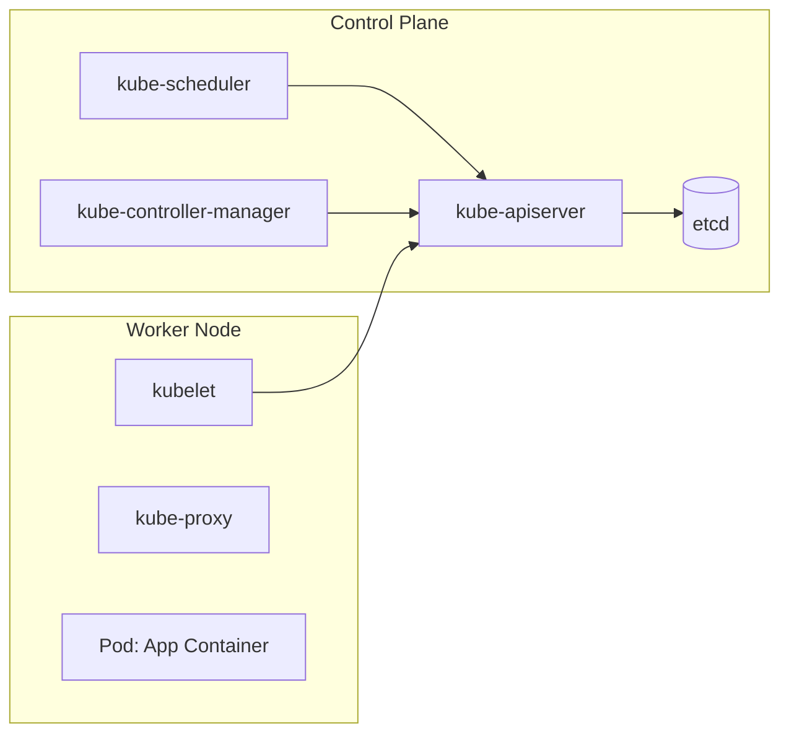

## Executive Summary

Declarative Container Orchestration manages the automated lifecycle, scheduling, scaling, state synchronization, and networking of containerized microservices across a clustered fleet of bare-metal or virtual machines.

- **Video Reference:** [Kubernetes Explained](https://www.youtube.com/watch?v=ID-_ic1fLkY)

---

## Architecture Diagram



### Control Plane State Mechanics

The **kube-apiserver** acts as the single entry point. The absolute cluster state is stored inside **etcd**, a highly available, distributed key-value store using the Raft consensus protocol.

**Reconciliation Loop:** The kube-controller-manager runs continuous observation loops comparing the actual state of the cluster against the declared desired state (e.g., "maintain 5 replicas of the Order Service Pod"), triggering calls to correct gaps.

### Pod Networking Wire Path

Every Pod gets a unique cluster-wide IP address. Ingress traffic routes through a virtual abstraction layer (**Service**) handled by **kube-proxy**, which rewrites Linux kernel iptables or IPVS rules to distribute packets directly to target pods across nodes.

See also: [Application Containerization (Docker)](/microservices/application-containerization-docker/), [Dynamic Service Discovery & Registry](/microservices/dynamic-service-discovery-registry/), and [Zero-Downtime Deployment Topologies](/microservices/zero-downtime-deployment-topologies/).

---

### Key Kubernetes Primitives

| Resource | Purpose | Production note |
| :--- | :--- | :--- |
| **Deployment** | Declarative rolling updates for stateless apps | Pair with HPA for autoscaling |
| **Service** | Stable cluster IP + DNS endpoint | ClusterIP internal; LoadBalancer/Ingress for external |
| **StatefulSet** | Stable pod identity + ordered rollout | Use for stateful workloads with PVCs |
| **Ingress** | HTTP routing to Services | TLS termination at edge |
| **PodDisruptionBudget** | Min available pods during drains | Required for zero-downtime node upgrades |

---

## Tradeoffs

### Network & Latency

Intra-cluster communication involves overlay networking via encapsulation protocols (e.g., VXLAN or Geneve used by Calico/Flannel), adding CPU packet wrapping/unwrapping overhead.

### Data Consistency

Managing stateful databases inside Kubernetes introduces substantial operational risk. While StatefulSets handle stable network identities and persistent volume mappings, a network partition can lead to **split-brain** situations if automated database failovers trigger while the orchestrator attempts scheduling modifications.

## Common Failures

**Cascading Evictions:** If a node runs out of memory, Kubernetes begins evicting low-priority pods. If resource limits are missing or misconfigured on neighboring nodes, the evicted pods get rescheduled onto them, triggering an immediate domino effect that can bring down the entire cluster.

| Failure Mode | Symptom | Mitigation |
| :--- | :--- | :--- |
| **Missing readiness probe** | Traffic to initializing pods | `readinessProbe` gates Service endpoints |
| **Missing liveness probe** | Deadlocked pods stay in rotation | `livenessProbe` triggers restart |
| **No resource limits** | Memory leak evicts neighbor pods | Set `requests` + `limits` on every container |
| **Cascading eviction** | Cluster-wide pod death spiral | Limits + PDBs + pod priority classes |
| **Stateful split-brain** | Dual primaries on DB failover | Run databases outside K8s or use operator with quorum |

---

### Pod Lifecycle Probe Strategy

```yaml
livenessProbe:
  httpGet:
    path: /actuator/health/liveness
    port: 8080
  initialDelaySeconds: 30
  periodSeconds: 10

readinessProbe:
  httpGet:
    path: /actuator/health/readiness
    port: 8080
  initialDelaySeconds: 10
  periodSeconds: 5

resources:
  requests:
    memory: "512Mi"
    cpu: "250m"
  limits:
    memory: "768Mi"
    cpu: "500m"
```

* **Liveness** — restart if the process is deadlocked (app cannot recover alone).  
* **Readiness** — remove from Service endpoints during warmup or dependency outage.  
* **Requests** — scheduling guarantee; **limits** — eviction containment boundary.

---

## Interview Questions

### The "Junior" Mistake

Believing Kubernetes resolves application-level reliability out of the box, or omitting the implementation of application health endpoints, causing traffic to route to broken or initializing containers.

### The "Senior" Counter-Measure

Detail a bulletproof **Pod Lifecycle Strategy**. Define precise `livenessProbes` (to restart deadlocked apps) and `readinessProbes` (to hold back traffic during startup warmups). Combine this with configured **ResourceRequests** (for scheduling guarantees) and **ResourceLimits** (to contain memory leaks), and utilize **PodDisruptionBudgets** to protect service availability during infrastructure upgrades.

```text
  K8s reliability stack (application team's job):

    1. readinessProbe  → no traffic until warmed up
    2. livenessProbe   → restart on deadlock
    3. resources.requests → guaranteed scheduling slot
    4. resources.limits   → OOM/eviction containment
    5. PodDisruptionBudget → min replicas during node drain
    6. HPA               → scale on CPU/custom metrics
```

---


---

## Where It Fits

Apply at service boundaries within the microservices fleet. Cross-link to domain handbooks for broker, database, and cache engine internals.

---

## Security Considerations

Apply zero-trust between services, mTLS in mesh, and least-privilege credentials per service identity.

---

## Observability

Export RED metrics, structured logs with `trace_id`, and distributed traces on every cross-service hop. See [Observability](/microservices/08-observability/observability/).

---

## Architect Notes

Expanded from legacy playbook content. See related modules in the curriculum sidebar for adjacent patterns.
