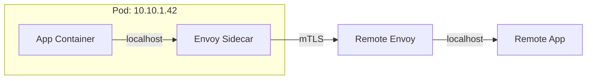
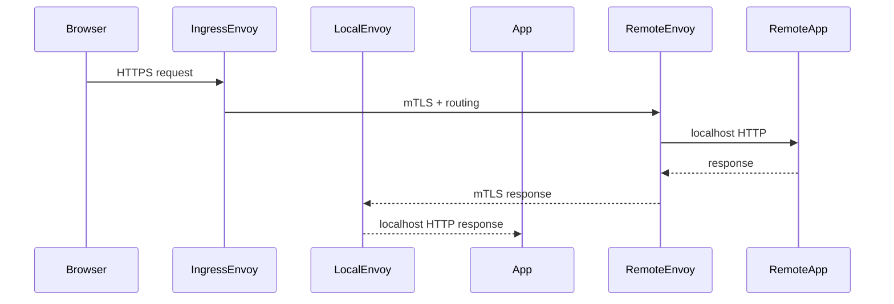

## Why Sidecar Exists

Why this pattern appears in real stacks: when many services need the same operational features — TLS, retries, tracing, metrics — teams either duplicate code across runtimes or outsource them to an infrastructural component. The sidecar pattern centralizes those cross-cutting concerns at the Pod level so application teams can remain focused on business logic.

- Why app-level retries/TLS/tracing get duplicated: every language/framework implements TLS/retry/observability differently; implementing them in app code ties you to libraries and bugs.
- Why sidecars: move policy and heavy crypto out of app process, enable consistent, platform-wide behavior, and make upgrades independent of application releases.

---

## Sidecar Architecture

Pod
- Kubernetes schedules a Pod as the atomic unit. A sidecar is simply another container inside the same Pod manifest: same PID/NW namespace, same IP.

Application Container
- Runs business logic. Sends/receives plain HTTP/gRPC to localhost; depends on sidecar for networking features.

Envoy Sidecar
- L7 proxy that speaks to remote peers using mTLS, performs retries, circuit-breakers, and telemetry. It owns TLS keys and policy enforcement.

Shared Network Namespace
- App and sidecar share loopback. App talks to 127.0.0.1:port; sidecar intercepts and forwards.

Transparent iptables Interception
- A small init step programs iptables (or eBPF) rules to redirect outbound traffic to the sidecar. This keeps the app code unchanged while ensuring all egress is observable and controlled.

Diagram: Pod components

---

## Service Mesh Architecture (short)

Control Plane vs Data Plane — the "why"
- Why separate: Control plane makes high-level decisions (policies, certificates), data plane executes them at runtime (Envoy proxies). Splitting reduces request-path latency and isolates dynamic config from packet processing.

Istiod
- Control-plane component that issues identities/certs, converts policies into xDS snapshots, and serves xDS over a long-lived gRPC stream.

Envoy
- Sidecar (data plane) that receives config via xDS, enforces policies, and handles traffic. It does the heavy lifting; Istiod is not in the data path.

xDS
- Protocol set (Listeners, Routes, Clusters, Endpoints) used by control plane to push config to Envoy. Event-driven: snapshots update resources, Envoy applies them live.

Automatic Sidecar Injection
- Admission webhook mutates Pod specs at creation time to add the sidecar container and init rules (unless disabled). This is how meshes roll out transparently.

---

## End-to-End Request Flow (explain every hop)

High-level sequence: Browser → Ingress Gateway → Local Envoy (source Pod) → App → Local Envoy (source Pod) → Network → Remote Envoy → Remote App

1. Browser → Ingress Gateway
   - TLS terminates at edge or pass-through depending on topology. Ingress Envoy applies routing and may perform TLS origination to services.
2. Ingress Envoy → Remote Envoy (destination Pod)
   - If using mesh-internal mTLS, Ingress Envoy talks mTLS to destination Envoy. Routing policy (virtual service) decides destination cluster.
3. Remote Envoy → Remote App (localhost)
   - Envoy forwards decrypted request to app on localhost. App sees an incoming plain HTTP request with trace headers inserted.
4. App → Local Envoy (egress)
   - App issues outbound request to 127.0.0.1:port. iptables/eBPF redirects it to local Envoy which enforces retries, timeouts, and telemetry.
5. Local Envoy → Remote Envoy (wire)
   - Local Envoy uses service discovery to find endpoints, opens mTLS connection to remote Envoy and forwards the request.
6. Remote Envoy → Remote App
   - Remote Envoy applies listener/route rules and forwards locally.

Mermaid sequence

Why this matters in interviews: be able to trace which component terminates TLS, where tracing headers are injected/extracted, and which side handles retries/timeouts.

---

## Internal Working (detailed, interview depth)

How sidecar injection works
- Admission Webhook: Mutating webhook intercepts Pod CREATE requests. It patches the Pod spec to add an initContainer (to set iptables), the envoy container, and annotations for ports/traffic capture.

Pod creation lifecycle
- API Server receives Pod create → Admission controller (mutating) patches Pod → Pod scheduled on node → kubelet pulls images and starts initContainers.

Envoy startup
- InitContainer runs: configures iptables; ensures ports and redirect rules are in place.
- Envoy container starts and contacts control plane (istiod) using a bootstrap config, or reads a mounted bootstrap file.
- Envoy opens a persistent gRPC stream to Istiod (xDS) for config.

Configuration download & persistent gRPC
- Istiod stream: Envoy sends a DiscoveryRequest, Istiod responds with a snapshot (Listeners, Routes, Clusters, Endpoints).
- The gRPC stream stays open; Istiod pushes incremental updates or new snapshots when config/policies/endpoint topology changes.

Event-driven xDS updates
- Endpoint changes (new Pod IP) trigger the endpoint provider to update EDS; Istiod computes new snapshots and stream-pushes them.
- Envoy applies updates without restart — route/table state changes happen in-memory.

Why Istiod is not in the request path
- Istiod only sends control signals (config, certs) over a management channel. Data-plane traffic flows directly between Envoys; adding Istiod to the path would create a single point of latency and failure.

---

## Kubernetes Lifecycle (how failures behave in interviews)

Application container crash
- Container restarts per Pod restartPolicy. If only app crashes and restarts quickly, sidecar continues to run with same Pod IP; during app restart, Envoy keeps listeners bound and can buffer/return errors.

Sidecar crash
- If sidecar container crashes, the app may lose egress/ingress (depending on interception). Common setups configure liveness/startup probes: if sidecar fails, Kubernetes restarts it. But some clusters treat sidecar failure as Pod-level failure and restart entire Pod.

Pod recreation
- New Pod gets new IP. k8s Service DNS and Endpoints get updated; xDS/EDS pushes updated endpoints to peers. Connection-level state (TCP) is lost and must be re-established.

Rolling deployment
- New Pods register with service discovery; Istio can do graceful drain via connection draining and draining delays on the sidecar. Be prepared to explain rolling-update hooks and preStop drain windows.

Node failure
- All Pod IPs on that node disappear; EDS updates notify Envoys to remove endpoints. Understand how health checks and kubernetes endpoints react.

Pod IP vs Service DNS
- Pod IP is ephemeral; Service DNS maps to a stable virtual IP (ClusterIP) or headless IP. Envoy uses endpoints directly (IP:port) via EDS; DNS is not the single source of truth inside mesh.

Container restart vs Pod recreation
- Restart (container restart within same Pod) keeps Pod IP. Pod recreation (DELETE/CREATE or node reschedule) assigns new Pod IP and triggers endpoint updates.

---

## Production Trade-offs (concise, practical)

CPU
- Envoy is CPU-hungry on heavy TLS or header processing. Profile p99 paths and scale accordingly.

Memory
- Per-Envoy memory increases with cluster/route table size and active connections. Watch allocation per sidecar and limit growth (aggregate memory planning).

Latency
- Each sidecar hop adds serialization/parsing overhead. Use p99 latency budgets and measure tail effects.

Operational complexity
- Mesh adds control plane, cert rotation, xDS tuning, and more surfaces to debug. Make trade-off decisions explicit in interviews.

Debugging
- Need tools: tcpdump on host, envoy admin endpoints, istioctl proxy-config, and distributed tracing to triage.

Startup ordering
- App should not assume network is immediately available. Use startupProbe, initContainers, readiness checks, or explicit backoff in code.

Resource tuning
- Right-size envoy CPU/memory, tune connection reuse, and configure circuit-breakers and retries conservatively to avoid retry storms.

---

## Production Best Practices (clear bullets to cite in interviews)

- Resource requests/limits: set for both app and sidecar; plan for cumulative Pod resources.
- startupProbe: ensure sidecar readiness before app starts accepting traffic.
- readinessProbe: ensure app is marked ready only after it can function behind the sidecar.
- Avoid duplicate retries: make retries a single layer (usually the sidecar) and disable automatic app retries unless you control idempotency.
- Keep applications mesh-aware but mesh-independent: propagate trace headers and health semantics, but do not hard-code mesh-only behavior.
- Use canary and staged rollout for mesh policy changes; validate xDS impacts in staging.

---

## Top Interview Questions (scenario-based with answers)

1) Sidecar vs Service Mesh — how do you answer?
- Short: Sidecar is the deployment pattern; service mesh is the distributed system built using sidecars (control plane + many data-plane proxies). In interviews, explain the distinction and why both terms are used together.

2) Control Plane vs Data Plane — what’s in / out of path?
- Answer: Data plane (Envoy) handles requests. Control plane (Istiod) handles certs/policies and pushes config over gRPC. Istiod is off-path for request traffic.

3) What happens if Istiod is down?
- If Istiod is down: existing Envoy config continues to operate. New Envoys may fail to bootstrap or rotate certs; EDS updates stop. For resilience, use HA istiod and consider control-plane caching.

4) Does Envoy restart? What if it dies?
- Envoy runs as a container with probes. If Envoy dies, kubelet restarts it; depending on Pod lifecycle, this may or may not restart the app. If sidecar restarts often, expect transient connection failures.

5) Container restart vs Pod recreation — difference?
- Container restart keeps Pod IP and volumes; Pod recreation produces a new Pod with a new IP and requires EDS propagation. Explain implications for TCP connections and sticky sessions.

6) How does mTLS work end-to-end?
- App → Local Envoy: plain. Local Envoy terminates/initiates TLS to remote Envoy using identities from Istiod (X.509). Envoys authenticate each other (mutual TLS) and forward plaintext to apps locally.

7) Explain Automatic Sidecar Injection flow.
- Mutating webhook patches Pod specs on CREATE to add sidecar and init rules. If injection fails or is disabled by annotation, Pod runs without sidecar.

8) xDS update flow (concise)
- Envoy opens ADS (Aggregated Discovery Service) gRPC stream to Istiod, requests resource types. Istiod computes snapshots and pushes updates; Envoy ACKs and applies them dynamically.

9) Why not implement retries in code?
- Retries in code duplicate logic, risk inconsistent behavior, and require library maintenance across languages. Sidecars centralize retry logic and observability. But note that some app-level retries (for idempotent domain logic) may still be required.

10) API Gateway vs Service Mesh — when each?
- API Gateway: edge concerns (authZ/authN, routing, rate-limiting to external clients). Service Mesh: intra-cluster service-to-service concerns. Both coexist: gateways handle north-south, mesh handles east-west.

---

## Production Pitfalls (real issues to cite)

- Retry storms: stacked retries (client + sidecar) amplify failures. Mitigate with bounded retries, jitter, and circuit breakers.
- Double retries: app and mesh both retry; disable app retries or centralize policy.
- Sidecar OOM: insufficient sidecar memory kills connectivity. Track sidecar RSS and set limits.
- Misconfigured readiness: app marked ready before sidecar is ready — causes 503s and crashloops.
- Traffic bypassing mesh: iptables failure or permissive annotations lead to plaintext, unauthenticated traffic.
- Startup race conditions: DB connections started before sidecar — use init/startup probes and backoffs.

---

## Diagrams

- Architecture and request flow diagrams are embedded above. Use these in whiteboard explanations: draw the Pod, the local loopback hops, and the xDS push path to highlight control vs data plane.

---

<!-- end of playbook body -->
