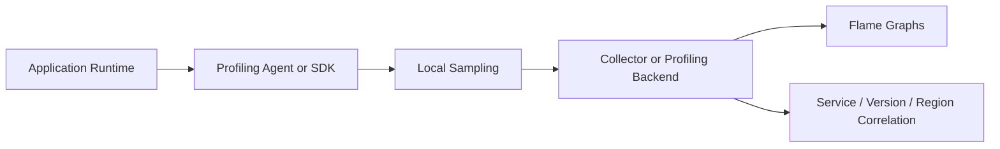

## 1. Purpose

```text
Trace:   Which distributed operation consumed time?
Profile: Which code path consumed CPU, memory, allocations, locks, or runtime effort?
```

A trace can isolate a slow service yet still leave thousands of functions as suspects. Profiles aggregate sampled stacks so engineers can compare resource consumption by service, version, region, instance, and time window.

## 2. Profile Types

| Type | Reveals | Typical question |
| :--- | :--- | :--- |
| CPU | On-CPU sampled stacks | Which code caused a post-release CPU regression? |
| Allocation | Allocation sites and rates | Which path creates excessive temporary objects? |
| Heap | Retained live objects | What retains memory across collections? |
| Wall clock | On- and off-CPU elapsed stacks | Is time spent computing, waiting, or blocked? |
| Lock/contention | Contended synchronization | Which lock serializes otherwise parallel work? |
| Thread/goroutine | Concurrency state and stacks | Why are workers accumulating? |
| Runtime/GC | Collection and runtime effort | Is allocation pressure driving long pauses? |

Heap evidence indicates retention, not automatically a leak. Compare multiple time windows and deployment versions before assigning causality.

## 3. Architecture



Profiling export must be asynchronous and bounded. A backend outage must drop or buffer within limits rather than block business execution.

## 4. Continuous Versus Incident-Only

| Decision | Continuous low-overhead | Activated high-detail |
| :--- | :--- | :--- |
| Value | Baselines and evidence before detection | Deep evidence for a known target |
| Risk | Persistent overhead and storage | Higher temporary overhead and operational error |
| Retention | Aggregated, tiered, sampled | Short-lived, case-specific |
| Control | Default policy and fleet rollout | Time-boxed approval and automatic expiry |

Benchmark overhead against representative workloads. Roll out by service and version, define automatic disablement, and keep a safe incident-only path when runtimes cannot meet the continuous budget.

## 5. Correlation and Use Cases

Attach bounded service, version, region, workload, and instance identity. Correlate with deployment events and RED metrics; attach trace IDs only where the profiler safely supports exemplars or trace-to-profile linking.

- Compare CPU flames before and after a deployment.
- Find allocation churn and GC pressure behind high P99 latency.
- Locate lock contention, serialization overhead, or a hot loop.
- Compare one abnormal pod with healthy peers.
- Distinguish growing live heap from temporary allocation volume.

## 6. Tools and Trade-offs

Pyroscope, Parca, Grafana Cloud Profiles, Datadog Continuous Profiler, Elastic Universal Profiling, Google Cloud Profiler, and language-native profilers represent different managed, self-hosted, agent, and runtime approaches. Capabilities, supported runtimes, correlation, and overhead are version-sensitive; validate them against current vendor documentation.

Key risks are runtime overhead, sensitive function or symbol names, incomplete native symbol resolution, storage volume, sampling bias, and uncontrolled production enablement. Select by runtime coverage, measured overhead, tenancy, retention, symbol security, correlation, operating ownership, and exit strategy—not by flame-graph appearance.

## 7. Adoption Criteria

Adopt continuous profiling when trusted RED/traces repeatedly isolate a service but code-level diagnosis remains slow, or when capacity cost needs code attribution. Require an overhead budget, approved data classification, named platform owner, retention policy, and a measured outcome such as lower diagnosis time or CPU per transaction.

