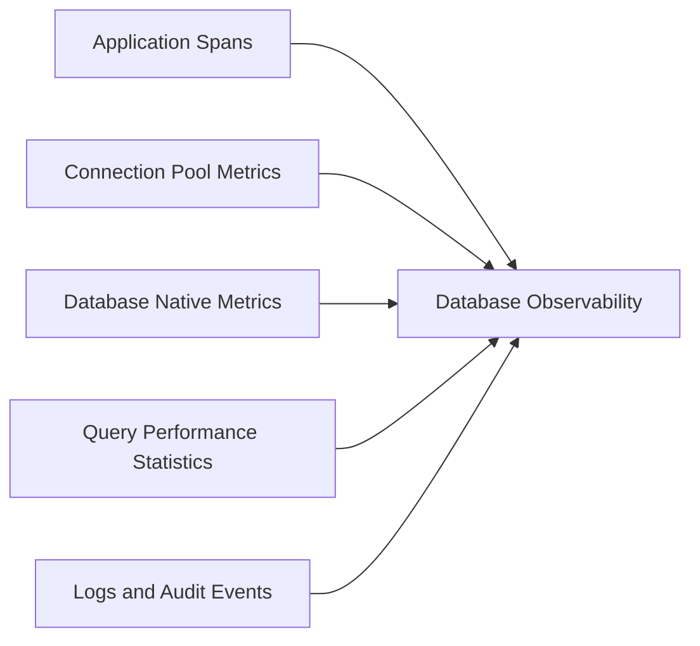

## 1. Diagnostic Model

Database observability separates time waiting for a connection from time executing work, then correlates application impact with query, engine, and storage evidence.



## 2. Core Dimensions

- Query latency, throughput, errors, transaction duration, and rows/documents scanned.
- Connection use, maximums, acquisition wait, churn, and idle lifetime.
- Lock waits, deadlocks, blocking chains, and long transactions.
- Buffer/cache hit rate, disk/I/O latency, checkpoints/compaction, replication lag, and storage growth.
- Normalized statement fingerprints, execution plans, index use, and plan changes.

## 3. Diagnosis Workflows

```text
API P99 high
  -> DB span dominates
  -> Connection acquisition normal
  -> Query execution slow
  -> Execution plan changed
  -> Index no longer used
```

Validate plan history, statistics, data distribution, and deployment changes before adding an index.

```text
API P99 high
  -> Connection acquisition dominates
  -> DB CPU normal
  -> Pool utilization 100%
  -> Long transactions hold connections
```

Increasing the pool may move saturation into the database. First find holders, transaction boundaries, retries, timeouts, and leaked connections.

## 4. Database-Type Differences

| Type | Additional evidence |
| :--- | :--- |
| Relational | Plans, locks, transactions, indexes, replication |
| Document | Document scans, index coverage, shard targeting, working set |
| Key-value | Command latency, key distribution, eviction, hot partitions |
| Distributed SQL | Consensus latency, ranges/tablets, locality, rebalancing |
| Managed cloud | Provider metrics, query insights, quotas, maintenance, opaque infrastructure |

Use engine-native semantics; a universal dashboard can hide the cause-specific evidence each database requires.

## 5. Security and Cost

Never capture credentials or unrestricted bind values. Normalize or fingerprint statements, restrict raw query text and explain plans, protect audit logs, and separate production diagnostics from developer access. Query capture may expose PII, schema, tenant boundaries, and business rules even after values are removed.

High-frequency statement collection and plan retention can be expensive. Sample by normalized fingerprint and outcome, retain slow/error exemplars, and keep enough history for deployment comparison.

## 6. Architecture Decisions

Define the source of query truth, application-to-database correlation, pool ownership, fingerprint rules, privileged access, sampling, plan retention, managed-service limits, alert ownership, and a diagnosis runbook. Link database evidence to [distributed tracing](/microservices/08-observability/distributed-tracing/) and validate it through representative [failure scenarios](/microservices/08-observability/production-failure-scenarios/).

