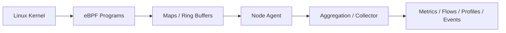

## 1. Problem Solved

eBPF can observe selected Linux kernel and network activity without manually instrumenting every application. It is valuable for network flows, TCP retransmissions, DNS failures, syscalls, process/container behavior, communication discovery, runtime profiling, policy telemetry, and uninstrumented dependencies.

It provides system evidence, not business meaning. A TCP flow can reveal that two workloads communicate; it cannot reliably explain that the flow authorized a payment.

## 2. Architecture

Programs must constrain event volume near the source. Node agents enrich kernel identity with pod, namespace, container, service, node, and workload metadata before aggregation.

## 3. Relationship to OpenTelemetry

- eBPF discovers network and runtime behavior, including gaps between instrumented services.
- [OpenTelemetry](/microservices/08-observability/opentelemetry-architecture/) supplies semantic application context, domain spans, outcomes, baggage policy, and portable export.
- The strongest design correlates kernel evidence with service identity, traces, RED, and USE.
- Duplicated application and eBPF spans require explicit precedence and deduplication policy.

eBPF is complementary evidence, not an instrumentation replacement.

## 4. Kubernetes Pattern

A DaemonSet gives node visibility and enriches processes with pod/container identity. Review privileged capabilities, host mounts, service accounts, NetworkPolicy, kernel and architecture compatibility, managed-cluster restrictions, upgrades, and multi-tenant isolation. Separate platform-wide access from tenant queries because node-level evidence can expose cross-namespace relationships.

Roll out by kernel/node pool, measure CPU and memory overhead, and define behavior when maps, buffers, or export queues fill.

## 5. Limitations and Failure Modes

- Linux-centric coverage and kernel-version differences complicate portability.
- Encryption hides payload semantics; business outcomes remain absent.
- Required privileges expand attack surface.
- High event volume can lose evidence or overload the backend.
- Shared proxies and NAT can produce ambiguous edges.
- Kernel-level signals require specialist interpretation.
- Auto-generated spans may duplicate or disagree with application spans.

Missing evidence does not prove absence: sampling, unsupported protocols, encrypted traffic, kernel restrictions, and agent failure all create blind spots.

## 6. Tool Landscape and Decisions

Cilium/Hubble, Pixie, Grafana Beyla, OpenTelemetry eBPF instrumentation initiatives, and eBPF features from Datadog, Dynatrace, New Relic, Elastic, and security-focused platforms span networking, profiling, auto-instrumentation, and security use cases. Product and initiative maturity is version-sensitive; verify supported kernels, protocols, signals, privileges, and production status.

Architect decisions include the exact evidence gap, workload eligibility, privilege boundary, supported kernels, enrichment authority, overlap with service mesh and agents, retention, residency, overhead budget, ownership, and fallback when eBPF is restricted.

