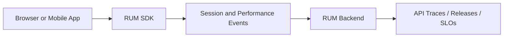

## 1. Why Backend Health Is Insufficient

A healthy API does not prove a healthy experience. DNS failure, CDN delay, JavaScript error, rendering work, redirect loops, mobile crashes, cellular loss, third-party scripts, and regional edge failures occur outside backend RED signals.

## 2. Architecture

The SDK must batch asynchronously, cap memory and network use, tolerate offline clients, and never make application success depend on telemetry delivery.

## 3. Browser and Mobile Signals

| Browser | Mobile |
| :--- | :--- |
| Page load, navigation and resource timing | App start and screen rendering |
| Core Web Vitals and long tasks | Crash-free sessions and ANR/frozen UI |
| JavaScript errors and route changes | Network request performance |
| API failures by browser/network class | Version, OS, device and network class |
| CDN and third-party resource delay | Battery/resource impact where supported |

Aggregate by bounded route template, release, region, device class, browser family, and network class. Avoid raw URLs and unique device or user labels.

## 4. Correlation

Propagate trace context only to approved first-party origins. Map frontend and mobile releases to backend deployment versions, and use sampled trace links or tokenized session handles to pivot into backend evidence. Do not place authentication tokens, raw user IDs, or sensitive navigation state in trace context.

Sampling must preserve errors, rare device/network classes, and critical journeys while bounding session volume. Measure SDK overhead and ingestion loss separately from application behavior.

## 5. Privacy and Security

Consent, cookies, session replay, text/input masking, PII, location precision, identifiers, residency, retention, and mobile-store disclosures require explicit review. Prefer collection allowlists, default masking, coarse location, short retention, role-based replay access, and auditable unmasking. A replay product must never capture passwords, payment fields, health data, or private messages.

## 6. RUM Versus Product Analytics

RUM measures performance and reliability; product analytics measures behavior, adoption, and conversion. They may share release and journey dimensions, but their lawful purpose, consent, ownership, retention, access, and correctness requirements differ.

## 7. Adoption and Failure Modes

Adopt RUM where client-side or regional experience materially affects an SLO and backend evidence cannot quantify it. Common failures include SDK-induced latency, blocked collectors, consent gaps, unbounded event schemas, replay leakage, biased sampling, duplicate sessions, and confusing lack of traffic with availability. Define client SLOs, data controls, overhead budgets, and a product-plus-platform ownership model before rollout.

