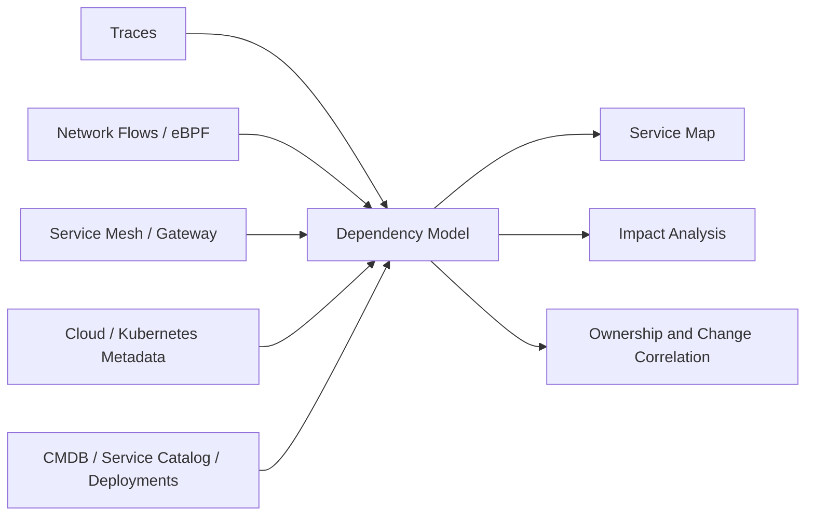

## 1. Purpose

Static diagrams drift as releases, routing, feature flags, messaging, and third parties change runtime behavior. Topology intelligence combines observed and declared evidence to answer which upstreams depend on a failing service, which deployment changed the critical path, and who owns each affected edge.

## 2. Architecture

Identity reconciliation is the core architecture problem. Service names, workload identities, endpoints, queues, databases, and external providers require stable canonical identifiers and confidence-scored edges.

## 3. Capabilities

- Dynamic upstream/downstream maps and critical-path identification.
- Blast-radius, orphan-service, and undocumented-dependency analysis.
- Version, deployment, configuration, incident, and ownership overlays.
- Dependency SLOs and change-impact review.
- Detection of runtime edges absent from declared architecture.

Maps should expose evidence source, last-seen time, traffic class, environment, and confidence—not render every discovered edge as equally authoritative.

## 4. Different Models, Different Purposes

| Model | Authority |
| :--- | :--- |
| Runtime topology | Observed communication during a time window |
| Declared architecture | Intended components and allowed relationships |
| Service catalog | Ownership, lifecycle, interfaces, and operational metadata |
| CMDB | Governed configuration items and enterprise relationships |
| Business capability map | Business outcomes and organizational capabilities |

Runtime topology enriches these models; it does not automatically replace them.

## 5. Limitations

- Missing traffic does not prove no dependency.
- Sampled traces create incomplete maps.
- Shared gateways, brokers, proxies, and infrastructure can create misleading edges.
- Async, batch, scheduled, failover, and rarely used paths are harder to observe.
- External dependencies may remain opaque.
- Identity drift can split one service or merge unrelated services.

## 6. Adoption and Governance

Adopt topology intelligence when incident blast-radius analysis or change review is slowed by dependency uncertainty. Define canonical identity, source precedence, edge expiry, confidence, tenant isolation, external-service grouping, ownership reconciliation, and review workflow. Measure improvement through faster owner discovery, fewer undocumented edges, and more accurate incident impact—not map density.

