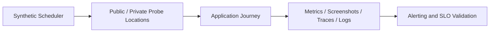

## 1. Purpose and Types

Synthetics exercise known journeys on a schedule before or independently of real traffic. Types include HTTP/API probes, browser journeys, supported mobile/device tests, DNS checks, TLS/certificate checks, network probes, external locations, and private locations.

Use them for login, checkout, payment, search, API contracts, DNS resolution, certificate expiry, regional availability, and dependency reachability. A probe validates its particular path; it does not prove every user path works.

## 2. Architecture

Public probes test the external edge and internet path. Private probes validate internal DNS, routing, identity, and dependencies. Use multiple independent locations before classifying a regional or global outage.

## 3. Design Rules

- Use dedicated least-privilege test accounts and securely rotated secrets.
- Tag synthetic traffic and separate it from product analytics and financial reporting.
- Avoid real customer data and irreversible business actions.
- Handle MFA through approved test flows; do not weaken production authentication.
- Make generated data idempotent and automatically clean it up.
- Rate-limit probes and include jitter to avoid synchronized load.
- Use private probes for internal systems and multiple locations for external availability.
- Capture screenshots and bodies only under strict redaction and retention controls.

## 4. Synthetic Versus RUM

| Synthetic | RUM |
| :--- | :--- |
| Controlled traffic | Real user traffic |
| Works before users arrive | Depends on actual usage |
| Repeatable journey | Real-world diversity |
| Limited scenarios | Broad experience coverage |
| Useful for availability | Useful for actual user impact |

Combine both for critical journeys: synthetic failures provide early controlled evidence, while RUM confirms scope and real-user impact.

## 5. SLO and Alert Design

Decide whether probes are the SLI source, supporting evidence, or a canary. Low-frequency probes produce small denominators, so one failure can distort a percentage. Require consecutive failures or multi-location confirmation when appropriate, but do not mask a true single-region objective. Route results with journey, location, step, release, trace, runbook, and owner.

## 6. Failure Modes and Adoption

Common failures include expired test credentials, dirty test data, bot protection, selector drift, location outages, third-party instability, leaked screenshots, and probes that bypass the real edge. Monitor the probe platform separately and distinguish application failure from test failure.

Adopt synthetics for critical, stable, automatable journeys with explicit SLO value. Owners must maintain scripts as product code, review security, control frequency and cost, and rehearse alert behavior.

