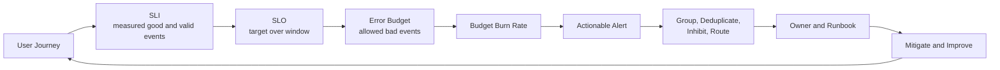
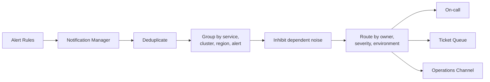

## 1. Executive Summary

Alerting exists to trigger a useful human or automated response before unacceptable user impact persists. It should begin with service outcomes—availability, latency, correctness, durability, or processing delay—not with every component crossing a local threshold.

An **SLI** defines the measured service behavior. An **SLO** sets the target over a window. The difference between perfect service and the SLO creates an **error budget** that makes reliability risk explicit. Burn-rate alerts page when the service is consuming that budget too quickly.

Infrastructure alerts still matter when they predict imminent irreversible damage, threaten the observability/control plane, or require action before a customer SLI can react.

---

## 2. Problem It Solves

Threshold-first alerting produces noise without establishing impact:

```text
CPU above 70% for one minute
One pod restarted
One ERROR log appeared
Disk usage changed by 5%
```

These observations may be useful diagnostics, but they do not automatically justify waking an engineer. A healthy batch worker can sustain 90% CPU; Kubernetes can replace one pod without impact; one error can be expected; a filesystem can grow predictably.

| Alerting failure | Operational consequence |
| :--- | :--- |
| Page on every cause | Alert storms and duplicated investigation |
| Page on transient conditions | Engineers stop trusting alerts |
| Alert after the budget is already spent | Response begins too late |
| No owner or runbook | Notification creates awareness but not action |
| Maintenance mutes too broadly | Real incidents are hidden |
| Alerting pipeline is unmonitored | Silence is mistaken for health |

---

## 3. Reliability Control Loop



The loop must define what happens when the budget is healthy, at risk, or exhausted. Without a decision policy, an error budget becomes another dashboard rather than a mechanism for balancing reliability and delivery risk.

---

## 4. SLI, SLO, SLA, and Error Budget

| Term | Meaning | Example |
| :--- | :--- | :--- |
| SLI | Quantitative measure of delivered service | Proportion of valid HTTP requests that succeed under 500 ms |
| SLO | Target for an SLI over a defined window | 99.9% over rolling 30 days |
| SLA | Agreement with explicit consequences if commitments are missed | Service credit when contractual availability is not met |
| Error budget | Allowed unreliability implied by the SLO | 0.1% bad events in the window |

Define the indicator as a numerator and denominator:

```text
Good events:
  Valid HTTP requests completed successfully under 500 ms

Valid events:
  All eligible HTTP requests, excluding documented classes

SLI:
  good events / valid events

SLO:
  99.9% over 30 days
```

For a purely time-based availability model:

```text
30 days × 24 hours × 60 minutes × 0.1%
= 43.2 minutes of allowed unavailability
```

For a request-based SLO, the budget is bad requests, not minutes. At 100 million valid requests, a 99.9% SLO permits 100,000 bad requests, regardless of whether they occurred in one outage or were distributed across the month.

---

## 5. Designing Useful SLIs and SLOs

Start with what users need, then select the nearest trustworthy measurement.

| Service | User-relevant SLI | Important definition question |
| :--- | :--- | :--- |
| Interactive API | Successful requests below latency threshold | Which client errors and cancellations are eligible? |
| Payment | Correct authorization outcome within deadline | Are declines good outcomes while technical failures are bad? |
| Event pipeline | Events processed correctly before deadline | Is age measured from production or broker receipt? |
| Storage | Successful reads/writes and retained data | How is durability verified rather than inferred? |
| Notification | Delivery accepted or confirmed within objective | Which provider/user failures count? |

Every SLO needs:

- User or workload class
- Good-event definition
- Valid-event denominator and exclusions
- Measurement point and data source
- Target and rolling or calendar window
- Low-traffic and missing-data behavior
- Owner, review cadence, and correction policy
- Relationship to external commitments

Avoid choosing a target only because current performance happens to meet it. Reliability targets are product and business decisions constrained by user need, architecture, staffing, cost, and delivery goals.

---

## 6. Symptoms, Causes, and Alert Severity

### Page on symptoms

Better paging candidates include:

- Sustained customer-visible error-rate increase
- Error-budget burn rate exceeding the response threshold
- Queue delay violating the processing objective
- Payment success below a defined business threshold
- Data loss, corruption, or security control failure

### Investigate causes

CPU, memory, restarts, thread pools, connection pools, disk queues, and dependency errors explain symptoms. Route them to dashboards, tickets, or warning notifications unless they require immediate action by themselves.

| Severity | Expected response | Example |
| :--- | :--- | :--- |
| Critical/page | Immediate action; active or imminent material impact | Fast SLO burn, data corruption, exhausted critical capacity |
| Warning | Response during staffed hours or before forecast exhaustion | Slow budget burn, rising queue age, capacity trend |
| Ticket | Planned corrective work | Persistent inefficiency, missing redundancy, noisy instrumentation |
| Informational | Timeline and diagnostic context | Deployment, failover, completed maintenance |

Severity should derive from impact, urgency, and response—not from whether a metric sounds alarming.

---

## 7. Burn Rate and Multi-Window Alerts

**Burn rate** compares the observed bad-event rate with the rate that would consume the budget evenly across the SLO window:

```text
Burn rate = observed error ratio / allowed error ratio
```

For a 99.9% SLO, the allowed error ratio is 0.1%:

```text
Observed error ratio: 1.0%
Allowed error ratio:  0.1%
Burn rate:             10×
```

At that sustained rate, the service consumes budget ten times faster than planned.

Multi-window alerting evaluates the same burn across a shorter and longer window:

- The **long window** confirms meaningful budget consumption and filters brief noise.
- The **short window** confirms the condition is still active and allows recovery to resolve promptly.
- A high-burn pair pages for rapid incidents.
- A lower-burn pair creates a warning or ticket for slower budget erosion.

Do not copy universal window and multiplier values without considering the SLO window, traffic volume, incident-response time, and data delay. Validate policies by replaying historical incidents and benign spikes.

For low-volume services, ratio alerts can be unstable. Add a minimum event count, use longer windows, or measure synthetic/user-journey availability where appropriate.

---

## 8. Deduplication, Grouping, Routing, and Inhibition



| Control | Purpose | Example |
| :--- | :--- | :--- |
| Deduplication | Prevent duplicate notifications for the same alert identity | Two evaluators report the same service alert |
| Grouping | Combine related alerts into one incident notification | Fifty pods fail because one cluster is unavailable |
| Routing | Deliver by owner, environment, service, and severity | Production payment page to Payments on-call |
| Inhibition | Suppress derivative alerts when a parent failure is active | Silence pod alerts while cluster-unreachable alert fires |
| Silence/maintenance window | Temporarily suppress a known scoped condition | Planned database failover in one region |

Group by stable incident dimensions, not pod or request identifiers. Over-grouping can combine unrelated failures; under-grouping floods responders.

Every page should include service, environment, region, impact, observed value, objective, start time, dashboard, representative traces/logs, runbook, owner, and safe initial actions.

---

## 9. Maintenance, Alert Fatigue, and Infrastructure Exceptions

### Maintenance controls

- Scope by exact service, region, environment, and alert class.
- Require an owner, reason, start, expiry, and change reference.
- Prefer automatic expiration over manual cleanup.
- Do not silence business SLIs merely because infrastructure maintenance is planned; verify expected impact separately.
- Review alerts that fired but were muted to confirm the maintenance model was accurate.

### Alert-fatigue controls

- Delete alerts with no defined action.
- Tune noisy alerts using incident evidence, not arbitrary delay alone.
- Combine dependent symptoms through grouping and inhibition.
- Track page volume, false-positive rate, acknowledgment time, escalations, and alerts closed without action.
- Review whether warning alerts produce completed preventive work.

### When infrastructure pages are necessary

Page directly on infrastructure when delay would cause irreversible or widespread harm, for example:

- Imminent disk exhaustion on a stateful primary
- Loss of quorum or replication durability
- Certificate expiry near the remaining response window
- Alerting or telemetry pipeline failure that creates monitoring blindness
- Backup/restore or data-integrity failure
- Security control or key-management failure
- Capacity exhaustion forecast sooner than safe provisioning lead time

These alerts still need an owner, urgency, and runbook. “CPU high” is not actionable merely because it is infrastructure.

---

## 10. Failure Modes and Governance

| Failure mode | Consequence | Control |
| :--- | :--- | :--- |
| SLI measured only at server | Client/network failures excluded | Client, edge, or synthetic measurement where justified |
| Errors excluded informally | SLO appears healthier than user experience | Versioned denominator and exclusion policy |
| Warning and critical overlap | Duplicate pages for one incident | Inhibition or mutually exclusive rules |
| One alert per pod | Notification storm | Service/cluster grouping and symptom alert |
| Alert depends on same failed region | Outage also removes detection | Independent evaluation and notification paths |
| Missing data treated as success | Blindness looks healthy | Explicit absent/stale-data behavior |
| Maintenance silence never expires | Future incidents hidden | Mandatory expiry and audit |
| Notification manager unavailable | Firing rules never reach responders | HA, end-to-end canaries, delivery monitoring |
| Budget exhausted without policy | Reliability risk continues unchecked | Pre-agreed change and remediation policy |

Error-budget policy should state which changes pause, which security or corrective changes continue, who can approve exceptions, and how service health is restored. Apply policy over a meaningful review period rather than using one incident to punish teams.

---

## 11. Architect Checklist

### Objectives

- Does each critical journey have a user-relevant SLI?
- Are good events, valid events, exclusions, and measurement points explicit?
- Are SLO target and window tied to product and operational needs?
- Is the SLA distinguished from the internal SLO?
- Does the error budget govern release and reliability decisions?

### Alerting platform

- Do critical pages represent customer symptoms or imminent irreversible harm?
- Are multi-window burn alerts tested against historical traffic and incidents?
- Are low-traffic and missing-data cases handled?
- Are warnings, critical pages, tickets, and informational events distinct?
- Are alerts deduplicated, grouped, routed, inhibited, and automatically resolved?
- Do maintenance silences have narrow scope, owners, and expiry?
- Is the alerting path highly available and tested end to end?
- Does every notification include owner, impact, dashboard, runbook, and safe initial action?
- Are page volume, false positives, and unactioned alerts reviewed?

Official references: [Google SRE service-level objectives](https://sre.google/sre-book/service-level-objectives/), [Google SRE alerting on SLOs](https://sre.google/workbook/alerting-on-slos/), and [Prometheus Alertmanager](https://prometheus.io/docs/alerting/latest/alertmanager/).
Client and journey objectives may require [Frontend and Mobile RUM](/microservices/08-observability/advanced/frontend-mobile-rum/) plus [Synthetic Monitoring](/microservices/08-observability/advanced/synthetic-monitoring/) rather than backend request metrics alone.
