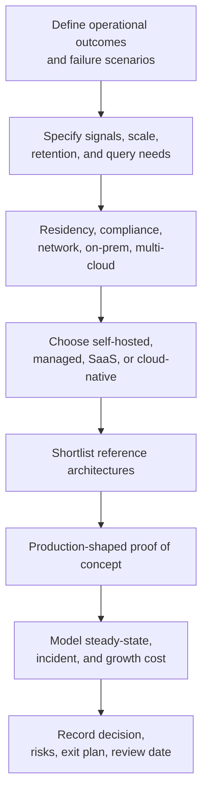

## 1. Executive Summary

Choosing an observability stack is an operating-model decision disguised as a product decision. Two platforms can ingest the same OpenTelemetry data while requiring very different staffing, storage, access, incident, upgrade, and cost-governance models.

Do not begin with “Which product is best?” Begin with:

- Which user journeys and failure modes must operators diagnose?
- Which metrics, logs, traces, profiles, events, RUM, synthetics, and security data are required?
- Who will operate the telemetry plane at 03:00?
- Where may the data be processed and retained?
- Which cost units can the organization govern predictably?
- Which proprietary capabilities justify exit cost?

OpenTelemetry should define the portable instrumentation baseline. It reduces application-level switching cost, but dashboards, queries, alerts, retention, identity, incident workflows, and backend-specific enrichments still require migration.

---

## 2. Decision Process



The proof of concept should reproduce real workflows: SLO alert → metric → trace → logs → deployment; high-cardinality rejection; backend throttling; regional failure; tenant isolation; archive restore; and a representative monthly volume projection.

---

## 3. Option 1 — CNCF Self-Hosted

```text
Applications
  -> OpenTelemetry
  -> OTel Collector
  -> Prometheus / Mimir
  -> Loki
  -> Tempo
  -> Grafana
  -> Alertmanager
```

### Choose when

- Kubernetes is the primary runtime.
- A strong platform engineering team already operates distributed stateful systems.
- Data residency, on-premises deployment, or custom processing is mandatory.
- PromQL/Grafana skills and open interfaces are strategic.
- Infrastructure and staffing can provide more predictable economics than managed ingestion.

### Risks

- Operational overhead across several independent components
- Scaling, sharding, compaction, object storage, upgrades, and schema compatibility
- High availability, backup, restore, tenant isolation, and disaster recovery
- Platform on-call ownership and capacity engineering
- Internal labor and opportunity cost hidden behind “free software”

Do not choose this solely to avoid a SaaS invoice. The team must fund the control plane, storage, engineering, incidents, security patches, and lifecycle for every component.

---

## 4. Option 2 — Grafana Cloud

```text
Applications and Infrastructure
  -> OpenTelemetry Collector or Alloy
  -> Grafana Cloud
       Metrics
       Logs
       Traces
       Profiles
       Dashboards and Alerts
```

### Choose when

- Grafana and Prometheus-compatible workflows are already preferred.
- Managed backend operations are desired.
- OpenTelemetry, PromQL, and multi-cloud visibility matter.
- Teams want correlation across the Grafana metrics/logs/traces ecosystem.
- A SaaS control/data plane is acceptable for the required regions and compliance model.

### Risks

- Telemetry cost growth across active series, logs, traces, profiles, retention, and users
- Ingestion limits, quotas, and network dependency
- SaaS availability and regional/data-residency constraints
- Grafana query, dashboard, alert, and managed-feature coupling

Keep application instrumentation on OpenTelemetry, govern labels and sampling before export, and test whether the required workflows depend on Grafana Cloud-only features.

---

## 5. Option 3 — Elastic Observability

```text
Applications and Platforms
  -> OpenTelemetry / EDOT / approved agents
  -> Elastic ingestion
  -> Elasticsearch data tiers
  -> Elastic Observability and Kibana
  -> Optional Elastic Security integration
```

### Choose when

- Elasticsearch already exists as an organizational capability.
- Deep log search and event analytics are primary requirements.
- Observability and SIEM workflows need shared search and security context.
- Teams already understand index, mapping, shard, lifecycle, and KQL/ES|QL operations.
- Self-managed, hosted, or serverless deployment flexibility matters.

### Risks

- Infrastructure, hot-storage, indexing, and retention cost
- Cluster and data-lifecycle tuning for self-managed deployments
- Licensing and edition selection
- Schema coexistence between legacy agents and OpenTelemetry
- Query, dashboard, index, and security-workflow coupling

Use native OTLP/EDOT paths deliberately and validate feature parity for metrics, logs, traces, histograms, sampling, and infrastructure correlation.

---

## 6. Option 4 — Datadog

```text
Applications, Kubernetes, Cloud, Browser
  -> Datadog Agent and/or OpenTelemetry
  -> Datadog SaaS
       Infrastructure
       APM
       Logs
       RUM and Synthetics
       Security and Service Catalog
```

### Choose when

- Rapid onboarding and broad integrations are more important than backend control.
- SaaS is acceptable.
- Kubernetes, cloud, infrastructure, APM, logs, and frontend views should share one platform.
- Product teams want managed workflows with minimal telemetry-backend operations.

### Risks

- Cost growth across hosts, containers, custom metrics, tags, logs, spans, users, and add-ons
- Tag-cardinality mistakes affecting usability and cost
- Vendor query, dashboard, monitor, agent, and workflow dependency
- Feature differences between OpenTelemetry and vendor-native instrumentation

Model cost using production-shaped data and contract units. Do not extrapolate from a small proof of concept with a few hosts and short retention.

---

## 7. Options 5–7 — Enterprise Managed Platforms

### New Relic

Choose when managed, application-centric APM is required; teams want metrics, events, logs, traces, and error workflows; and minimal backend operations are preferred.

Risks include ingest and retention growth, NRQL/dashboard coupling, and feature differences between proprietary agents and OpenTelemetry. Validate whether sampled spans, OTel metrics, and derived transaction views meet required accuracy.

### Dynatrace

Choose for large enterprises prioritizing automated topology discovery, deep enterprise integrations, centralized governance, and assisted root-cause workflows.

Risks include licensing cost, platform breadth and complexity, rollout governance, specialized operating knowledge, and high dependency on the platform's entity/topology model. Compare OpenTelemetry ingestion with native agent depth rather than assuming parity.

### Splunk Observability

Choose when Splunk is already strategic, infrastructure/APM and security/operational analytics must integrate, and enterprise-scale event or log search is central.

Risks include product-boundary ambiguity between Observability Cloud and Splunk log/security platforms, licensing and ingestion cost, and strong query/workflow dependency. Define which system owns metrics, traces, operational logs, security logs, alerts, and retention before procurement.

---

## 8. Option 8 — Cloud-Native

```text
Cloud Workloads
  -> Provider agents / OpenTelemetry distribution
  -> Native metrics, logs, traces, profiling
  -> Managed Prometheus and Grafana where required
  -> Native IAM, alerting, and incident integrations
```

### Choose when

- Most workloads and operators are concentrated in one cloud.
- Deep native service integration and cloud IAM matter.
- Managed operations are preferred over a cross-cloud backend.
- Native audit, resource, network, serverless, and control-plane telemetry is essential.
- Existing cloud commitments and skills support the expected usage.

### Risks

- Cloud lock-in across schemas, queries, dashboards, alerts, IAM, and archives
- Fragmented experiences across metrics, logs, traces, Prometheus, and Grafana services
- Cross-cloud and on-premises correlation complexity
- Cost unpredictability across many separately metered services
- Migration of retained data and native service integrations

An OpenTelemetry-first application layer helps portability, but native cloud resource telemetry and operational workflows will remain provider-specific. A hybrid design may keep application telemetry portable while retaining native cloud logs and control-plane evidence locally.

---

## 9. Technical Decision Matrix

Ratings are directional starting points, not procurement facts. “Strong” means the architecture commonly fits the criterion; “Conditional” means edition, topology, integration, or proof-of-concept validation materially affects the result.

### Runtime and signal fit

| Option | Kubernetes | Multi-cloud | Log search | Tracing | Metrics scale |
| :--- | :---: | :---: | :---: | :---: | :---: |
| CNCF self-hosted | Strong | Strong | Conditional | Strong | Strong with Mimir design |
| Grafana Cloud | Strong | Strong | Strong | Strong | Strong |
| Elastic | Strong | Strong | Very strong | Strong | Strong; validate metric model |
| Datadog | Strong | Strong | Strong | Strong | Strong; govern tags |
| New Relic | Strong | Strong | Strong | Strong | Strong; validate workflows |
| Dynatrace | Strong | Strong | Strong | Strong | Strong |
| Splunk | Strong | Strong | Very strong with Splunk platform | Strong | Strong |
| Cloud-native | Strong in provider | Conditional | Strong in provider | Strong in provider | Strong in provider |

### Portability and environment fit

| Option | OpenTelemetry | SIEM integration | On-premises | Vendor lock-in |
| :--- | :---: | :---: | :---: | :---: |
| CNCF self-hosted | Native baseline | Integration required | Strong | Low–moderate; query/tool coupling |
| Grafana Cloud | Strong | Integration required | Collector at edge; SaaS backend | Moderate |
| Elastic | Strong, path-dependent | Very strong in Elastic | Strong when self-managed | Moderate–high |
| Datadog | Strong, native features differ | Strong product integration | Agent/collector edge; SaaS backend | High |
| New Relic | Strong, native features differ | Integration required | Collector edge; SaaS backend | Moderate–high |
| Dynatrace | Strong, native features differ | Enterprise integration | Conditional by supported model | High |
| Splunk | Strong via OTel distribution | Very strong in Splunk | Conditional by product topology | High |
| Cloud-native | Provider distributions/export | Strong provider-native security tools | Weak–conditional | High to cloud provider |

---

## 10. Operating and Governance Matrix

### Ownership and deployment

| Option | Operational overhead | Primary ownership | SaaS vs self-hosted |
| :--- | :---: | :--- | :--- |
| CNCF self-hosted | Very high | Internal platform/SRE | Self-hosted |
| Grafana Cloud | Low–medium | Vendor backend; customer telemetry governance | SaaS |
| Elastic | Low to high | Vendor or internal platform by deployment | SaaS/serverless/self-hosted |
| Datadog | Low–medium | Vendor backend; customer agents/schemas/cost | SaaS |
| New Relic | Low–medium | Vendor backend; customer instrumentation/governance | SaaS |
| Dynatrace | Medium | Vendor platform plus enterprise observability team | SaaS/supported managed models |
| Splunk | Medium | Vendor plus Splunk platform/observability teams | SaaS and enterprise platform components |
| Cloud-native | Low–medium | Cloud provider plus cloud platform team | Provider-managed |

### Compliance, residency, and cost

| Option | Compliance/residency | Cost predictability | Dominant cost risk |
| :--- | :--- | :---: | :--- |
| CNCF self-hosted | Maximum placement control; customer proves controls | Medium | Labor, storage, peak capacity, incidents |
| Grafana Cloud | Available regions/contracts must fit | Medium | Series, logs, traces, profiles, retention |
| Elastic | Flexible by deployment | Medium | Indexed data, hot tiers, compute, license |
| Datadog | Available regions/contracts must fit | Low–medium | Hosts, tags, custom metrics, ingest, add-ons |
| New Relic | Available regions/contracts must fit | Medium | Ingest, retention, users/features |
| Dynatrace | Enterprise controls; verify topology/region | Medium | Monitored resources, data, features, contract |
| Splunk | Enterprise controls; verify product regions | Medium | Ingestion, retention, workloads, licenses |
| Cloud-native | Strong within provider regions | Low–medium | Distributed service meters, queries, egress |

Compliance cannot be selected from a matrix. Validate certifications, regional processing, support access, encryption/key control, deletion, legal hold, private connectivity, tenant isolation, and audit evidence against the specific edition and contract.

---

## 11. Architect Checklist and ADR Output

### Selection evidence

- Are required user journeys and failure scenarios documented?
- Are metrics, log search, traces, profiles, RUM, synthetics, and SIEM needs explicit?
- Are Kubernetes, multi-cloud, on-premises, and serverless requirements tested?
- Is OpenTelemetry support validated for each signal, histogram, exemplar, span link, and semantic convention?
- Are self-hosted labor and incident costs compared with managed-service spend?
- Are compliance, residency, connectivity, access, deletion, and audit requirements contractually verified?
- Has projected cost used peak and incident telemetry, not only average volume?
- Can the team export data and recreate critical SLOs, alerts, dashboards, and investigations elsewhere?

### ADR contents

Record:

1. Decision drivers and non-negotiable constraints
2. Options evaluated and evidence from the proof of concept
3. Selected reference architecture and operational owner
4. Portable OpenTelemetry baseline and approved proprietary extensions
5. Cost model, budgets, quotas, and chargeback/showback approach
6. Security, compliance, residency, retention, and disaster-recovery design
7. Known limitations and accepted risks
8. Exit strategy, data-export path, and migration throughput
9. Review triggers such as volume, cost, acquisition, regulation, or multi-cloud expansion

Use [Observability Tool Landscape](/microservices/08-observability/observability-tool-landscape/) for capability detail and [OpenTelemetry Architecture](/microservices/08-observability/opentelemetry-architecture/) for the portable collection baseline.
