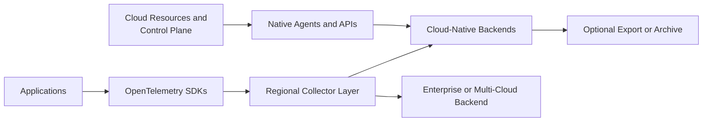
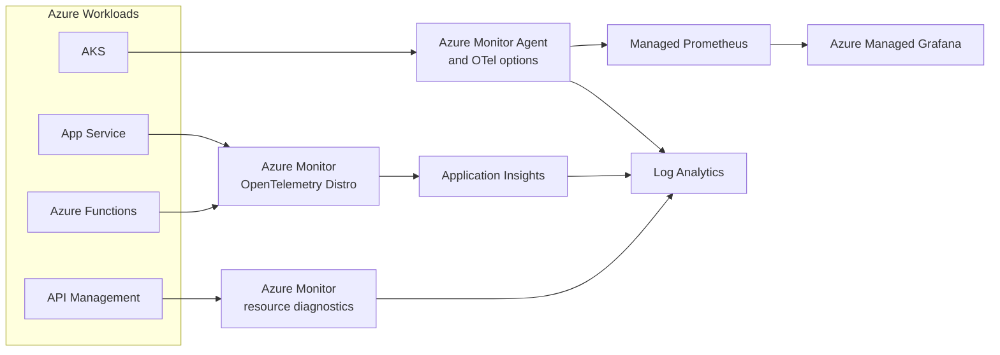
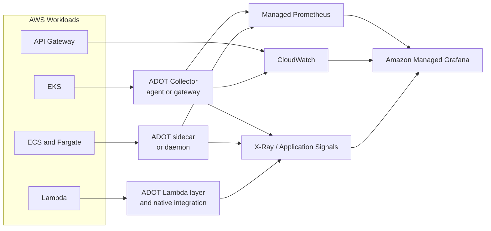
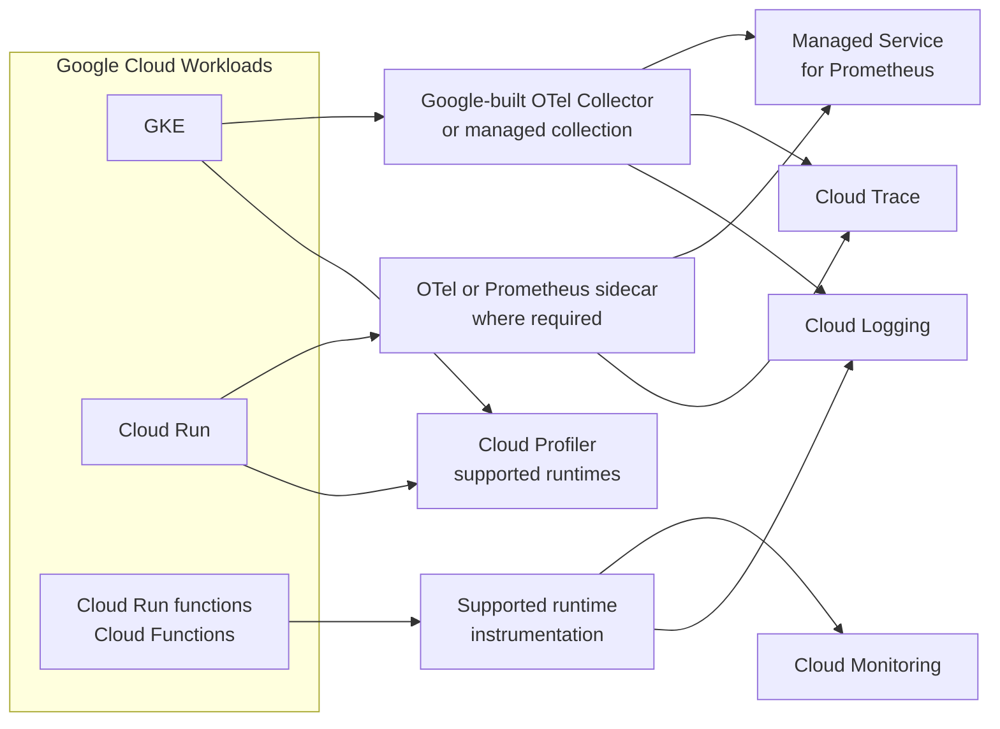

## 1. Executive Summary

Cloud observability has two telemetry domains:

1. **Application telemetry** that can usually follow OpenTelemetry standards.
2. **Provider control-plane and managed-service telemetry** that remains cloud-specific.

A native-first architecture optimizes provider integration and reduces backend operations. An OpenTelemetry-first architecture preserves application portability and central policy. A hybrid architecture keeps native resource/audit evidence in the cloud while routing portable application signals to one or more backends.

The decision is not “native or OpenTelemetry.” It is where to place instrumentation, collection, processing, storage, querying, alerting, identity, retention, and ownership for each signal.

---

## 2. Cross-Cloud Design Principles



Apply these principles in every provider:

- Use stable `service.name`, environment, region, zone, version, and account/subscription/project attributes.
- Keep ingestion regional unless global processing is an explicit requirement.
- Separate application, platform, audit, security, and billing telemetry.
- Use cloud workload identity rather than static backend credentials.
- Define what happens when the Collector, cloud ingestion endpoint, or cross-cloud link is unavailable.
- Budget logs, custom metrics, traces, profiles, queries, retention, archive retrieval, and cross-region/cloud egress independently.
- Validate current product, region, language, signal, and support status before production adoption.

---

## 3. Azure Reference Architecture

```text
Application
  -> OpenTelemetry / Azure Monitor Agent
  -> Application Insights
  -> Azure Monitor
  -> Log Analytics
  -> Azure Monitor managed service for Prometheus
  -> Azure Managed Grafana
```



### Service responsibilities

| Service | Primary role | Architecture caution |
| :--- | :--- | :--- |
| Azure Monitor | Azure metrics, logs, alerts, resource and platform integration | Separate meters, workspaces, query languages, and retention settings can fragment cost and experience |
| Application Insights | Application performance, dependencies, failures, transaction views | Language and ingestion path affect feature support; do not assume all OTel data produces identical UI behavior |
| Log Analytics | KQL workspace for logs and operational analysis | Workspace topology, access, retention, transformations, and query cost require governance |
| Managed Prometheus | Prometheus-compatible metrics for AKS and related workloads | Scrape scope, labels, rules, quotas, and workspace placement remain customer responsibilities |
| Azure Managed Grafana | Managed visualization across Azure and approved sources | It is not the telemetry store; RBAC and data-source permissions must align with workspace boundaries |

---

## 4. Azure Deployment Approaches

### Native-first

Use Azure Monitor integration for AKS, App Service, Functions, API Management, and other resources; Application Insights for supported application runtimes; Log Analytics for logs; managed Prometheus for AKS; and Managed Grafana for visualization.

Choose when most workloads, operators, identity, and incident processes are Azure-centered. Benefits include managed identity, portal integration, resource metadata, native diagnostic settings, and reduced telemetry-backend operations.

Risks include KQL/workspace coupling, fragmented configuration, custom-metric/log costs, and differing support across runtimes and ingestion paths.

### OpenTelemetry-first

Instrument applications with upstream OTel APIs/SDKs, send OTLP to regional Collectors, enrich Azure resource attributes, and export to approved Azure Monitor endpoints or an external backend.

Choose when application portability, central redaction/sampling, or multi-destination routing matters. Verify whether the selected Collector/export path is supported for the workload and signal; preview paths must not be treated as production commitments.

### Hybrid

Keep Azure activity/resource logs, platform metrics, API Management diagnostics, and security/audit evidence in Azure. Route portable application traces, metrics, and logs through OTel to Azure and/or an enterprise backend.

This preserves provider-native evidence while avoiding unnecessary proprietary application instrumentation. The cost is two schemas, correlation policy, routing governance, and possible duplicate ingestion.

### Workload guidance

- **AKS:** managed Prometheus and Container Insights/native logs; OTel Collector for portable application signals. Check current status of native OTLP application-monitoring paths.
- **App Service:** use supported OTel-based auto/manual instrumentation and correlate with platform diagnostics.
- **Azure Functions:** account for cold start, supported language/runtime, execution correlation, and bounded exporter behavior.
- **API Management:** retain gateway analytics and diagnostics; propagate trace context to backends and prevent payload/secret capture.

---

## 5. AWS Reference Architecture

```text
Application
  -> ADOT / CloudWatch Agent
  -> CloudWatch
  -> X-Ray
  -> Amazon Managed Service for Prometheus
  -> Amazon Managed Grafana
```



### Service responsibilities

| Service | Primary role | Architecture caution |
| :--- | :--- | :--- |
| CloudWatch | AWS metrics, logs, alarms, dashboards, and resource integration | Custom metrics, log ingest/query, retention, and alarms use different cost and governance controls |
| X-Ray | Distributed trace backend and AWS service correlation | Keep instrumentation portable with OTel/ADOT and validate mapping to X-Ray/Application Signals features |
| Managed Prometheus | Managed Prometheus-compatible metrics | Customer still owns scrape/remote-write design, labels, rules, quotas, and workspace/account topology |
| Managed Grafana | Managed visualization for AWS and external sources | Workspace identity, data-source permissions, versions, plugins, and dashboard lifecycle remain customer concerns |
| ADOT | AWS-supported OpenTelemetry distribution for collection/instrumentation | AWS exporters and resource detection add value but create provider-specific configuration |

---

## 6. AWS Deployment Approaches

### Native-first

Use CloudWatch metrics/logs/alarms, X-Ray or Application Signals for application paths, managed Prometheus for EKS metrics, Managed Grafana for visualization, and provider-native telemetry for API Gateway, Lambda, ECS, and EKS.

Choose when AWS resource integration, IAM, managed operations, and provider incident workflows dominate. Risks include separate consoles/query models, many billing dimensions, and AWS-specific dashboards/alarms.

### OpenTelemetry-first

Use upstream OTel APIs with ADOT Collectors or supported upstream Collectors. Export traces to X-Ray/Application Signals, metrics to Managed Prometheus or CloudWatch, and logs to CloudWatch or another backend.

Choose when shared instrumentation, centralized policy, or backend flexibility matters. ADOT can simplify AWS authentication and resource metadata while retaining OTel APIs.

### Hybrid

Keep CloudTrail, VPC/network, load-balancer, API Gateway, Lambda platform, and control-plane logs in AWS. Route application telemetry through ADOT to AWS-native and/or enterprise backends.

Avoid unconditional dual export: it doubles network and ingestion volume and can create inconsistent sampling. State which backend owns alerting, retention, and incident truth for every signal.

### Workload guidance

- **EKS:** use the ADOT EKS add-on/Operator and Collectors for application traces and Prometheus metrics; choose agent/gateway roles deliberately.
- **ECS/Fargate:** sidecar collection may be appropriate per task; ECS on EC2 can also use daemon patterns. Include sidecar resource and failure budgets.
- **Lambda:** use supported ADOT layers/native integration; minimize cold-start and export overhead, and verify runtime-specific defaults.
- **API Gateway:** rely on native metrics/access/execution logs as applicable, propagate trace context, and correlate gateway request IDs without treating them as trace IDs.

---

## 7. Google Cloud Reference Architecture

```text
Application
  -> OpenTelemetry
  -> Cloud Monitoring
  -> Cloud Logging
  -> Cloud Trace
  -> Managed Service for Prometheus
  -> Cloud Profiler
```



### Service responsibilities

| Service | Primary role | Architecture caution |
| :--- | :--- | :--- |
| Cloud Monitoring | Metrics, dashboards, alerts, SLOs, and Google resource integration | Metric scopes, projects, labels, quotas, and alert ownership need central governance |
| Cloud Logging | Log routing, buckets, search, retention, sinks, and log-based metrics | Exclusions, buckets, views, retention, and exports can become fragmented and costly |
| Cloud Trace | Distributed trace storage and exploration | Sampling and application instrumentation remain customer concerns; it is not a full log/metric backend |
| Cloud Profiler | Continuous profiling for supported runtimes | Validate runtime/platform availability, overhead, retention, and access requirements |
| Managed Service for Prometheus | Managed, cross-project/multi-cloud Prometheus and OTel metrics with PromQL | Collection mode, project topology, labels, rules, and query scope still require architecture |

---

## 8. Google Cloud Deployment Approaches

### Native-first

Use GKE managed collection, Cloud Logging, Cloud Monitoring alerts/SLOs, Cloud Trace, Cloud Profiler, and Managed Service for Prometheus. Use provider-native resource and audit logs for GKE, Cloud Run, functions, load balancing, and IAM.

Choose when Google Cloud project/resource integration and managed global metrics are priorities. Risks include project/metric-scope complexity, provider query/workflow coupling, and separately governed logging, tracing, profiling, and metrics.

### OpenTelemetry-first

Instrument applications with upstream OTel and deploy the Google-built or upstream Collector to export correlated OTLP telemetry to Google Cloud and optional external backends.

For GKE, pair OTel application signals with Managed Service for Prometheus. For Cloud Run, use the supported sidecar pattern when the runtime requires local collection. Validate Cloud Run/function lifecycle, shutdown, buffering, and support constraints.

### Hybrid

Keep Cloud Audit Logs, VPC/service, GKE control-plane, Cloud Run platform, and IAM evidence in Google Cloud. Export portable application telemetry through OTel to Google Cloud and/or an enterprise platform.

Google Managed Service for Prometheus can collect outside Google Cloud, but using it as a multi-cloud metrics backend still creates Google identity, project, API, and data-location dependencies.

### Workload guidance

- **GKE:** managed Prometheus collection is the native default; use the Google-built OTel Collector for correlated application signals where appropriate.
- **Cloud Run:** structured stdout/stderr logs flow natively; use supported Prometheus or OTel sidecars for metrics/OTLP when needed and budget sidecar resources.
- **Cloud Run functions/Cloud Functions:** validate supported runtime instrumentation, execution context, sampling, cold start, and asynchronous export completion.
- **Cloud Profiler:** use only for supported runtimes and treat profile access as sensitive production-data access.

---

## 9. Cost, Multi-Cloud, and Data Governance

| Dimension | Native-first | OpenTelemetry-first | Hybrid |
| :--- | :--- | :--- | :--- |
| Platform operations | Lowest backend operations | Collector fleet and routing ownership | Both native configuration and Collector ownership |
| Application portability | Moderate | Highest baseline portability | High for applications, low for platform evidence |
| Native service depth | Highest | Depends on exporters and semantic mapping | High for native signals and portable app signals |
| Duplicate ingestion | Low | Low when one destination | High unless routing is selective |
| Multi-cloud query | Fragmented | Strong with common external backend | Depends on enterprise backend coverage |
| Migration effort | High for dashboards/queries/alerts | Lower for instrumentation, still high for stored workflows | Selective migration possible |

Model cost per signal and provider:

- Custom metric series/samples and cardinality
- Log ingestion, indexing/analysis, retention, archive, and restore
- Trace spans, sampling, and retention
- Profile volume and supported retention
- Dashboard/viewer/workspace licensing where applicable
- Cross-region and cross-cloud network egress
- Collector compute, memory, storage queues, and operations
- Duplicate native plus enterprise ingestion

Apply classification, residency, retention, encryption, customer-managed-key, private-connectivity, support-access, and deletion requirements before routing data across accounts, subscriptions, projects, regions, or vendors.

---

## 10. Migration Patterns and Failure Modes

### Migration sequence

1. Standardize service/resource attributes and trace propagation.
2. Introduce OTel APIs and Collector routing without changing the current backend.
3. Dual-export a bounded representative subset—not the whole estate.
4. Rebuild SLOs, alerts, dashboards, retention, and access controls in the target.
5. Compare metric semantics, trace completeness, log fields, query results, and cost.
6. Move ownership signal by signal and service by service.
7. Retire old exporters and ingestion only after the investigation window closes.

| Failure mode | Consequence | Control |
| :--- | :--- | :--- |
| Cross-region Collector dependency | Regional app incident loses telemetry | Region-local ingestion and bounded queues |
| Native and OTel schemas diverge | Broken correlation and duplicate services | Canonical resource mapping and conformance checks |
| Dual export left indefinitely | Double cost and conflicting alerts | Expiring migration plan and ownership matrix |
| Serverless exporter flushes late | Final spans/metrics disappear | Supported layer/sidecar and lifecycle-aware batching |
| Cloud metric dimensions explode | Quotas and cost increase | Attribute allowlists and cardinality budgets |
| Platform logs exported unfiltered | Sensitive data and egress cost | Classification, routing, redaction, and exclusions |
| Preview path treated as GA | Unsupported production dependency | Architecture gate on current support/SLA status |
| One backend owns all alert truth | Backend outage creates blindness | Independent platform-integrity and end-to-end canaries |

---

## 11. Architect Checklist

### Provider architecture

- Are application and provider-native telemetry ownership separated?
- Is the native-first, OTel-first, or hybrid choice explicit per signal?
- Are AKS/App Service/Functions/APIM, EKS/ECS/Lambda/API Gateway, and GKE/Cloud Run/functions paths documented?
- Is every language, runtime, region, signal, and ingestion path supported for production?
- Are managed Prometheus, Grafana, log, trace, and profiling responsibilities clear?

### Reliability, security, and migration

- Is ingestion regional and resilient to backend/network failure?
- Are workload identity and private connectivity used instead of static credentials?
- Are cardinality, sampling, log exclusions, retention, queries, and egress budgeted?
- Are audit/security logs protected separately from application telemetry?
- Does hybrid routing avoid uncontrolled duplicate ingestion?
- Can SLOs, alerts, dashboards, access policies, and archives be migrated?
- Are Collector drops, cloud ingestion rejections, throttling, and stale telemetry monitored?
- Is preview functionality blocked from production unless risk is explicitly accepted?

Official references: [Azure Monitor OpenTelemetry options](https://learn.microsoft.com/en-us/azure/azure-monitor/containers/opentelemetry-options), [ADOT for EKS](https://aws-otel.github.io/docs/getting-started/adot-eks-add-on/), [ADOT for ECS](https://aws-otel.github.io/docs/setup/ecs/), [Google Cloud instrumentation guidance](https://docs.cloud.google.com/stackdriver/docs/instrumentation/choose-approach), and [Google Managed Service for Prometheus](https://docs.cloud.google.com/stackdriver/docs/managed-prometheus).
