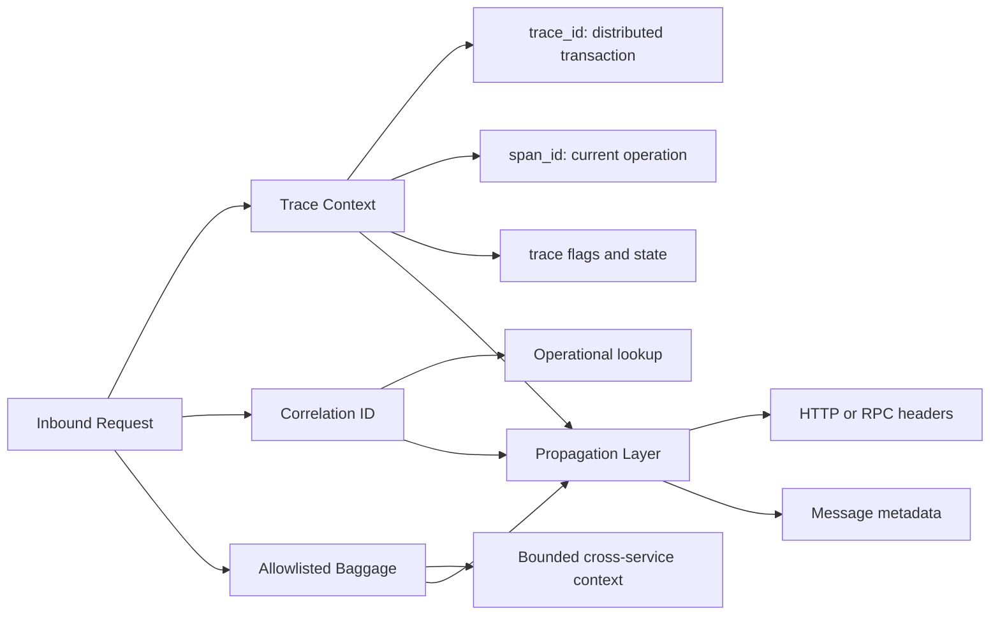

## 1. Executive Summary

Telemetry is useful only when responders can establish which records belong to the same operation. Distributed tracing provides standardized trace and span context; a correlation or request ID provides a stable operational handle where a trace may be absent, sampled, or split by a long-running workflow. Both must be generated, validated, propagated, logged, and returned deliberately.

Context propagation is also a security boundary. Baggage and business identifiers must be allowlisted, size-limited, and prevented from carrying secrets or sensitive identity data.

---

## 2. Problem It Solves

An order can cross an API gateway, four services, a Kafka topic, a retry topic, and a scheduled reconciliation job. Timestamp searches cannot reliably reconstruct that path under concurrency.

| Missing context | Operational effect |
| :--- | :--- |
| Gateway replaces the incoming trace | Frontend and backend traces are disconnected |
| Kafka producer omits headers | Consumer processing becomes a separate trace with no link |
| Every service generates a new request ID | Logs cannot be searched end to end |
| Raw customer ID is placed in baggage | Sensitive data propagates to every downstream system |
| Retry creates no attempt metadata | Operators cannot distinguish original work from retry storms |

---

## 3. Context Model



Use the W3C `traceparent` and `tracestate` standards for trace propagation. Treat a custom correlation ID as complementary, not as a replacement tracing protocol.

---

## 4. Synchronous Request Flow

```mermaid
sequenceDiagram
    participant C as Client
    participant G as API Gateway
    participant O as Order Service
    participant P as Payment Service

    C->>G: POST /orders + optional traceparent
    G->>G: validate context; create if absent
    G->>O: traceparent + correlation ID
    O->>P: child span + same correlation ID
    P-->>O: response + trace evidence
    O-->>G: order accepted
    G-->>C: response + safe correlation ID
```

At an untrusted ingress, validate header format and length. Do not blindly trust sampling flags, baggage, or identifiers supplied by an external caller. The gateway may preserve valid trace context while applying organization policy and recording the external-to-internal relationship.

---

## 5. Asynchronous Propagation

Messaging changes the causal model. Producers inject context into message headers; consumers extract it and create processing spans. A single message usually continues or links to producer context, while batch consumers may need links to multiple producer contexts rather than inventing one parent.

```mermaid
sequenceDiagram
    participant O as Order Service
    participant K as Kafka
    participant I as Inventory Service
    participant D as PostgreSQL

    O->>O: create producer span
    O--)K: order event + trace context + correlation ID
    K--)I: deliver event
    I->>I: extract context; create consumer span
    I->>D: reserve inventory child span
    D-->>I: committed
    opt retry required
        I--)K: retry event + original correlation + attempt metadata
    end
```

Persist business workflow identifiers in the domain event when they are part of the contract. Do not depend on broker headers as the only durable audit relationship; replay, transformation, and bridging infrastructure may alter them.

---

## 6. Identifier Responsibilities

| Identifier | Scope | Recommended use |
| :--- | :--- | :--- |
| Trace ID | One distributed execution graph | Traces and trace-linked logs |
| Span ID | One operation within a trace | Precise log-to-span correlation |
| Correlation/request ID | Operational request or workflow handle | Client support and cross-system log lookup |
| Domain ID | Order, payment, shipment, or workflow | Business state and audit relationships |
| Idempotency key | Deduplication scope | Safe command retry; not a general trace ID |

Do not overload one identifier for every purpose. A long-running order may involve multiple traces but retain one domain or correlation identifier; a retried HTTP attempt may retain business intent while creating new spans.

---

## 7. Design Options and Trade-offs

| Choice | Use when | Trade-off |
| :--- | :--- | :--- |
| Trace context only | Every boundary is instrumented and support does not need a public handle | Sampled traces can weaken lookup |
| Trace plus correlation ID | Cross-platform support and long workflows need a stable handle | Two identifiers require clear semantics |
| Baggage for bounded routing context | A small approved value must reach downstream instrumentation | Propagation overhead and data leakage risk |
| Domain event identifiers | Relationship must survive replay and storage | Couples telemetry investigation to domain contracts |
| Span links | Batch, fan-in, or async causality has multiple parents | Some backends visualize links less clearly than parent-child trees |

---

## 8. Failure Scenarios

| Failure | Evidence | Mitigation |
| :--- | :--- | :--- |
| Invalid inbound `traceparent` | Parser rejection or broken root | Validate and start a new internal trace with an audit event |
| Header stripped by proxy | New root appears after gateway | Explicit allowlist and integration verification at every hop |
| Context lost in executor/thread pool | Logs lack current span | Use supported context-aware instrumentation and explicit handoff |
| Retry reuses completed span | Incorrect durations and topology | Create a span per attempt; retain correlation and retry metadata |
| Baggage grows unbounded | Latency, header rejection, exposure | Key allowlist, size limit, truncation/drop counters |
| Consumer trusts serialized identity | Authorization bypass risk | Re-authenticate/authorize; telemetry context is not security proof |

---

## 9. Security and Privacy

- Never place credentials, tokens, session IDs, raw email addresses, or payment data in trace context or baggage.
- Treat externally supplied correlation IDs as untrusted input; validate length and character set before logging.
- Do not use correlation IDs as authorization or idempotency proof.
- Allowlist baggage keys and document their owner, purpose, maximum size, and retention impact.
- Tokenize business identifiers when operators need lookup without revealing raw values.
- Ensure log and trace access follows least privilege and tenant isolation.
- Redact at instrumentation and collector layers; backend-only redaction is too late for exported copies.

---

## 10. Architect Interview Answer

> I use W3C trace context for standardized distributed tracing and an optional correlation ID as a stable operational handle across sampled traces or long-running workflows. Gateways validate or create context, services propagate it automatically across HTTP and RPC, and producers inject it into message metadata. Consumers extract it and create processing spans or span links for fan-in. Logs include trace and span IDs, while domain IDs remain explicit business fields. Baggage is allowlisted and size-limited because it propagates widely and must never carry secrets or authorization claims.

---

## 11. Implementation Standards

An organization-wide propagation contract should specify:

- Supported standards and header names
- Trusted and untrusted ingress behavior
- HTTP, RPC, Kafka, NATS, and scheduled-job propagation
- Batch and fan-in span-link policy
- Correlation-ID generation, validation, and response behavior
- Required log fields: `trace_id`, `span_id`, and approved correlation field
- Baggage allowlist, size limits, and drop metrics
- Behavior when telemetry is unavailable—the business request must degrade safely
- Conformance checks in shared libraries and platform integration pipelines

The planned OpenTelemetry Architecture page will continue with SDK, propagator, Collector, and sampling decisions.
