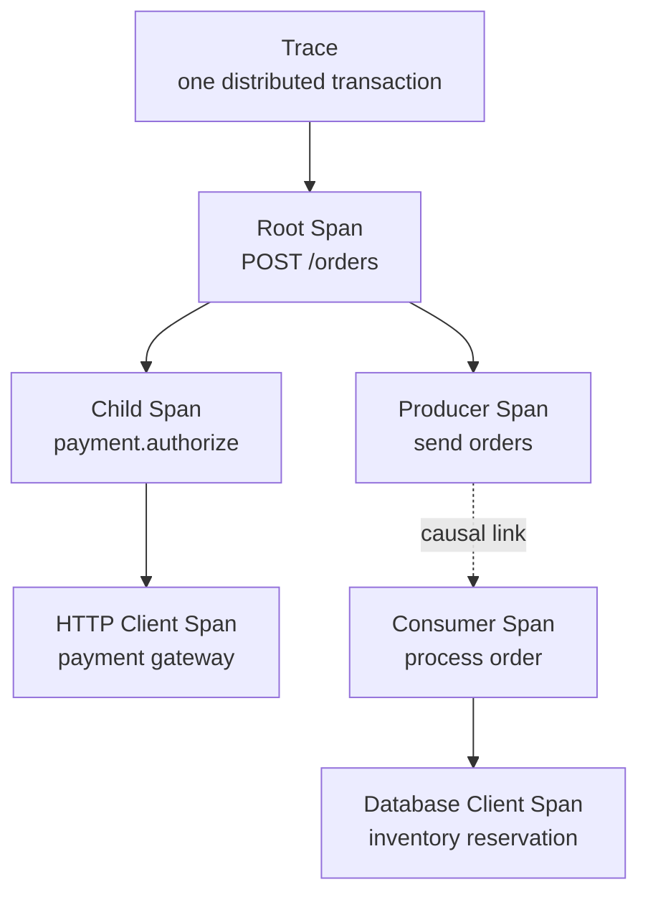
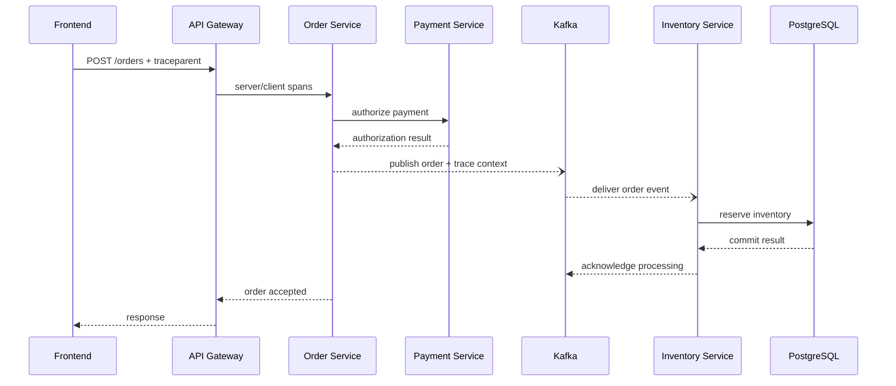
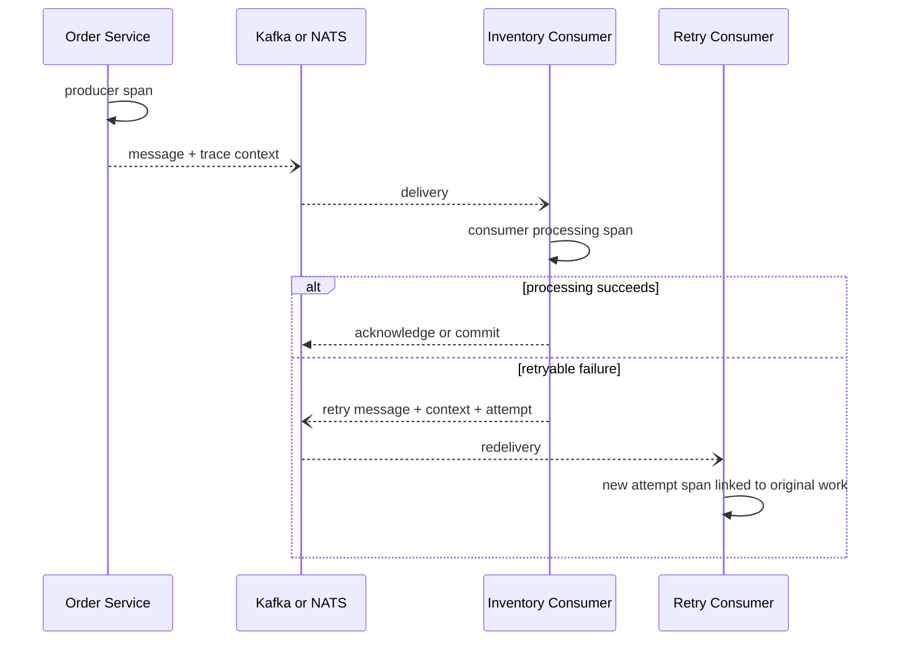

## 1. Executive Summary

A distributed trace records the causal path of one transaction across process, network, messaging, and storage boundaries. The trace is composed of **spans**: timed operations with a parent or causal link, attributes, events, status, and resource identity.

Tracing answers where a request spent time and how downstream operations related to it. It is especially valuable for microservices because service-level latency alone cannot distinguish local execution, network delay, queue waiting, database work, retries, and external APIs.

Tracing is sampled evidence, not an accounting system. Architecture must define propagation, span boundaries, semantic conventions, sampling, retention, security, cost, and behavior when parts of a trace never arrive.

---

## 2. Problem It Solves

Suppose checkout P99 rises from 600 ms to 2.5 seconds. Metrics establish the regression, but several explanations fit:

- Payment Service is slow.
- Payment Service retries an external gateway.
- Order Service calls Payment and Inventory serially when they could run in parallel.
- The Kafka message waits in a queue before Inventory begins processing.
- PostgreSQL query or connection acquisition dominates Inventory latency.
- One deployment version creates excessive internal work.

A representative trace makes these hypotheses testable by showing operation timing and causal relationships. It does not prove population-wide impact without metrics or a statistically valid sample.

---

## 3. Trace and Span Model



| Concept | Purpose |
| :--- | :--- |
| Trace ID | Identifies the distributed execution graph |
| Span ID | Identifies one operation within that graph |
| Parent | Represents direct nested or downstream causality |
| Link | Relates a span to one or more causal contexts without forcing a tree |
| Span kind | Describes server, client, producer, consumer, or internal role |
| Attributes | Bounded facts about the operation |
| Events | Timestamped occurrences during the span, such as an exception |
| Status | Operation-level success/error interpretation |
| Resource | Service, instance, region, version, and runtime producing the span |

Use spans for significant operations with duration. Use events for point-in-time occurrences. Do not create spans for every function call, serialization step, or log statement.

---

## 4. End-to-End Request Flow



The synchronous trace can show the client response before asynchronous inventory processing finishes. Long workflows may span multiple traces connected by message context, domain identifiers, and span links. Do not hold one span open for hours merely to force a business process into one trace.

---

## 5. HTTP, RPC, and Database Spans

### HTTP and RPC

Instrument both sides of a network boundary:

- Server span: normalized route or RPC method, status, duration, protocol, and bounded error type.
- Client span: downstream operation, server address, attempt outcome, timeout, and network evidence supported by instrumentation.
- Propagation: standard trace context injected into approved carriers and extracted at the receiving boundary.

Span names must remain low-cardinality. Use `POST /orders/{order_id}`, not `POST /orders/83921?expand=all`.

### Database

Database spans should identify the database system, operation, logical database, and bounded collection/table context where safe. They help distinguish:

- Connection acquisition from statement execution
- Application processing from network/database latency
- One slow query from repeated fast queries
- Lock or transaction wait from CPU work

Do not capture credentials, bind values, full result sets, or unrestricted SQL text. Normalized or obfuscated statements still require a security and cardinality review.

### Retries

Represent the logical dependency call and physical attempts consistently. Per-attempt spans expose timeout and retry storms; the parent operation records the final caller-visible outcome. Record attempt number and retry reason using bounded attributes rather than embedding them in span names.

---

## 6. Kafka, NATS, and Asynchronous Messaging

Producers inject trace context into message metadata; consumers extract it and create receive/process spans or links according to the messaging model.



Architecture rules:

- Propagate context in broker headers or message metadata, not by rewriting the business payload solely for tracing.
- Keep durable domain and correlation identifiers in the event contract when replay and audit require them.
- Use **span links** for batch consumption, fan-in, fan-out, and work causally related to multiple producer contexts.
- Record queue or schedule delay separately from consumer processing duration.
- Capture bounded destination, operation, consumer group/subscription, partition, and attempt data where supported and safe.
- Treat incoming context as untrusted and apply header size and key limits.
- Govern semantic-convention versions because messaging conventions and instrumentation can evolve.

Kafka and NATS differ in delivery, persistence, consumer, and acknowledgment semantics. Use the relevant instrumentation rather than forcing identical broker attributes beyond the common semantic contract.

---

## 7. Reading Traces in Production

| Trace pattern | Evidence | Likely direction |
| :--- | :--- | :--- |
| One downstream span dominates critical path | Slow dependency or network | Dependency RED/USE and logs |
| Several repeated client spans | Retry amplification or duplicate call | Retry policy and attempts per operation |
| Independent calls appear sequential | Avoidable serialization | Parallelism with dependency capacity checks |
| Large gap before consumer span | Queue delay or missing producer/consumer evidence | Broker lag, schedule delay, propagation |
| Database span dominates | Query, connection pool, lock, or storage | DB spans, pool USE, query diagnostics |
| External API spans vary by provider | Provider-specific latency/failure | Routing, timeout, provider SLO |
| Service span slow with normal child spans | Local CPU, lock, GC, or uninstrumented work | Profile and service USE |
| Trace ends unexpectedly | Crash, cancellation, sampling, or export loss | Logs, Collector health, process events |

Use multiple traces from the affected route, region, version, and outcome. A visually compelling trace is still one sample.

---

## 8. Sampling Strategy

Collecting 100% of traces can be operationally or financially impractical at scale. Sampling policy should preserve representative healthy traffic and diagnostically valuable exceptions.

| Strategy | Decision point | Strength | Limitation |
| :--- | :--- | :--- | :--- |
| Head sampling | When the trace begins | Early cost and overload protection | Cannot know final latency or error |
| Consistent probability | At trace start using trace identity/probability | Representative baseline and whole-trace consistency | Rare critical outcomes may be missed |
| Tail sampling | After enough spans arrive | Keep errors, slow traces, or policy classes | Stateful, delayed, memory-heavy, trace affinity required |
| Error-based | Usually tail or policy-assisted | Preserves failed transactions | Misclassified errors and success-only regressions |
| Latency-based | Usually tail | Preserves slow outliers | Threshold and incomplete-trace sensitivity |
| Tenant/transaction policy | Head or tail using approved bounded class | Protects critical journeys | Fairness, privacy, and cardinality concerns |

A practical policy can combine:

- Low-rate consistent probability sampling for healthy traffic
- Higher sampling for critical payment or authentication classes
- Tail retention for errors and latency beyond an objective
- Explicit capacity limits and a deterministic overload policy

Tail sampling requires all spans for a trace to reach the same decision-making Collector. Missing or late spans can still produce incomplete traces. Sampling probabilities must be retained when sampled trace data is used for population estimates.

---

## 9. Storage, Retention, and Cost

Trace volume grows approximately with:

```text
transactions × spans per transaction × sampled fraction × bytes per span
```

A small increase in spans per request can outweigh a reduction in request rate. Cost controls include:

- Avoid duplicate framework, ORM, driver, and manual spans.
- Keep span names and indexed attributes bounded.
- Drop low-value attributes before export.
- Apply sampling by service volume and diagnostic value.
- Use shorter searchable retention for routine traces and longer retention only where justified.
- Separate storage retention from indexed/searchable retention where the backend supports it.
- Measure accepted, sampled, dropped, rejected, and stored spans.

Retention should cover the incident-discovery and investigation window. Long trace retention has little value if deployment metadata, logs, or metric context expire earlier and the signals can no longer be correlated.

---

## 10. Security, Correlation, and Failure Modes

### Sensitive attributes

Never attach secrets, tokens, raw credentials, request/response bodies, unrestricted SQL, session IDs, or sensitive identity claims to spans. Trace data crosses many services and may be exported to multiple backends.

Apply attribute allowlists at instrumentation and Collector layers. Restrict access by environment and tenant, encrypt transport/storage, govern residency, and define deletion behavior.

### Trace-log correlation and exemplars

- Add active `trace_id` and `span_id` to structured logs; do not log the entire propagated header as authority.
- Use metric exemplars to pivot from a latency/error observation to a sampled trace.
- Keep correlation and domain IDs distinct from trace IDs when workflows outlive one trace.

| Failure mode | Consequence | Control |
| :--- | :--- | :--- |
| Context dropped at proxy or broker | Broken trace graph | Propagation conformance checks at each boundary |
| Every function becomes a span | Runtime, storage, and query overload | Significant-operation span policy |
| Raw IDs in span names | Unbounded index/cardinality | Stable names plus controlled attributes |
| Round-robin before tail sampling | Trace fragments reach different samplers | Trace-aware routing |
| Export queue fills | Recent incident traces disappear | Bounded queues, drop metrics, backend throttling tests |
| Duplicate auto/manual spans | Misleading topology and excess cost | Instrumentation ownership and suppression |
| Unsampled trace referenced by log | Log pivot has no stored trace | Expected sampling-aware UX and fallback correlation |

---

## 11. Architect Checklist

### Instrumentation

- Are span boundaries limited to significant operations with duration?
- Are HTTP server/client, RPC, database, producer, and consumer boundaries covered?
- Are span names low-cardinality and semantic conventions versioned?
- Are retries represented as physical attempts under a logical operation?
- Are queue wait and consumer processing durations distinguishable?
- Are span links used for batches, fan-in, fan-out, and async causality?

### Sampling and governance

- Is the healthy-traffic baseline statistically representative?
- Are error, latency, and critical-journey policies capacity bounded?
- Does tail sampling preserve trace affinity and handle incomplete traces?
- Are trace volume, span count, indexed attributes, and retention budgeted?
- Are sensitive attributes blocked before export?
- Can traces pivot to logs and metrics through trace IDs and exemplars?
- Are missing propagation, dropped spans, queue pressure, and export failures monitored?

Official references: [OpenTelemetry semantic conventions](https://opentelemetry.io/docs/concepts/semantic-conventions/), [messaging spans](https://opentelemetry.io/docs/specs/semconv/messaging/messaging-spans/), and [sampling](https://opentelemetry.io/docs/concepts/sampling/).
When a database span dominates, continue with [Database Observability](/microservices/08-observability/advanced/database-observability/). For evidence-derived dependency maps and blast-radius analysis, see [Service Topology and Dependency Intelligence](/microservices/08-observability/advanced/service-topology-dependency-intelligence/).
