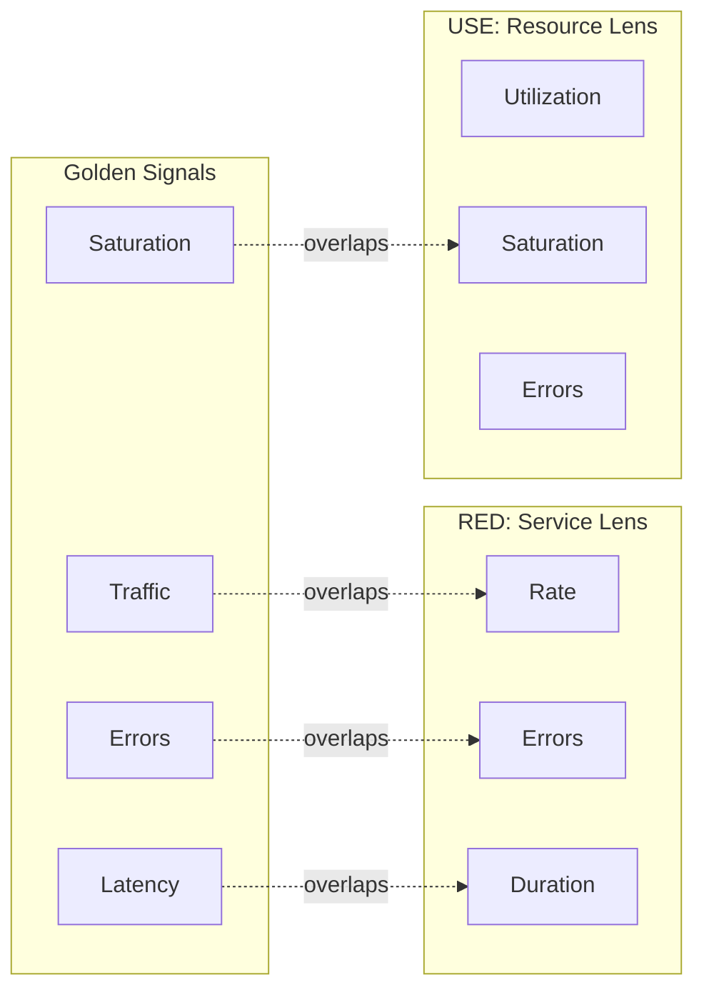

## 1. Executive Summary

The four Golden Signals are **Latency**, **Traffic**, **Errors**, and **Saturation**. Together they provide a compact service-health view: demand, customer-visible outcomes, response time, and proximity to a capacity constraint.

Golden Signals, RED, and USE overlap, but they are not identical frameworks. RED is a service/request lens; USE is a resource lens; Golden Signals intentionally place service symptoms and saturation on one operational dashboard.

---

## 2. Problem It Solves

Dashboards often grow around whatever exporters make easy to collect. Hundreds of charts then obscure whether customers are affected and whether the system is approaching a limit.

Golden Signals provide a minimum review:

```text
Golden Signals
  Latency
  Traffic
  Errors
  Saturation

RED
  Rate
  Errors
  Duration

USE
  Utilization
  Saturation
  Errors
```

The framework is a prioritization tool, not a prohibition on domain, dependency, or business metrics.

---

## 3. Signal Relationships



Overlap means the signals may use related measurements. It does not mean the diagnostic scopes are interchangeable.

---

## 4. Latency

Latency is the time required to serve work. Measure distributions for critical operations and distinguish:

- Successful from failed or rejected requests
- Server duration from client-perceived end-to-end duration
- Processing time from queue wait time
- Internal service latency from dependency latency
- Typical latency from tail latency

A timeout is both a latency-policy violation and usually an error. Do not force one event into only one dashboard category when it provides evidence for both.

---

## 5. Traffic

Traffic describes demand placed on the system. Select a unit matching the service:

| System | Traffic signal |
| :--- | :--- |
| HTTP API | Requests/second by bounded route |
| Streaming platform | Records or bytes/second |
| Database | Queries/second and transaction rate |
| Queue worker | Messages received and completed/second |
| Storage service | Operations and bytes/second |
| Business workflow | Orders, payments, or jobs initiated/minute |

Measure offered load and completed throughput when backpressure or rejection can create a difference.

---

## 6. Errors

Errors are failed, rejected, timed-out, or unacceptable outcomes. Maintain technical and business views where appropriate:

- Transport and protocol errors
- Dependency failures
- Timeout and cancellation
- Capacity rejection
- Degraded fallback responses
- Business outcome failure, such as payment authorization below its objective

An HTTP `200` can still contain a failed business outcome; an HTTP `404` can be an expected successful lookup. Define errors from the service contract and SLI, not solely from status-code conventions.

---

## 7. Saturation

Saturation measures how close the system is to a constrained limit and how much work is waiting. Examples include:

- CPU run queue and container throttling
- Database connection-pool waiters
- Thread-pool queue time
- Disk I/O queue
- Kafka consumer lag and oldest-message age
- Unschedulable pods and node pressure

Utilization may explain saturation but is not itself one of the four Golden Signals. A CPU at 90% with no queueing can be healthy; a pool at 100% with rising wait time is saturated even when host CPU is low.

---

## 8. Framework Selection

| Situation | Start with | Why |
| :--- | :--- | :--- |
| Service or endpoint health | RED | Directly measures request behavior |
| Host, device, pool, or queue diagnosis | USE | Systematic constrained-resource analysis |
| Compact service operations dashboard | Golden Signals | Combines symptoms, demand, and saturation |
| Customer journey objective | SLI/SLO plus RED | Measures an explicit outcome over a window |
| Capacity review | USE plus traffic forecast | Connects demand growth to resource limits |

Teams can use all three. The failure mode is duplicating measurements under different names without preserving clear operational questions.

---

## 9. Failure Scenarios

| Golden Signal pattern | Interpretation | Investigation |
| :--- | :--- | :--- |
| Traffic normal, latency high, errors normal | Slow but completing | Traces, USE saturation, dependency latency |
| Traffic high, saturation high, errors rising | Capacity exceeded | Queues, limits, retries, load shedding |
| Traffic falling, all else healthy | Demand loss or upstream failure | Gateway, discovery, clients, business traffic |
| Errors high, latency low | Fast rejection or immediate dependency failure | Error class, breaker, validation, authentication |
| Saturation rising before latency | Early capacity warning | Forecast exhaustion and scale safely |

Golden Signals narrow the initial hypothesis; they do not establish root cause without traces, logs, and resource evidence.

---

## 10. Architect Interview Answer

> Golden Signals are latency, traffic, errors, and saturation. I use them as a compact service-health view, but I do not claim they are identical to RED or USE. RED focuses on rate, errors, and duration at request boundaries. USE focuses on utilization, saturation, and errors for constrained resources. Their overlap is deliberate: Golden Signals detect customer impact and capacity pressure, RED deepens service behavior, and USE helps locate the resource bottleneck.

---

## 11. Architecture Checklist

- Does each critical service expose latency, traffic, errors, and saturation?
- Are latency distributions separated by outcome where necessary?
- Does traffic measure offered load as well as completed work?
- Are business failures distinguishable from transport failures?
- Does saturation represent waiting, throttling, or exhaustion—not only utilization?
- Can Golden Signals drill into RED operations and USE resources?
- Are dashboards tied to owners, objectives, and diagnostic runbooks?

Next: [RED and USE Diagnostic Workflow](/microservices/08-observability/red-use-diagnostic-workflow/).
