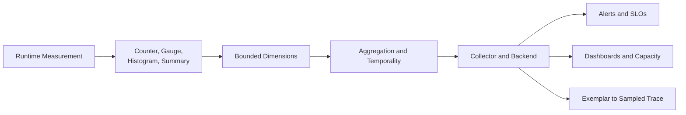

## 1. Executive Summary

Metrics compress large numbers of runtime events into time-series statistics. That compression makes metrics efficient for alerting, SLOs, capacity, and trends—but it also removes transaction detail. A sound metric contract defines the question, instrument, unit, dimensions, aggregation, temporality, ownership, and retention before code emits data.

The dominant design risk is **cardinality**: every unique combination of attribute or label values creates another series and another aggregation state. Unbounded identifiers can exhaust application memory, Collector capacity, backend storage, and query budgets without improving fleet-level diagnosis.

---

## 2. Problem It Solves

Naive instrumentation often begins with “add every useful field as a label.” Consider:

```text
http_requests_total{
  service,
  method,
  raw_url,
  status_code,
  user_id,
  tenant_id,
  exception_message
}
```

If a service sees 100,000 users, 10,000 raw URLs, and thousands of exception messages, the theoretical combinations become enormous. Even when only a fraction occurs, churn continuously creates series and aggregation state.

A safer metric answers a bounded question:

```text
http_server_requests_total{
  service="order-service",
  method="POST",
  route="/orders/{order_id}",
  status_class="5xx",
  error_type="dependency_timeout"
}
```

Use logs or sampled traces for the individual request, user, session, and full exception.

---

## 3. Metric Architecture



Metric design happens at several layers:

- Application code selects the semantic measurement.
- SDK views can filter attributes or change aggregation.
- Collectors can transform, drop, or route data.
- Backends determine storage representation, query functions, and percentile behavior.

Dropping a dangerous attribute at the backend is too late if the SDK already created unbounded in-process aggregation state.

---

## 4. Instrument Types

| Instrument | Represents | Good examples | Common misuse |
| :--- | :--- | :--- | :--- |
| Counter | Monotonic accumulated events or amount | Requests, failures, bytes, retries | Current queue depth |
| Up/down counter | Accumulated value that can increase or decrease | Active requests, items added/removed | Value observed from an external system |
| Gauge | Current sampled value | Temperature, queue depth, pool use | Number of events over time |
| Histogram | Distribution of observations | Latency, payload size, queue wait, batch size | Unique identifiers encoded as values |
| Summary | Client-computed windowed quantiles in some ecosystems | Local quantiles when aggregation is unnecessary | Fleet-wide percentile across replicas |

Prefer counters for event totals and derive rates at query time. A process restart resets a cumulative counter; backends or collectors must interpret resets correctly rather than treating them as negative traffic.

Use gauges for state that can move in either direction. If every transition is available, an up/down counter can preserve changes; if only the current external state is observable, record a gauge.

---

## 5. Histograms, Summaries, and Percentiles

Histograms retain a distribution representation that a compatible backend can aggregate. Summaries commonly calculate configured quantiles inside each process over a configured window.

| Property | Histogram | Summary with precomputed quantiles |
| :--- | :--- | :--- |
| Percentile selected | Usually at query time | At instrumentation time |
| Window selected | Usually at query time | Usually fixed by client configuration |
| Cross-instance aggregation | Supported when representations are compatible | Quantiles are not aggregatable |
| Application cost | Bucket/distribution update | Streaming quantile computation |
| Error control | Bucket width or configured resolution | Quantile algorithm error |

Never average P95 values from individual pods. A percentile is derived from the combined observation distribution, not from the arithmetic mean of per-instance percentiles.

Prometheus-oriented examples:

```promql
# Classic histogram: preserve the `le` bucket boundary while aggregating.
histogram_quantile(
  0.95,
  sum by (le) (rate(http_request_duration_seconds_bucket[5m]))
)

# Incorrect: averaging precomputed per-instance quantiles.
avg(http_request_duration_seconds{quantile="0.95"})
```

Other backends may use explicit-boundary, exponential, sketch, digest, or native histogram representations. Percentile accuracy, merge behavior, and query syntax depend on that representation. Validate the complete SDK → OTLP → Collector → backend path before promising an aggregatable P99.

---

## 6. Histogram Design

Choose boundaries or resolution from operational thresholds and observed distributions—not round numbers alone.

| Measurement | Useful design anchors | Failure from poor design |
| :--- | :--- | :--- |
| Request latency | SLO threshold, timeout, typical and tail range | Wide bucket makes P95/P99 too imprecise near SLO |
| Payload size | Protocol limit, compression threshold, memory pressure | Oversized traffic hidden in final catch-all bucket |
| Queue wait time | Processing objective, retry/timeout budget | Cannot distinguish processing from waiting |
| Batch size | Minimum efficient batch, target, maximum | Throughput issue hidden behind average batch size |

Every classic histogram bucket creates a series for each attribute combination. Ten buckets across 200 label sets require roughly 2,000 bucket series, plus count and sum. More buckets improve resolution but increase ingestion, storage, and query cost.

For latency, keep end-to-end, dependency, and queue-wait measurements separate. Mixing seconds and milliseconds or mixing unrelated operations in one distribution produces meaningless aggregation.

---

## 7. Labels, Dimensions, and Cardinality

Cardinality is the number of unique attribute combinations reported for a metric. Estimate it before launch:

```text
5 routes × 4 methods × 5 status classes × 3 regions × 4 versions
= 1,200 possible series for one simple metric family
```

### Never use unbounded labels

- `user_id`
- `request_id`
- `session_id`
- Raw URL or query string
- Full exception message or stack trace
- Unbounded tenant identifier
- Email, IP address, order ID, or payment ID
- Timestamp or randomly generated value

### Prefer bounded alternatives

| Unsafe value | Safer dimension |
| :--- | :--- |
| `/orders/83921?expand=all` | `route="/orders/{order_id}"` |
| `status="503"` when detail is unnecessary | `status_class="5xx"` |
| Raw exception message | `error_type="dependency_timeout"` |
| Tenant UUID | `tenant_tier="enterprise"` or no tenant label |
| Pod-generated service variant | Stable `service.name` plus governed version |
| Customer identifier | Trace exemplar or secure log lookup |

Cardinality governance should include per-instrument limits, SDK overflow behavior, backend quotas, dashboards for active/churned series, and review for new dimensions. A label with five values today is unsafe if teams can add arbitrary values tomorrow.

---

## 8. Naming, Units, and Aggregation

Metric identity must remain stable across languages and backends.

| Rule | Example |
| :--- | :--- |
| Measure one logical quantity | Request duration is separate from payload size |
| Use one canonical unit | Seconds for time, bytes for data |
| State instrument intent | Counter for completed orders; gauge for queue depth |
| Use stable domain or semantic names | `payment.authorizations` rather than team-specific abbreviations |
| Document dimensions and allowed values | `outcome=success|failure|rejected` |
| Avoid procedural metric names | Use bounded attributes, not one metric per status or tenant |

OpenTelemetry records name, unit, description, instrument kind, and attributes as separate concepts. Prometheus exposition convention commonly encodes base unit and counter intent in names such as:

```text
http_request_duration_seconds
payment_authorization_failures_total
queue_depth
payload_size_bytes
```

Define translation rules at the platform boundary rather than making every team invent names for each backend.

Aggregation must preserve meaning. Counts and sums usually aggregate; ratios require summing numerator and denominator separately; gauges may need sum, maximum, minimum, or last-value depending on the question. An average of per-pod averages is incorrect when pods process different volumes.

---

## 9. Technical, Platform, Dependency, and Business Metrics

| Layer | Example | Architectural question |
| :--- | :--- | :--- |
| Technical | Request rate, error ratio, duration | Is the service contract healthy? |
| Platform | CPU throttling, memory pressure, pod restarts | Is runtime capacity constrained? |
| Dependency | DB pool use, cache hit ratio, downstream timeout | Which dependency threatens the request path? |
| Messaging | Kafka consumer lag, oldest-message age, retry count | Is asynchronous work meeting its objective? |
| Business | Orders created, authorization success, fulfillment delay | Is technical health producing the required outcome? |

Representative metric contracts:

```text
orders_created_total{channel, outcome}
payment_authorization_attempts_total{provider, outcome}
kafka_consumer_lag{consumer_group, topic, partition}
database_pool_connections{pool, state}
cache_requests_total{cache, outcome="hit|miss|error"}
dependency_retries_total{dependency, operation, outcome}
queue_depth{queue}
```

Even apparently bounded fields require governance. Kafka partitions are bounded but can still multiply across clusters, topics, groups, environments, and regions. Business metrics need domain ownership and reconciliation rules; they should not silently become the financial system of record.

---

## 10. Exemplars, Cost, and Failure Modes

An exemplar attaches a representative measurement to trace context, commonly a trace and span ID. It allows an operator to move from a latency bucket to a sampled request without putting `trace_id` on every metric series.

| Failure mode | Consequence | Control |
| :--- | :--- | :--- |
| Unbounded label enters SDK | Application and backend memory growth | SDK views/allowlists and cardinality limits |
| Buckets differ by service instance | Incorrect or impossible aggregation | Central histogram policy and versioned rollout |
| Summary quantiles averaged | Statistically invalid fleet percentile | Aggregatable histogram/distribution |
| Too many buckets | Series and query cost increase | SLO-focused boundaries and measured resolution |
| Counter renamed or labels changed | Dashboard and SLO discontinuity | Versioned schema migration and dual-read window |
| Exemplars capture sensitive attributes | Trace pivot exposes restricted context | Exemplar filtering and trace access control |
| Business counter double-counts retries | Incorrect product reporting | Count domain transitions, not delivery attempts |

Treat metric schemas as production APIs. Owners should review usage, series count, churn, query cost, and unused instruments. Removing unused metrics can be safer than shortening retention while preserving unlimited cardinality.

---

## 11. Architect Checklist

### Instrument contract

- Does every metric answer a named operational or business question?
- Is the counter, gauge, histogram, or summary choice semantically correct?
- Are name, description, canonical unit, temporality, and owner documented?
- Are ratios computed from aggregatable numerator and denominator metrics?
- Are resets, missing data, and zero-traffic behavior understood?

### Cardinality and distributions

- Are request, user, session, raw URL, tenant, and exception-message labels prohibited?
- Are route templates, status classes, error classes, tiers, and stable service names used instead?
- Has worst-case series count been estimated across replicas and environments?
- Are histogram boundaries or resolution aligned with SLOs and observed ranges?
- Can the selected backend aggregate distributions across instances?
- Do exemplars provide trace pivots without creating metric dimensions?
- Are active series, churn, rejected points, overflow, and metric cost monitored?

Official references: [OpenTelemetry metrics](https://opentelemetry.io/docs/concepts/signals/metrics/), [OpenTelemetry metric data model](https://opentelemetry.io/docs/specs/otel/metrics/data-model/), [Prometheus metric naming](https://prometheus.io/docs/practices/naming/), and [Prometheus histograms and summaries](https://prometheus.io/docs/practices/histograms/).
Apply [Telemetry FinOps](/microservices/08-observability/advanced/telemetry-finops/) when cardinality, retention, duplication, and query decisions must be governed across teams.
