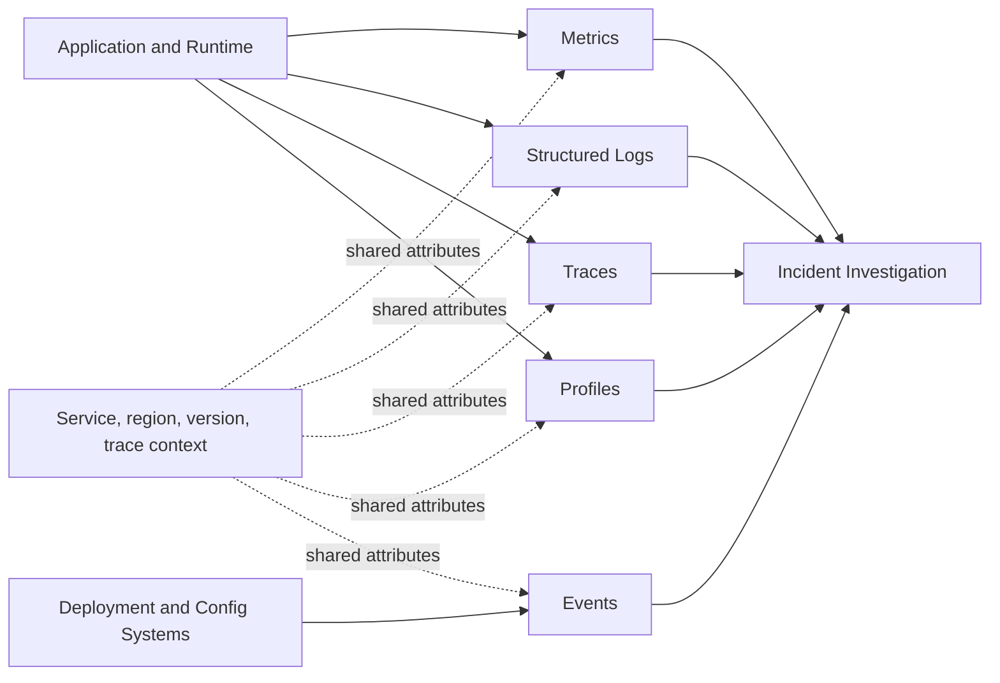
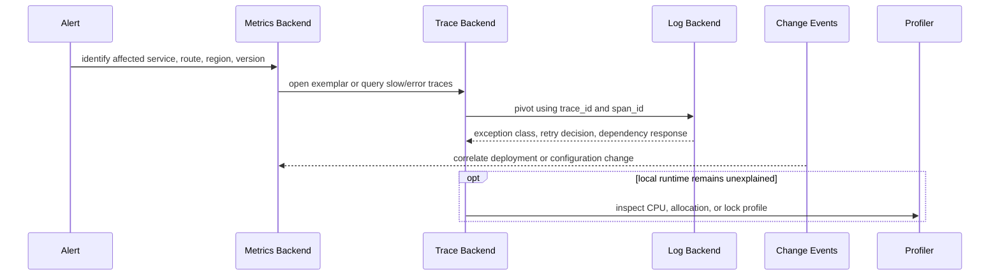

## 1. Executive Summary

Metrics, logs, traces, profiles, and events are complementary evidence types. Architecture fails when teams collect each signal in isolation and expect operators to correlate timestamps manually. A production design starts with operational questions, chooses the cheapest signal that answers each question, and preserves enough shared context to pivot between them.

---

## 2. Problem It Solves

Assume `POST /orders` becomes slow only for payment transactions routed through one provider.

| Evidence | What it reveals | What it does not prove |
| :--- | :--- | :--- |
| `p99` order latency metric | Customer-visible degradation exists | Which dependency or transaction is slow |
| Trace critical path | Payment gateway spans dominate latency | Why the gateway call timed out |
| Trace-linked error log | Timeout, retry count, provider response class | Fleet-wide impact over 30 days |
| CPU profile | Whether local computation caused delay | Whether the user request succeeded |
| Deployment event | A new version preceded the regression | Causality without matching version evidence |

The response workflow moves between signals; it does not choose a single “pillar.”

---

## 3. Visual Architecture



Correlation does not mean copying every identifier into every signal. Metrics require bounded dimensions; logs and sampled traces can carry controlled transaction-level context.

---

## 4. Core Investigation Flow



This order is not mandatory. A security investigation may begin with an audit event; a customer ticket may begin with a tokenized transaction lookup.

---

## 5. Metrics

Metrics are timestamped numeric measurements aggregated over bounded dimensions. They are efficient for dashboards, capacity trends, RED/USE analysis, and SLO computation.

Use metrics for questions such as:

- Is the payment success rate falling?
- Is the database pool approaching saturation?
- How much Kafka consumer lag exists per bounded consumer group?
- Did latency change after version `2026.07.17.2`?

Do not add `request_id`, `user_id`, raw URL, or unbounded exception text as labels. Metrics detect and segment symptoms; the planned Metrics Design page will own instrument types, histograms, exemplars, and cardinality governance.

---

## 6. Logs and Events

Logs record discrete application or infrastructure observations. Prefer stable event names and structured fields over prose that requires regular-expression parsing.

```text
event=payment_authorization_failed
service=payment-service
provider=provider_a
error_type=gateway_timeout
trace_id=4bf92f3577b34da6a3ce929d0e0e4736
deployment_version=2026.07.17.2
```

Platform events describe changes such as deployments, feature-flag updates, autoscaling, failovers, and certificate rotation. They belong on the same investigation timeline but have different ownership and retention from application logs.

Logs should explain a decision once at the appropriate boundary. Logging the same exception at every layer multiplies volume without creating new evidence. Detailed schema, PII, audit separation, and retention will be covered by the planned Structured Logging page.

---

## 7. Traces and Profiles

A trace models one distributed transaction as related spans. It is the primary signal for locating latency across HTTP, RPC, messaging, and database boundaries. Span attributes should identify operations using bounded, normalized names such as `POST /orders/{id}`, not raw URLs.

Profiles aggregate where a process spends CPU time, allocates memory, blocks on locks, or performs runtime work. They answer a different question from traces:

```text
Trace:   Which distributed operation consumed the request time?
Profile: Which code paths consumed resources inside this process?
```

Profiles are valuable when a service span is slow but downstream spans are normal. They require their own sampling, retention, access control, and cost model; see [Continuous Profiling](/microservices/08-observability/advanced/continuous-profiling/) for the architecture decisions.

---

## 8. Design Options and Trade-offs

| Pattern | Strength | Main risk |
| :--- | :--- | :--- |
| Metrics-first | Low-cost detection and capacity visibility | Weak transaction-level explanation |
| Logs-first | Familiar search and rich event context | High volume, inconsistent schemas, slow aggregation |
| Trace-first | Excellent dependency and critical-path visibility | Sampling gaps and span-storage cost |
| Fully correlated signals | Fast pivots and stronger incident evidence | Requires shared standards and backend integration |
| Vendor-specific correlation | Rapid advanced workflows | Portability and migration constraints |
| OpenTelemetry-first correlation | Common context and export model | Semantic governance and collector ownership |

Collecting everything at full fidelity is not an architecture. Explicit loss, sampling, and retention policies are required.

---

## 9. Failure Scenarios and Controls

| Failure mode | Symptom | Control |
| :--- | :--- | :--- |
| Clock skew | Logs and spans appear out of order | Time synchronization and duration from monotonic clocks |
| Missing version attribute | Regression cannot be tied to rollout | Resource-level deployment metadata |
| Raw URL metric labels | Series explosion | Route templates and bounded dimensions |
| Trace sampled out | Error has logs but no request path | Error-aware or tail sampling where justified |
| Log ingestion delayed | Investigation misses recent evidence | Pipeline-lag and dropped-record metrics |
| Profile lacks service context | Hot code cannot be tied to workload | Common service, instance, region, and version attributes |

---

## 10. Architect Interview Answer

> Metrics tell me whether a population is unhealthy, traces show where a distributed transaction spent time, and structured logs explain application decisions or exceptions. Profiles identify code-level resource hotspots, while events correlate deployments and configuration changes. I do not treat them as independent tools: I standardize service, environment, region, and version attributes; propagate trace context; use exemplars or trace IDs for pivots; keep metric dimensions bounded; and define sampling, retention, security, and ownership per signal.

---

## 11. Architecture Checklist

- Can an alert pivot from a metric series to representative traces?
- Can a span pivot to logs using `trace_id` and `span_id`?
- Are service, environment, region, and deployment-version names consistent?
- Are transaction identifiers excluded from metric dimensions?
- Are profiles and deployment events available when traces do not explain local work?
- Does every signal have a retention, access, sampling, and cost owner?
- Are pipeline delay, rejection, and data loss observable?

Next: [Correlation IDs and Context Propagation](/microservices/08-observability/correlation-and-context-propagation/).
