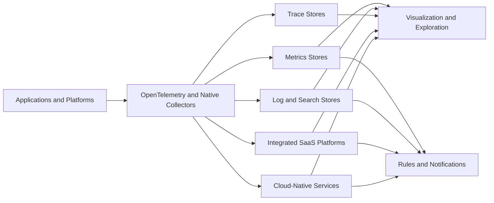

## 1. Executive Summary

The observability market contains signal-specific databases, visualization layers, telemetry pipelines, alert routers, integrated SaaS platforms, and cloud-provider services. Comparing them as if every name represented the same product category produces weak architecture decisions.

Start with required capabilities and operating constraints:

- Metrics scale and PromQL compatibility
- Log search depth and retention
- Trace exploration and sampling
- Cross-signal correlation
- Kubernetes, serverless, browser, mobile, and on-premises coverage
- SLO and notification workflow
- Compliance, residency, access control, and tenant isolation
- Platform-team capacity and on-call ownership
- Ingestion, active-series, indexed-field, retention, query, host, or user cost drivers
- OpenTelemetry portability versus backend-specific enrichment

No platform is universally best. A technically powerful stack can still be the wrong choice when its operational ownership or cost model does not fit the organization.

---

## 2. Capability Map

OpenTelemetry covers instrumentation, context, data models, and collection. It is not a storage, query, visualization, incident-management, or retention product.

---

## 3. Open-Source Metrics, Visualization, and Logs

### Metrics and visualization

| Tool | Strength and best fit | Deployment and ownership | Limitation, cost, lock-in, OTel |
| :--- | :--- | :--- | :--- |
| Prometheus | PromQL, pull-based metrics, Kubernetes ecosystem; best for service/platform metrics and alert rules | Self-hosted server or managed-compatible service; platform team owns HA, retention, federation/sharding | Local-server model needs additional architecture for large global retention; cost is compute, memory, disk, and series count; low data lock-in; OTel metrics arrive through OTLP-compatible paths, Collector translation, or Prometheus exposition |
| Grafana | Multi-source dashboards and exploration; best when teams need one UI over several backends | Self-hosted or managed; owners govern data sources, dashboards, auth, plugins, and upgrades | Grafana is not the underlying telemetry store; dashboard/query coupling remains; cost is hosting/users/plugins or managed plan; low-to-moderate UI lock-in; visualizes OTel data after a compatible backend ingests it |
| Mimir | Horizontally scalable, multi-tenant, long-term Prometheus metrics; best for large centralized PromQL estates | Distributed self-hosted system or managed through Grafana Cloud; platform team owns object storage, capacity, upgrades, and tenancy when self-hosted | More components and tuning than standalone Prometheus; cost follows active series, ingestion, object storage, and query load; moderate PromQL/ecosystem coupling; OTel metrics usually enter through Collector/Prometheus-compatible ingestion |

### Logs

| Tool | Strength and best fit | Deployment and ownership | Limitation, cost, lock-in, OTel |
| :--- | :--- | :--- | :--- |
| Loki | Label-indexed log aggregation integrated with Grafana; best for Kubernetes logs with disciplined labels and cost-sensitive object storage | Self-hosted distributed stack or managed service; platform team owns agents, object storage, compaction, queries, and tenancy | It does not index full log content like a search engine; poor labels or broad scans hurt queries; cost follows bytes, retention, queries, and label cardinality; moderate LogQL coupling; OTel logs can be routed through compatible collectors/exporters |
| OpenSearch | Search, log analytics, dashboards, alerting, and OTel-oriented observability; best for teams wanting an open, self-hosted search/analytics foundation | Self-hosted, third-party managed, or cloud-managed variants; owners manage cluster sizing, shards, mappings, lifecycle, and upgrades | Search clusters require memory/storage and lifecycle expertise; cost follows indexed volume, replicas, hot storage, and queries; moderate index/query coupling; current Observability Stack uses OTel as a primary ingestion model |
| Elasticsearch | Mature distributed search and log analytics with Elastic ecosystem; best where Elasticsearch skills, search, or security analytics already exist | Self-managed Elastic Stack or Elastic Cloud; ownership varies from platform team to vendor | Cluster/mapping/lifecycle complexity and licensing must be reviewed; cost follows ingest, indexed fields, hot tiers, replicas, and subscription/deployment; moderate-to-high schema/query coupling; Elastic supports native OTLP/its OTel distribution, with feature-path limitations to validate |

Prometheus, Loki, Mimir, and Grafana are complementary components, not interchangeable choices. OpenSearch and Elasticsearch can retain broad event data but demand deliberate shard, mapping, index, and lifecycle design.

---

## 4. Open-Source Tracing, Pipeline, and Alerting

### Trace backends

| Tool | Strength and best fit | Deployment and ownership | Limitation, cost, lock-in, OTel |
| :--- | :--- | :--- | :--- |
| Tempo | Object-storage-oriented distributed tracing and Grafana correlation; best with Grafana, Loki, and Prometheus/Mimir | Self-hosted distributed service or Grafana Cloud; platform team owns ingestion, object storage, compaction, query, and HA when self-hosted | Trace search depends on indexed/searchable attributes and architecture; cost follows spans, object storage, retention, and query; moderate Grafana/TraceQL coupling; accepts OpenTelemetry through supported protocols/collectors |
| Jaeger | Distributed trace collection and exploration with mature tracing concepts; best for focused tracing and open-source deployments | Self-hosted components backed by supported storage; platform team owns storage, scaling, sampling integration, and upgrades | Not a full metrics/log/SLO platform; storage backend drives scale and cost; low-to-moderate query/UI coupling; OpenTelemetry is the preferred instrumentation path and OTLP support should be validated for the chosen version |
| Zipkin | Simple distributed trace model and familiar compatibility format; best for legacy Zipkin-instrumented estates or lightweight trace exploration | Self-hosted server and storage; platform team owns capacity and retention | Narrower full-stack capabilities and less modern correlation than integrated platforms; cost follows span/storage volume; moderate legacy instrumentation coupling; OTel Collector can receive/export Zipkin formats for migration |

### Pipeline and notification components

| Tool | Strength and best fit | Deployment and ownership | Limitation, cost, lock-in, OTel |
| :--- | :--- | :--- | :--- |
| OpenTelemetry Collector | Vendor-neutral receive/process/export pipeline; best for centralized policy, enrichment, filtering, sampling, credentials, and routing | Agent, gateway, hybrid, or sidecar; platform team owns availability, queues, capacity, configuration, and upgrades | It is not durable telemetry storage or a user query product; processors can lose or distort data if misconfigured; cost is Collector compute/memory/network; low protocol lock-in but configuration/extensions matter; native OTel component |
| Alertmanager | Deduplication, grouping, routing, inhibition, and silencing for Prometheus alerts; best with Prometheus-compatible rule evaluation | Self-hosted or embedded in managed Prometheus/Grafana offerings; platform/on-call team owns routing tree, HA, receivers, and silences | It does not collect telemetry or evaluate PromQL rules itself; notification integrations and HA require operations; low-to-moderate configuration coupling; OTel compatibility is indirect through metric backends and alert rules |

---

## 5. Managed and Commercial Platforms — Application Focus

| Platform | Strength and best fit | Deployment and ownership | Limitation, cost, lock-in, OTel |
| :--- | :--- | :--- | :--- |
| Grafana Cloud | Managed Grafana plus metrics, logs, traces, profiles, alerting, and integrations; best for Grafana/Prometheus users wanting managed operations and multi-cloud visibility | SaaS with Alloy, OpenTelemetry Collector, direct OTLP, and cloud integrations; vendor runs backends while customer owns instrumentation, pipelines, schemas, and usage | Cost follows active series/data points, logs, traces, profiles, retention, and plan; SaaS dependency and Grafana query coupling create moderate lock-in; OTel/Prometheus compatibility is a primary path |
| Elastic Observability | Search-led logs, APM, infrastructure, RUM/synthetics, profiling, alerting, and security adjacency; best where Elastic search or SIEM is strategic | Elastic Cloud hosted/serverless or self-managed; vendor or platform team owns cluster layer accordingly | Storage, mappings, lifecycle, subscription, and schema coexistence can be complex; cost follows ingest, retention, compute, and deployment model; moderate-to-high Elastic query/schema coupling; supports OTel/OTLP with documented limitations by ingestion path |
| New Relic | Application-centric APM with metrics, events, logs, traces, errors, and query-driven dashboards; best when teams want managed APM with limited backend operations | SaaS using New Relic agents, OTel SDKs/Collector, cloud integrations, and direct endpoints | Cost follows ingest/retention/users or contract model; derived UI behavior may depend on New Relic data mapping; moderate-to-high NRQL/platform coupling; native OTLP and OTel correlation are supported, with feature differences from proprietary agents |
| Honeycomb | High-dimensional event and trace exploration for debugging unknown production behavior; best for engineering teams centered on rich request context | SaaS using OTel SDKs, direct OTLP, or Collector; customer owns instrumentation quality and sampling | It may not replace every infrastructure-monitoring, SIEM, or long-retention log requirement; cost follows event/telemetry volume and retention; moderate query/workflow lock-in; OpenTelemetry is the recommended ingestion path |
| Sentry | Developer-focused error aggregation, stack traces, releases, frontend/mobile diagnostics, and performance context; best for application errors and release regression workflows | SaaS or self-hosted options depending on edition; application teams own SDK rollout, source maps, releases, and issue workflow | Not a complete infrastructure metrics/log analytics replacement; event volume, retention, users, and advanced features drive cost; high workflow/SDK metadata coupling; OTel interoperability exists but supported signals and parity should be verified in a proof of concept |

---

## 6. Managed and Commercial Platforms — Unified Enterprise Operations

| Platform | Strength and best fit | Deployment and ownership | Limitation, cost, lock-in, OTel |
| :--- | :--- | :--- | :--- |
| Datadog | Broad SaaS integration catalog spanning infrastructure, Kubernetes, APM, logs, RUM, synthetics, security, and service catalog; best for rapid onboarding and unified cloud operations | SaaS with Datadog agents, OTel SDKs/Collector, cloud integrations, and serverless libraries; vendor runs storage/control plane | Cost can expand across hosts/containers, custom metrics, logs, indexed data, spans, users, and add-ons; tags require governance; high dashboard/query/integration lock-in; OTel metrics, logs, and traces are supported, while proprietary agents may expose richer features |
| Dynatrace | Automated topology, enterprise application/infrastructure coverage, governance, and assisted analysis; best for large estates prioritizing dependency discovery and centralized operations | SaaS or supported managed deployment models with OneAgent/gateways and OTel ingestion; vendor/customer responsibilities depend on topology | Platform breadth, specialization, rollout governance, and licensing can be complex; cost follows monitored resources/data/features/contracts; high workflow/model coupling; supports OTel ingestion but compare feature depth with native instrumentation |
| Splunk Observability | SaaS infrastructure monitoring, APM, RUM, synthetics, and analytics with Splunk ecosystem alignment; best when Splunk is strategic and operational/security workflows must connect | SaaS using Splunk OTel distributions/Collector and integrations; Splunk platform may separately own large-scale log search | Product boundaries between Observability Cloud and Splunk log/security platforms require architecture clarity; cost follows telemetry, hosts, usage, retention, and contracts; high Splunk query/workflow coupling; OTel distribution and Collector are core application/infrastructure collection paths |

These platforms reduce backend operations but do not remove customer responsibility for instrumentation, cardinality, sampling, retention, access, alert quality, and cost governance.

---

## 7. AWS-Native Landscape

| Service | Strength and best fit | Deployment/ownership, limitation, cost, lock-in, OTel |
| :--- | :--- | :--- |
| Amazon CloudWatch | AWS resource metrics, logs, alarms, dashboards, and native service integrations; best for AWS-first operational coverage | Managed service; customer owns collection, schemas, queries, retention, alarms, and spend. Cost follows metrics/API calls/log ingest, storage, queries, and alarms. High AWS data/query coupling; OTel reaches it through ADOT/AWS integrations and supported exporters |
| AWS X-Ray | Request tracing and AWS service integration; best for AWS-native distributed paths | Managed backend with SDK/agent or OTel/ADOT paths. Narrower than a full telemetry platform; trace volume and retrieval drive cost. High AWS trace-workflow coupling; prefer OTel instrumentation for portability and verify feature mapping |
| Amazon Managed Service for Prometheus | Managed Prometheus-compatible metrics for Kubernetes and cloud workloads; best for EKS/PromQL teams avoiding metrics-backend operations | AWS operates service; customer owns scraping/remote write, rules, labels, and Grafana. Cost follows samples, storage, and queries. Moderate AWS identity/service lock-in with low PromQL lock-in; Collector/ADOT and Prometheus paths supported |
| Amazon Managed Grafana | Managed Grafana workspaces integrated with AWS and external data sources; best for teams wanting managed visualization | AWS manages workspace service; customer owns dashboards, data-source access, users, and queries. It is not the telemetry store. Cost follows workspace/users and underlying sources. Moderate AWS IAM/workspace coupling; visualizes OTel after storage in compatible backends |
| AWS Distro for OpenTelemetry | AWS-supported OTel distribution and collection path; best for portable AWS application/container/serverless instrumentation | Runs in workload, agent, sidecar, or gateway patterns depending on service. Customer owns Collector capacity/configuration. Cost is workload resources plus destinations. Low instrumentation lock-in, moderate AWS exporter/integration coupling |

---

## 8. Azure-Native Landscape

| Service | Strength and best fit | Deployment/ownership, limitation, cost, lock-in, OTel |
| :--- | :--- | :--- |
| Azure Monitor | Azure platform metrics, logs, alerts, workbooks, and resource integration; best for Azure-first operations | Managed service; customer owns data collection rules, workspaces, schemas, alerts, retention, and budget. Cost follows log ingest/retention/queries, metrics, alerts, and exports. High Azure/KQL/resource coupling; Microsoft OTel distributions and supported ingestion paths connect applications |
| Application Insights | Azure Monitor APM, transaction diagnostics, failures, dependencies, and application views; best for applications hosted primarily on Azure | Managed service with Azure Monitor OTel distribution or supported agents/export paths. Feature parity varies by language and ingestion path. Cost follows telemetry volume and retention. High Azure application-model coupling; OTel is recommended for new supported applications |
| Log Analytics | KQL-based workspace for Azure logs and operational queries; best for cross-resource Azure investigations | Managed workspace; customer owns tables, transformations, retention, access, and queries. Ingestion/index/query volume drives cost. High KQL/workspace coupling; OTel logs/traces depend on supported Azure Monitor ingestion architecture |
| Azure Monitor managed service for Prometheus | Managed Prometheus metrics integrated with Azure Monitor workspaces; best for AKS/PromQL monitoring | Azure operates backend; customer owns scrape configuration, labels, rules, and dashboard use. Cost follows ingestion/query/storage policies. Moderate Azure identity/workspace lock-in and low PromQL lock-in; OTel Collector paths depend on supported architecture |
| Azure Managed Grafana | Managed Grafana with Azure identity and data-source integration; best for Azure teams needing Grafana without operating it | Azure manages workspace; customer owns dashboards, RBAC, plugins/data sources, and queries. It is not a storage backend. Cost follows service tier and underlying sources. Moderate Azure workspace coupling; visualizes OTel-derived data in Azure/compatible stores |
| Azure Monitor OpenTelemetry support | Microsoft distribution and evolving native/Collector ingestion options; best for supported .NET, Java, Node.js, and Python applications | Customer deploys SDK/distro; Azure manages destination. Preview versus supported paths must be checked. Cost follows Azure Monitor destinations. Low API-level lock-in, moderate Azure distribution/export coupling |

---

## 9. Google Cloud-Native Landscape

| Service | Strength and best fit | Deployment/ownership, limitation, cost, lock-in, OTel |
| :--- | :--- | :--- |
| Cloud Monitoring | Google Cloud resource/application metrics, dashboards, alerting, SLOs, and service integration; best for GCP-first operations | Managed service; customer owns metric schemas, dashboards, alerts, and quotas. Cost follows chargeable metrics/API/query patterns. High Google resource/query coupling; OTel metrics can arrive through Google-supported collectors/export paths |
| Cloud Logging | Managed collection, routing, search, log-based metrics, sinks, and retention; best for GCP platform and application logs | Managed service; customer owns exclusions, routing, buckets, views, retention, and access. Ingest, storage, analysis, and exports drive cost. High Logging query/router coupling; OTel logs require a supported Google collection pipeline |
| Cloud Trace | Distributed tracing integrated with Google Cloud services; best for GCP-native latency investigation | Managed backend; customer owns instrumentation, sampling, and trace context. It is not a full logs/metrics platform. Trace volume and retention policy drive cost. High GCP UI/backend coupling; OTel trace export is supported through Google-compatible paths |
| Cloud Profiler | Continuous application profiling for supported runtimes; best for CPU/allocation analysis alongside GCP workloads | Managed service plus runtime agent/integration. Language/runtime coverage and overhead must be validated. Cost and availability follow current service policy. High Google profiling workflow coupling; this is profiling rather than a general OTLP backend |
| Managed Service for Prometheus | Managed Prometheus metrics with PromQL across Google Cloud; best for GKE and multi-project Prometheus estates | Managed backend with managed collection, self-deployed collection, OTel Collector, or Ops Agent. Customer owns labels, rules, scoping, and dashboards. Cost follows samples and queries. Moderate GCP identity/project coupling, low PromQL lock-in, explicit OTel Collector support |

---

## 10. Selection Risks and Proof-of-Concept Criteria

| Risk | What to test |
| :--- | :--- |
| Marketing-level OTel claim | Exact signals, temporality, histograms, exemplars, span links, logs, semantic conventions, and limits |
| Hidden operational ownership | Upgrade, shard, object storage, backup, restore, tenant isolation, and on-call procedures |
| Unpredictable cost | Representative active series, log bytes, indexed fields, spans, retention, queries, users, and egress |
| Weak cross-signal correlation | Metric exemplar → trace → logs → deployment event workflow |
| Cloud or vendor lock-in | Export raw data, reproduce dashboards/alerts, dual-write test, and migration throughput |
| Compliance mismatch | Region, encryption keys, private connectivity, audit, deletion, legal hold, and support evidence |
| Sample/demo bias | Peak load, backend throttling, partial outage, noisy tenant, and high-cardinality failure |

A proof of concept should use production-shaped telemetry and failure scenarios, not only a vendor demo application. Measure operator time, query latency, missing evidence, platform resource use, ingestion rejection, and projected monthly volume without embedding list pricing into the architecture decision.

---

## 11. Architect Checklist

- Is each candidate being evaluated for the same required signals and workflows?
- Are primary strength, best fit, limitation, deployment, and operational owner documented?
- Are ingestion, series, retention, indexing, query, user, host, and egress cost drivers modeled?
- Is OpenTelemetry support verified per signal and feature—not treated as a checkbox?
- Are vendor-native features distinguished from portable baseline instrumentation?
- Can data be exported and critical dashboards, SLOs, and alerts be recreated elsewhere?
- Are multi-cloud, on-premises, compliance, residency, and private-connectivity requirements tested?
- Does self-hosting include upgrade, scaling, backup, restore, security, and 24×7 ownership?
- Does managed service adoption retain internal schema, sampling, alert, access, and cost governance?
- Has the platform been tested under telemetry overload and backend failure?

Official starting points: [Prometheus](https://prometheus.io/docs/introduction/overview/), [Grafana Tempo](https://grafana.com/docs/tempo/latest/), [Grafana Loki](https://grafana.com/docs/loki/latest/get-started/overview/), [OpenSearch Observability](https://docs.opensearch.org/platform/observability/), [Elastic Observability](https://www.elastic.co/docs/solutions/observability), [Grafana Cloud](https://grafana.com/docs/grafana-cloud/introduction/), [Datadog OpenTelemetry](https://docs.datadoghq.com/getting_started/opentelemetry/), [New Relic OpenTelemetry](https://docs.newrelic.com/docs/opentelemetry/opentelemetry-introduction/), and [Honeycomb OpenTelemetry ingestion](https://docs.honeycomb.io/send-data/).
Tool-generated service maps should be evaluated using the evidence, identity, and confidence limits in [Service Topology and Dependency Intelligence](/microservices/08-observability/advanced/service-topology-dependency-intelligence/).
